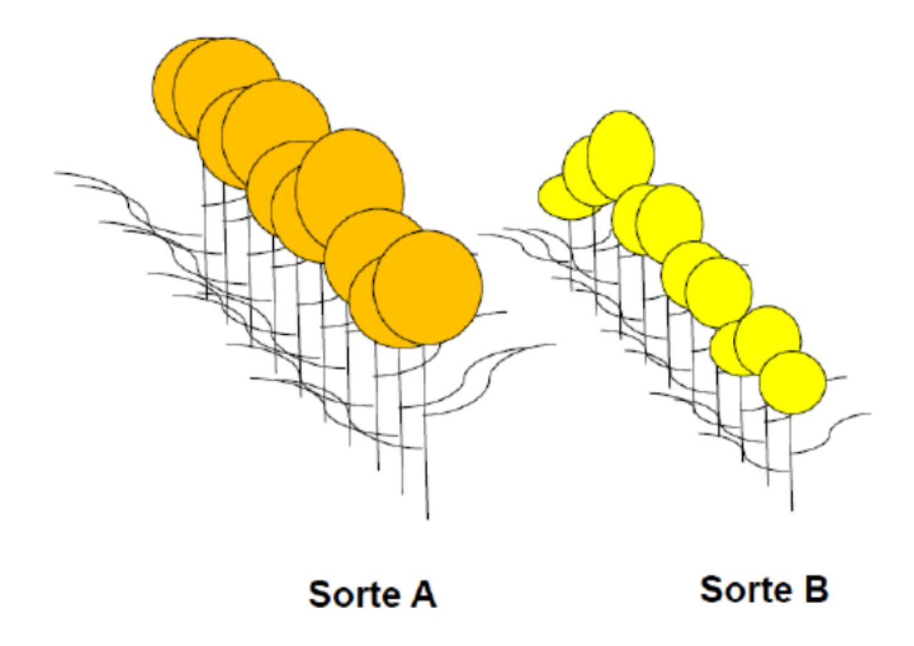
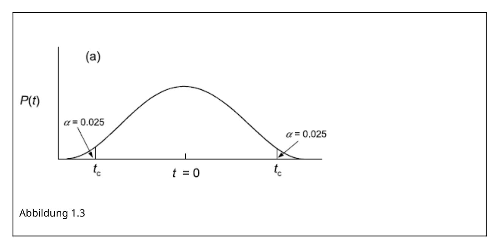
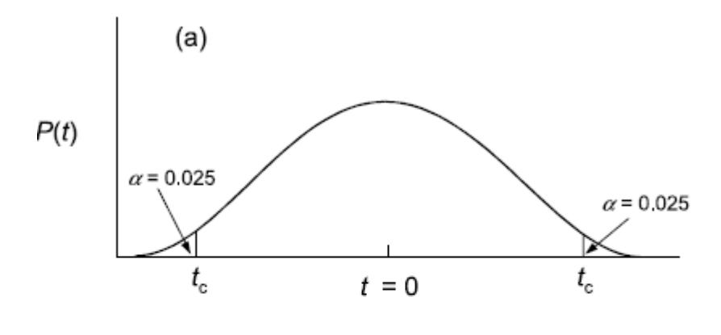
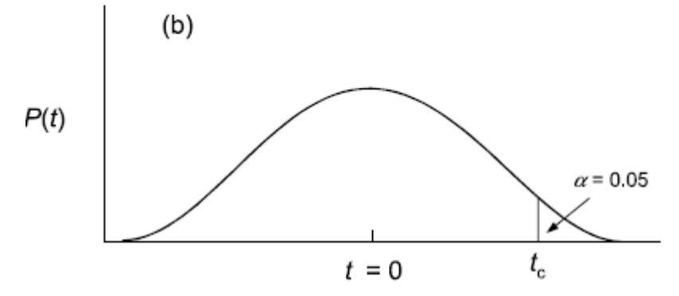
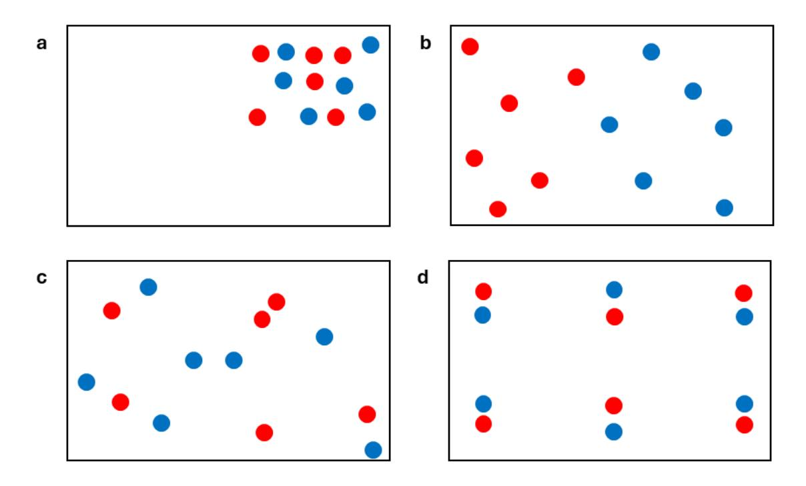
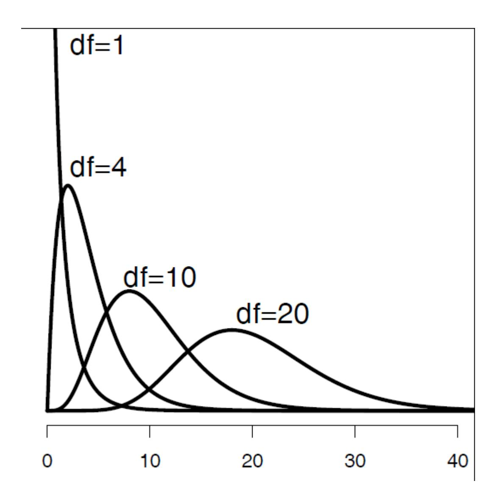
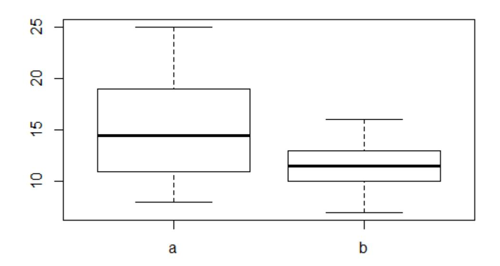
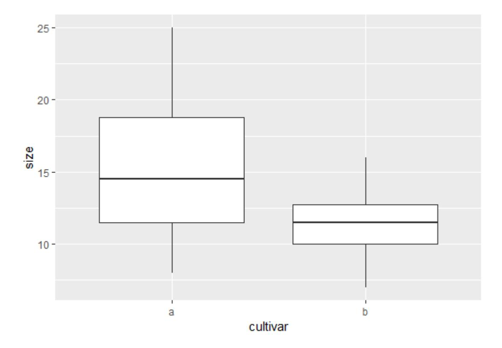
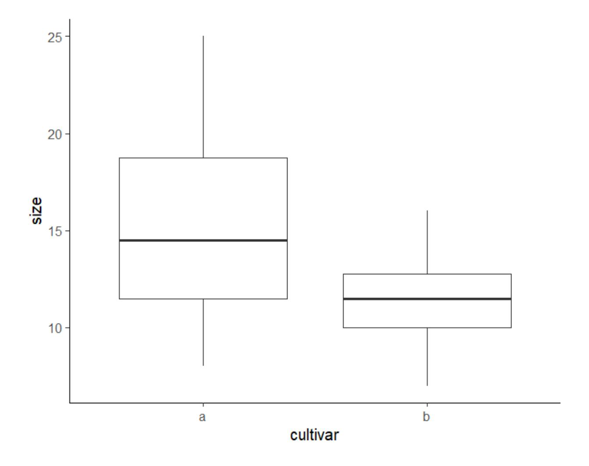
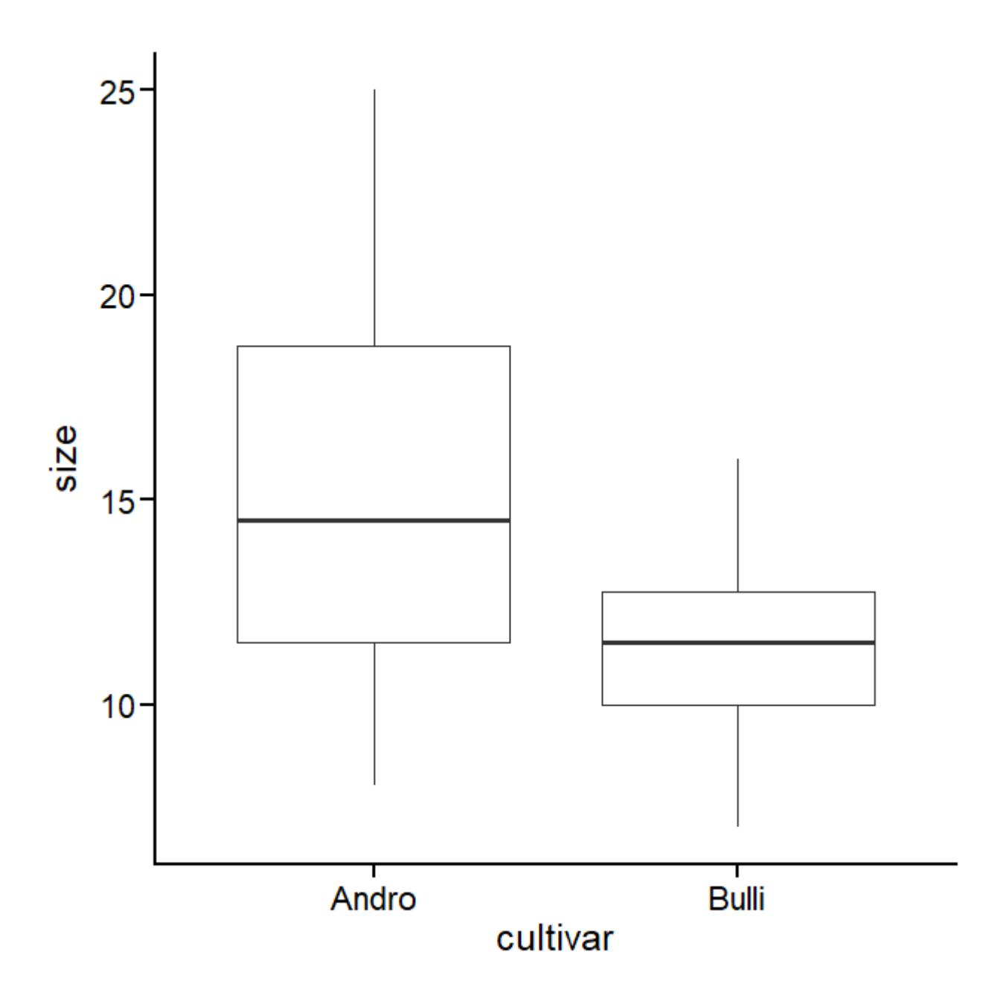

**In Statistik 1 lernen die Studierenden, was (Inferenz-) Statistik im Kern leistet und warum sie für wissenschaftliche Erkenntnis (in den meisten Disziplinen) unentbehrlich ist. Nach einer Wiederholung der Rolle von Hypothesen wird erläutert, wie Hypothesentests in der**  *frequentist***-Statistik umgesetzt werden, einschliesslich** *p***-Werten und Signifikanz-Levels. Die praktische Statistik beginnt mit den beiden einfachsten Fällen, dem Chi-Quadrat-Test für die Assoziation zwischen zwei kategorialen Variablen und dem -Test auf Unterschiede in Mittelwerten zwischen zwei Gruppen. Abschliessend beschäftigen wir uns damit, wie man Ergebnisse statistischer Analysen am besten in Abbildungen, Tabellen und Text darstellt.**

#### **Lernziele**

##### Ihr…

- versteht, was Statistik im Kern leistet und warum Statistik für wissenschaftliche Erkenntnis (in den meisten Disziplinen) unentbehrlich ist;
- könnt Angaben zu p-Werten oder Signifikanzlevels kritisch würdigen;
- wisst, wann man einen *t*-Test, einen Chi-Quadrat-Test oder einen Binomial-Test verwendet und wie man das praktisch in R durchführt;
- versteht, dass die räumliche und zeitliche Anordnung von Beobachtungen bestimmt, welchen Test man verwenden kann; und
- habt eine grundlegende Idee, worauf es beim Berichten statistischer Ergebnisse, insbesondere in Abbildungen ankommt.

#### **Warum brauchen wir Statistik?**

#### **Ein Beispiel**

Ich möchte die grundlegende Notwendigkeit von Statistik mit einem fiktiven Beispiel visualisieren. Gehen wir von einer einfachen Frage aus dem Zierpflanzenbau aus:

*Unterscheiden sich zwei verschiedene Sorten (Cultivare) in der Blütengrösse?*


Um diese Frage zu beantworten, vermessen wir die Blüten der beiden abgebildeten Individuen:

- Individuum A: 20 cm<sup>2</sup>
- Individuum B: 12 cm<sup>2</sup>

Mithin wäre unsere naive Antwort auf die Eingangsfragen: **Ja, die Blüten von Sorte A sind grösser als jene von B**. Wir können sogar sagen, um wie viel grösser (8 cm<sup>2</sup> oder 67 %).

Nun haben Pflanzen (wie fast alle Objekte, mit denen wir uns beschäftigen, mit Ausnahme vielleicht von Elementarteilchen) eine gewisse Variabilität:



Folglich ist es sinnvoller, für die Beantwortung der Frage jeweils mehrere Individuen zu vermessen. Wir greifen nun 10 Individuen jeder Sorte heraus und erzielen folgende Messergebnisse:

- Individuen A1-A10 [cm<sup>2</sup>]: 20; 19; 25; 10; 8; 15; 13; 18; 11; 14
- Individuen B1–B10 [cm<sup>2</sup>]: 12; 15; 16; 7; 8; 10; 12; 11; 13; 10

Wir erhalten für A einen Mittelwert von 15.3 cm<sup>2</sup> und für B einen Mittelwert von 11.4 cm<sup>2</sup> (was wir einfach in Excel ausrechnen können). **Wir schliessen daher, dass die Blüten von A im Mittel 3.9** cm<sup>2</sup> grösser sind als jene von B.

Wir könnten uns also zufrieden zurücklehnen und unserem Ergebnis, das wir mit etwas **deskriptiver Statistik** (Mittelwerte) erzielt haben, vertrauen. Wo liegt der Haken? Wir haben nicht alle existierenden Individuen der Sorten A und B vermessen (die "Grundgesamtheit"), sondern nur eine Stichprobe von jeweils 10 Individuen. Nun könnte es sein, dass KollegInnen von uns die gleiche Untersuchung mit jeweils anderen Stichproben von je 10 Individuen durchgeführt haben, etwa folgendermassen (mit ihren jeweiligen Schlussfolgerungen):

##### Mess-Serie 1:

- Individuen A1–A10 [cm<sup>2</sup>]: 20; 19; 25; 10; 8; 15; 13; 18; 11; 14
- Individuen B1-B10 [cm<sup>2</sup>]: 12; 15; 16; 7; 8; 10; 12; 11; 13; 10
- Ergebnis: A = 15.3; B = 11.4; A B = 3.9 cm<sup>2</sup>  $\rightarrow$  **A ist grösser als B**

##### Mess-Serie 2:

° Individuen A1–A10 [cm<sup>2</sup>]: 12; 19; 17; 10; 8; 13; 11; 15; 11; 9

- Individuen B1-B10 [cm<sup>2</sup>]: 12; 15; 16; 7; 8; 10; 12; 11; 13; 10
- Ergebnis: A = 12.5; B = 11.4; A B = 1.2 cm<sup>2</sup>  $\rightarrow$  **A ist (wenig) grösser als**

##### Mess-Serie 3:

- Individuen A1–A10 [cm<sup>2</sup>]: 20; 19; 25; 10; 8; 15; 13; 15; 11; 14
- Individuen B1-B10 [cm<sup>2</sup>]: 12; 15; 16; 7; 8; 10; 12; 11; 13; 10
- Ergebnis: A = 11.0; B = 11.0; A B = 0.0 cm<sup>2</sup> → A ist gleich gross wie B

##### Mess-Serie 4:

- Individuen A1–A10 [cm<sup>2</sup>]: 20; 19; 25; 10; 8; 15; 13; 18; 11; 14
- Individuen B1–B10 [cm<sup>2</sup>]: 12; 15; 16; 16; 14; 10; 12; 11; 13; 10
- Ergebnis: A = 11.0; B = 12.9; A B = 1.9 cm<sup>2</sup>  $\rightarrow$  **A ist kleiner als B**

Wer hat nun Recht? Um das zu beantworten, benötigen wir die **schliessende Statistik** (Inferenzstatistik).

##### **Fazit**

- In der Regel wollen wir nicht wissen, ob ein einzelnes Individuum der Sorte A sich von einem einzelnen Individuum der Sorte B unterscheidet.
- Meist interessiert uns, ob sich die Sorte A als solche von der Sorte B unterscheidet.
- Da es in der Regel nicht möglich ist, sämtliche existierenden Individuen beider Sorten (**Grundgesamtheiten**; engl. *populations*) zu vermessen, vermessen wir die Individuen in zwei **Stichproben** (engl. *samples*).
- Die Inferenzstatistik sagt uns dann, wie wahrscheinlich ein festgestellter Unterschied in den Mittelwerten der Stichproben einem tatsächlichen Unterschied in den Mittelwerten der Grundgesamtheiten entspricht.

#### Warum mit R?

Zugegeben: wir haben euch nicht gefragt...


#### **Was spricht dagegen?**

Auf den ersten Blick mag aus eurer Sicht ja einiges dagegensprechen

- **keine GUI** (grafische Benutzeroberfläche) zum Klicken
- auf Englisch
- **schwerer** zu erlernen

#### **Was spricht dafür?**

- R ist **kostenlos & open source** (unabhängig von teuren Lizenzen)
- R ist extrem **leistungsfähig** und immer **up-to-date** (da Tausende "ehrenamtlich" mitprogrammieren)
- R ist nah an den **speziellen Bedürfnissen** der einzelnen Disziplinen (durch zahlreiche spezielle *Packages*)
- R "zwingt" die Benutzenden dazu, ihr **statistisches Vorgehen zu durchdenken** (was zu besseren Ergebnissen führt)
- R gewährleistet eine sehr **gute Dokumentation** des eigenen Vorgehens ("Reproduzierbarkeit"), da der geschriebene R Code anders als eine Klickabfolge in einem kommerziellen Statistikprogramm mit GUI eingesehen und erneut durchgeführt werden kann
- R ist effizient, da man Code, den man einmal entwickelt hat, **immer wieder verwenden bzw. für neue Projekte anpassen** kann
- Für R gibt es **umfangreiche Hilfe im Internet** (googlen, spezielle Foren,…)

#### **Fazit**

Der Kursleiter (J.D.) hat Statistik nicht in seinem Studium gelernt und es sich später im Laufe seiner Forscherlaufbahn mühsam sich selbst beigebracht. Damals gab es noch kein R. Dafür gab es teure kommerzielle Statistikprogramme wie SPSS und STATISTICA, durch die man sich mit einer grafischen Benutzeroberfläche durchklicken konnte und am Ende ein Ergebnis bekam. Nicht immer war ganz klar, was das Programm da gerechnet hatte, aber immerhin bekam man mit relativ wenigen Klicks ein numerisches Ergebnis oder eine Abbildung (oft allerdings in bescheidenem

Layout) heraus. Häufig musste man aber erleben, dass das gewünschte statistische Verfahren im jeweiligen Programm in der gewünschten Version nicht implementiert war oder ein teures Zusatzpaket nötig gewesen wäre, das die eigene Universität nicht erworben hatte. Und wenn man dann an eine andere Universität wechselte, musste man oft feststellen, dass dort ein anderes Statistikprogramm erworben und genutzt wurde, für das man viele Dinge umlernen musste. Ganz zu schweigen von Zeiten ausserhalb einer Hochschule, wenn man keinen Zugriff auf ein kommerzielles Statistikprogramm hatte.

Aus dieser Sicht könnt ihr euch also glücklich schätzen, dass es heute R gibt und so leistungsfähig ist wie nie zuvor und auch dass das IUNR in der Ausbildung im Bachelor- und Masterlevel konsequent auf R setzt. Während es auf den ersten Blick vielleicht schwieriger erscheinen mag als die Benutzung von SPSS oder STATISTICA, bin ich überzeugt, dass ein Statistikkurs mit R euch bei gleichem Aufwand ein anderes Verständnislevel für Statistik ermöglichen wird als es Statistikkurse zu meiner Studienzeit taten. Nebenher bekommt ihr noch ein implizites Verständnis wie Algorithmen funktionieren, auch nicht ganz unwichtig in einer zunehmend digitalen Welt.

### **Die Rolle von Hypothesen in der Wissenschaft**

#### **Rekapitulation**

Im Methodenmodul und sicher auch in euren vorausgehenden Studiengängen habt ihr euch bereits mit Hypothesen beschäftigt. Daher beginnen wir mit einem Arbeitsauftrag (allein oder im Austausch mit KommilitonInnen):

##### **Arbeitsauftrag**

Formuliert jeweils in einem Satz die folgenden Punkte:

- Eine beispielhafte Aussage, die den Ansprüchen an eine Hypothese genügt
- Eine beispielhafte Aussage, die keine Hypothese ist

#### **Was ist eine Hypothese?**

Es gibt in der Literatur wie fast immer in der Wissenschaft verschiedene Formulierungen. Ich schlage die folgende vor:

Eine Hypothese ist eine aus einer allgemeinen Theorie abgeleitete Vorhersage für eine spezifische Situation.

Leider wird der Begriff "Hypothese" heutzutage in der Wissenschaft "inflationär" und aus meiner Sicht sogar häufig falsch verwendet.

Zweifelhaft sind "ad hoc"-Hypothesen auf der Basis einer Vorabuntersuchung bzw. eines "Bauchgefühls", aber ohne eine Erklärung des für das vorhergesagte Ergebnis verantwortlichen Mechanismus (also letztlich ohne Theorie dahinter). Wissenschaftstheoretisch sollte man nie dieselben Daten zum Aufstellen und zum Testen einer Hypothese verwenden!

Gänzlich falsch sind angebliche "Hypothesen", die nachträglich aus den schon erzielten Ergebnissen abgeleitet werden.

Warum findet man in der wissenschaftlichen Literatur wie auch in studentischen Arbeiten so viele "Hypothesen", die wissenschaftstheoretisch dem Konzept einer Hypothese nicht gerecht werden? Der Grund dürfte darin liegen, dass viele von der Annahme geleitet werden, dass nur eine hypothesentestende Forschung eine gute/richtige Forschung ist. Tatsächlich ist aber hypothesengenierende Forschung genauso wichtig und richtig wie hypothesentestende Forschung. Es gilt also:

Wenn das Vorwissen nicht für eine **plausibel begründete Hypothese** ausreicht (**hypothesentestende Forschung**), formuliert man das Forschungsthema korrekterweise besser als **offene Frage** (**hypothesengenerierende Forschung**).

Dabei können offene Fragen meist mit (fast) den gleichen statistischen Verfahren adressiert werden wie Hypothesen. Allerdings sollten Hypothesen konkret sein, also nicht "A unterscheidet sich von B", sondern entweder "A ist grösser als B" oder "A ist kleiner als B". Hier würde also im Fall einer Hypothese ein einseitiger Test, im Fall einer offenen Frage ein zweiseitiger Test zur Anwendung kommen. Dazu aber später mehr.

#### **Wissenschaftliches Arbeiten (***in a nutshell***)**

Wenn wir modernes wissenschaftliches Arbeiten knapp visualisieren, ergibt sich folgendes Bild:


Bei den ersten Schritten von den Beobachtungen bis zur Spekulation über die Musterursachen handelt es sich um hypothesengenerierende Forschung. Erst wenn man regelmässig, ähnliche Befunde hat, macht das Formulieren einer echten Hypothese Sinn, die nicht nur das gefundene Muster vorhersagt, sondern auch einen Mechanismus bereithält, der erklärt, wie es zustande gekommen ist. Eine solche Hypothese kann dann in einer neuen Untersuchung (mit neuen Daten!) getestet werden, die spezifisch darauf ausgelegt ist, alternative Erklärungsmöglichkeiten auszuschliessen ("Experiment"). Hypothesengenierende und hypothesentestende Forschung sind im modernen Forschungsablauf also beide gleichermassen nötig, aber in der Regel getrennt voneinander.

In einer Forschungsarbeit, die für das Testen einer zuvor in anderen Arbeiten erarbeiteten Hypothese, entwickelt wurde ("Experiment"), kann das Ergebnis entweder eine Bestätigung oder eine Falsifizierung sein. Wichtig ist, dass eine einmalige Bestätigung keine Verifizierung einer Hypothese ist, während eine einmalige Falsifizierung zur Widerlegung genügt. **Eine Verifizierung einer Hypothese in einem absoluten Sinn ist grundsätzlich nicht möglich, absolute Wahrheit gibt es in der Wissenschaft nicht!** Wenn man jedoch eine Hypothese mit immer neuen "Experimenten" unter immer neuen Rahmenbedingungen "herausfordert" und sie dabei nie falsifiziert wird, dann wird aus einer **einfachen Hypothese** zunehmend **gesichertes Wissen**. Wenn man dagegen eine Hypothese widerlegt hat, muss man zurückgehen. Die vorgeschlagene Erklärung für das gefundene Muster oder sogar das Muster an sich hat sich als nicht korrekt/nicht allgemeingültig herausgestellt. Man muss sich also einen anderen Mechanismus/eine andere Hypothese ausdenken und diese erneut testen. Dies geschieht dann nicht in derselben, sondern in einer folgenden wissenschaftlichen Arbeit.

Mit diesem Wissen über den Ablauf von wissenschaftlicher Erkenntnis und der Rolle des Hypothesentestens dabei habe ich noch eine Frage, zu der ihr euch bis zum Kurstag Gedanken machen solltet:

##### **Frage**

Profitiert Wissenschaft mehr von der Bestätigung oder von der Falsifizierung von Hypothesen? (Bitte begründet eure Antwort!)

## **Die Rolle der Statistik beim Hypothesengenerieren und -testen**

Wir haben gesehen, dass Hypothesen zentral für die moderne Wissenschaft sind, sowohl ihr Generieren als auch ihr Test. Doch welche Rolle spielt die Statistik dabei?

Statistische Verfahren, die implizit oder explizit Hypothesen testen, bezeichnet man als **Inferenzstatistik (schliessende Statistik)** – im Gegensatz zur **deskriptiven Statistik**.

#### **Von der Hypothese zur Nullhypothese…**

Die Herausforderung ist nun aber, wie oben gesehen, dass man eine **Hypothese (H<sup>a</sup> )** (auch **Forschungshypothese** oder *a***lternative Hypothese** genannt) nicht verifizieren kann, sondern nur falsifizieren. In der Statistik behilft man sich daher mit einem Trick, der sogenannten **Nullhypothese (H<sup>0</sup> )**. Die Nullhypothese ist die Negation der Hypothese, d. h. die Summe aller möglichen Beobachtungen, die mit der Hypothese nicht im Einklang sind. Wenn man nun die Nullhypothese falsifiziert, kann man indirekt die Hypothese bestätigen.

In unserem Beispiel von oben:

- Hypothese  $(H_{\Delta})$ : Sorte A und Sorte B unterscheiden sich in ihrer Blütengrösse
- Nullhypothese ( $H_{A0}$ ): Sorte A und Sorte B haben die gleiche Blütengrösse

Das ist formal korrekt, wissenschaftlich ist die Forschungshypothese aber wenig überzeugend, weil schwerlich ein Mechanismus vorstellbar ist, der in Sorte B sowohl kleinere als auch grössere, nur keine gleich grossen Blüten hervorbringt. Insofern wäre das folgende Paar sinnvoller:

- Hypothese (H<sub>R</sub>): Sorte A hat grössere Blüten als Sorte B
- Nullhypothese ( $H_{B0}$ ): Sorte A hat kleinere oder gleich grosse Blüten wie Sorte B

Die erste Forschungshypothese ( $H_A$ ) ist eine ungerichtete Hypothese und entspricht dem, was man in hypothesengenerierender Forschung implizit macht (wenn man also offene Fragen, aber keine konkreten Hypothesen hat). In diesem Fall wäre die zugehörige Forschungsfrage: "Unterscheiden sich die Sorten A und B in ihren Blütengrössen?". Die zweite Forschungshypothese ( $H_B$ ) ist dagegen gerichtet und wäre für hypothesentestenden Forschung adäquat. In der hypothesentestenden Forschung sollten wir auch eine Begründung/einen Mechanismus anführen, der vermutlich zu dem vorhergesagten Ergebnis führt, etwa dass die Sorte A polyploid ist. Dies gehört zur Begründung der Forschungshypothese, aber ist nicht Bestandteil der Forschungshypothese.

#### Einschub: Wichtige Termini in der Statistik

Bis hierher sind uns schon einige wichtige statistische Begriffe (wie Stichprobe und Grundgesamtheit) begegnet, deshalb sollen sie hier samt ihren englischen Pendants noch einmal rekapituliert werden:

| Deutscher Begriff | Englischer<br>Begriff | Definition                                                                    | Beispiel(e)                               |
|-------------------|-----------------------|-------------------------------------------------------------------------------|-------------------------------------------|
| Beobachtung       | Observation           | experimentelle bzw.<br>Beobachtungseinheit                                    | Pflanzenindividuum                        |
| Stichprobe        | Sample                | alle beprobten Einheiten                                                      | die 20 untersuchten<br>Pflanzenindividuen |
| Grundgesamtheit   | Population            | Gesamtheit aller Einheiten, über<br>die eine Aussage getroffen<br>werden soll | alle Individuen der<br>beiden Sorten      |

| Deutscher Begriff | Englischer<br>Begriff | Definition                             | Beispiel(e)                       |
|-------------------|-----------------------|----------------------------------------|-----------------------------------|
| Messung           | Measurement           | einzelne erhobene Information          | Blütengrösse eines<br>Individuums |
| Variable          | Variable              | Kategorie der erhobenen<br>Information | Blütengrösse, Sorte               |

Der englische Begriff *population* führt oft zu Verwirrung, da er in der Statistik etwas anderes meint als in der Biologie. *Population* ist schlicht die Grundgesamtheit, die in seltenen Fällen einer biologischen Population entspricht, in den meisten Fällen aber nicht (etwa *population of chairs*). Auch Messung/*measurement* wird in der Statistik weiter als in der Allgemeinsprache verwendet, d. h. auch für Zählungen oder Erhebung von kategorialen Variablen.

#### **Einschub: Parameter vs. Prüfgrössen**

Wenn wir in Inferenzstatistik betreiben, also von einer Stichprobe auf die Grundgesamtheit schliessen wollen, müssen wir zudem zwischen Parametern und Prüfgrössen unterscheiden. Unter Parameter (*parameter*) wird eine Grösse der deskriptiven Statistik für eine bestimmte Variable in der Grundgesamtheit verstanden, über die wir eine Aussage treffen wollen, die wir aber nicht kennen. Dagegen ist eine Prüfgrösse (*statistic*) eine aus den Messungen der Variablen in der Stichprobe berechnete Grösse, die zur Schätzung des Parameters dient. Etwas verwirrend ist, dass *stastitic* (Prüfgrösse) und *statistics* (die Statistik als Fach) fast gleich lauten. Oft wird die Konvention verwendet, dass die Prüfgrössen mit kursiven lateinischen Buchstaben (z. B. ) und die korrespondierenden Parameter mit den äquivalenten griechischen Buchstaben (z. B. ) bezeichnet werden (siehe [Abbildung 1.2](#page-17-1)).

| Parameter                                        | Statistic      | Formula                                                                                             |
|--------------------------------------------------|----------------|-----------------------------------------------------------------------------------------------------|
| Mean (µ)                                         | ÿ              | $\frac{\sum_{i=1}^{n} y_i}{n}$                                                                      |
| Median                                           | Sample median  | $y_{(n+1)/2}$ if $n$ odd                                                                            |
| Variance $(\sigma^2)$                            | s <sup>2</sup> | $(y_{n/2} + y_{(n/2)+1})/2$ if $n$ even $\sum_{i=1}^{n} \frac{(y_i - \bar{y})^2}{n-1}$              |
| Standard deviation $(\sigma)$                    | S              | $\sqrt{\sum_{i=1}^{n} \frac{(y_i - \bar{y})^2}{n-1}}$                                               |
| Median absolute deviation (MAD)                  | Sample MAD     | $median[ y_i - median ]$                                                                            |
| Coefficient of variation (CV)                    | Sample CV      | $\frac{s}{\bar{y}} \times 100$                                                                      |
| Standard error of $\bar{y}$ $(\sigma_{\bar{y}})$ | S <sub>ÿ</sub> | $\frac{s}{\sqrt{n}}$                                                                                |
| 95% confidence interval for $\mu$                |                | $\bar{y} - t_{0.05(n-1)} \frac{s}{\sqrt{n}} \le \mu \le \bar{y} + t_{0.05(n-1)} \frac{s}{\sqrt{n}}$ |

Abbildung 1.2

## Statistische Implementierung des Hypothesentestens (am Beispiel des *t*-Tests)

Wie lässt sich das Hypothesentesten nun mathematisch und statistisch umsetzen. Wir bleiben bei unserer offenen Forschungsfrage "Unterscheiden sich die Sorten A und B in ihren Blütengrössen?", woraus sich die Forschungshypothese "Sorten A und B unterscheiden sich in ihren Blütengrössen" ergibt. Mit dem Mittelwert  $\mu$  der Variablen (Blütengrösse) in den jeweiligen Grundgesamtheiten (A und B) lassen sich Forschungshypothese und Nullhypothese mathematisch wie folgt formulieren:

- H<sub>a</sub>:
- **H**<sub>0</sub>: oder

Für die Überprüfung der H<sub>0</sub> gibt es eine Teststatistik (Prüfgrösse) den *t*-Wert, der wie folgt definiert ist

Da für die gilt , lässt sich das vereinfachen zu:

Die Prüfgrösse t ist also die Differenz der beiden Mittelwerte dividiert durch den Standardfehler der Differenz der beiden Mittelwerte. Wenn also die Differenz der Mittelwerte gross und/oder der Standardfehler dieser Differenz klein ist, so ist t weit von Null entfernt.

Was sagt uns der berechnete *t*-Wert nun? Um daraus etwas schlussfolgern zu können, müssen wir ihn mit der theoretischen *t*-Verteilung vergleichen. Für diese gilt:

- Sie ist symmetrisch, mit einem Maximum bei 0.
- Der genaue Kurvenverlauf variiert in Abhängigkeit von den Freiheitsgraden (*degrees of freedom* = df). Bei vielen Freiheitsgraden, d. h. einer grossen Stichprobengrösse (mehr dazu, wie sich die Stichprobenzahl in Freiheitsgrade übersetzt, folgt später), nähert sicht die *t*-Verteilung einer Normalverteilung (auch *z*-Verteilung genannt).

Die allgemeine Konvention in der Statistik ist, dass die Nullhypothese dann verworfen wird, wenn die berechnete Prüfgrösse extremer ist als 95 % aller möglichen Werte bei der gegebenen Stichprobengrösse. Beim t-Test fragt man also, ob der berechnete t-Wert extremer ist als 95 % aller t-Werte der der Stichprobengrösse entsprechenden t-Verteilung. Da unsere Hypothese ungerichtet ist (also ist verschieden und nicht ist grösser/ist kleiner), benötigen wir einen zweiseitigen t-Test. Dieser bestimmt die "kritischen" t-Werte ( $t_c$ ), indem auf beiden Seiten quasi 2.5 % der Fläche des Integrals unter der Wahrscheinlichkeitsverteilung abgeschnitten werden, wie die Abbildung 1.3



Wenn also der berechnete t-Wert >  $t_c$  (oder <  $-t_c$ ) ist, dann sind wir **hinreichend sicher**, dass sich die Mittelwerte nicht nur in der Stichprobe, sondern auch in der Grundgesamtheit unterscheiden.

#### Fehler I. und II. Art

veranschaulicht:

Wichtig ist, dass es in der physischen Realität nie eine absolute Sicherheit gibt. Wenn wir also wir feststellen, dass die Wahrscheinlichkeit, dass die Nullhypothese zutrifft (oder präziser: dass das vorliegende Ergebnis oder ein extremeres bei Zutreffen der Nullhypothese aufgetreten wäre) kleiner als 5 % ist, gibt es eben doch Fälle gibt, in denen wir fälschlich die Nullhypothese verwerfen, d. h. das Vorliegend eines Effektes bejahen, obwohl er in der Realität (d. h. der Grundgesamtheit) nicht auftritt. Das bezeichnet man als **Typ I-Fehler**. Umgekehrt kann es aber auch passieren, dass man die Nullhypothese aufgrund des statistischen Tests beibehält, also einen Effekt nicht nachweist, obwohl er in der Realität existiert (**Typ II-Fehler**). Diese beiden Phänomene sind in der folgenden beiden Abbildungen visualisiert:

|                                                        |                           | Statistische Sc                                                | hlussfolgerung                                                                  |
|--------------------------------------------------------|---------------------------|----------------------------------------------------------------|---------------------------------------------------------------------------------|
|                                                        |                           | H0 wird verworfen                                              | H0 wird beibehalten                                                             |
| <b>der Realität</b><br>Idgesamtheit)                   | Effekt existiert          | Korrekte Entscheidung:<br>Effekt vorhanden und<br>nachgewiesen | Typ II-Fehler:<br>Effekt nicht nachgewiesen,<br>obwohl vorhanden                |
| Situation in der Realität<br>(d.h. der Grundgesamtheit | Effekt existiert<br>nicht | Typ I-Fehler:<br>Effekt nachgewiesen, aber<br>nicht vorhanden  | Korrekte Entscheidung:<br>Effekt nicht vorhanden und<br>auch nicht nachgewiesen |
| P(t)                                                   | Region wh                 | nere H <sub>0</sub> retained Region                            | where H₀ rejected                                                               |

Wie man der zweiten Visualisierung entnehmen kann, steigt die Wahrscheinlichkeit eines Typ II-Fehlers, je weiter man die akzeptierte Wahrscheinlichkeit eines Typ I-Fehlers reduziert. In der Statistik wir im Allgemeinen sehr viel stärker auf die Minimierung von Typ I-Fehlern fokussiert, d. h. man will vermeiden, dass man fälschlich einen Effekt behauptet, der in Realität nicht existiert, während es als weniger problematisch angesehen wird, einen vorhandenen, aber dann sehr schwachen Effekt, nicht nachgewiesen zu haben.

(aus Quinn & Keough 2002)

#### *p***-Werte und Signifikanzniveaus**

Signifikanzniveaus und p-Werte sind zentrale Termini in der am weitesten verbreiteten inferenzstatistischen Schule, der *frequentist statistics* ("Frequentistische Statistik", aber ich habe den Begriff noch nie im Deutschen gehört). Deren Grundideen sind:

- Die beobachteten Werte werden als eine Beobachtung unter vielen möglichen Beobachtungen interpretiert, die zusammen eine **Häufigkeitsverteilung** ergeben.
- Es wird eine **einzige wahre Beschreibung der Realität** angenommen, der man sich mit bestimmten Irrtumswahrscheinlichkeiten annähern kann.

In der *frequentist statistics*, sind die *p*-Werte das zentrale "Gütemass". Als *p***-Wert** bezeichnet man dabei die berechnete **Wahrscheinlichkeit eines Typ I-Fehlers**. Der *p*-Wert bezeichnet also die Wahrscheinlichkeit, dass man aufgrund des statistischen Tests einen Zusammenhang feststellt, ohne dass dieser in Realität existiert.

Als **statistisch signifikant** bezeichnet man Ergebnisse, die unter einem bestimmten *p*-Wert liegen. Diese Schwellenwerte sind Konventionen und nicht "gottgegeben". Traditionell werden drei Signifikanzniveaus verwendet (wozu R noch ein viertes hinzugefügt hat, das man mit "marginal signifikant" bezeichnen könnte), die wie folgt notiert werden:

| *** | p < 0.001 | höchst signifikant; highly significant       |
|-----|-----------|----------------------------------------------|
| **  | p < 0.01  | hoch signifikant; very significant           |
| *   | p < 0.05  | signifikant; significant                     |
|     | p < 0.1   | marginal signifikant; marginally significant |

Die Schwellenwerte der Signifikanzniveaus (d. h. Schwellenwerte für akzeptierte Typ I-Fehler) werden auch mit α bezeichnet. Was man in einer Arbeit als signifikant betrachtet, sollte man vor Beginn der Untersuchung festlegen und im Methodenteil schreiben ("als Signifikanzschwelle verwenden wir " oder "als signifikant sehen wir Ergebnisse mit an"). Es bietet sich normalerweise an, bei der allgemeinen Konvention von zu bleiben, es sei denn es sprechen spezifische Gründe dagegen. Ein Grund könnte sein, dass die Verwerfung der Nullhypothese/Annahme der Forschunshypothese schwerwiegende Folgen hätte und man sich daher besonders sicher sein will.

Da sich ober- und unterhalb der genannten Schwellen nichts Fundamentales ändert, sollte man grundsätzlich die exakten *p*-Werte mit drei Nachkommastellen (z. B. "" bzw. wenn noch niedriger als "") angeben. Zur besseren Lesbarkeit können zusätzlich die korrespondierenden Signifikanzniveaus angegeben werden.

Es ist wichtig, sich bewusst zu sein, dass **statistisch signifikant nicht gleichbedeutend ist mit biologisch bzw. sozialwissenschaftlich bedeutsam**. Ein Effekt kann statistisch hoch signifikant sein (wg. grosser Stichprobengrösse) und trotzdem inhaltlich bedeutungslos (da die Effektgrösse minimal ist). Umgekehrt kann ein inhaltlich bedeutsamer Effekt evtl. nicht statistisch signifikant nachgewiesen werden, wenn man extrem wenige Replikate hatte.

Mit dem Kriterium "statistische Signifikanz"/*p*-Wert trennen wir unsere Ergebnisse in einem ersten Schritt in jene, die wir für **belastbar** halten und jene, die mit grosser Wahrscheinlichkeit "zufällig" ("Rauschen in den Daten", Messungenauigkeit, etc.) zustande gekommen sind. Bei den belastbaren müssen wir dann immer noch ihre **Relevanz** (also die Effektstärke) beurteilen.

## *t***-Test (für eine metrische Variable im Vergleich von zwei Gruppen)**

Dear *t*-Test ist eines der einfachsten inferenzstatistischen Verfahren Er vergleicht zwei Gruppen statistisch, wenn die abhängige Variable metrisch ist.

**Sorte Andro Sorte Bullie**

| 20 | 12 |
|----|----|
| 19 | 15 |
| 25 | 16 |
| 10 | 7  |
| 8  | 8  |
| 15 | 10 |
| 13 | 12 |
| 28 | 11 |
| 11 | 13 |

Sorte Andro Sorte Bullie

| 14 | 10 |
|----|----|
|    |    |

 $\mathrm{H}_{\text{0}}$ : Die beiden Sorten unterscheiden sich nicht in der Blütengrösse.

##### Students und Welch t-Test

Als statistisches Verfahren kommt **Students** *t*-**Test für zwei unabhängige Stichproben** zum Einsatz ("Student" ist das Pseudonym für William Sealy Gosset, dem Erfinder des Tests, dessen Arbeitsvertrag in der Privatwirtschaft das Publizieren von Ergebnissen verbot).

Wobei der gepoolten Varianz entspricht:

Der berechnete t-Wert wird mit der t-Verteilung für  $(n_1 - 1) + (n_2 - 1)$  Freiheitsgraden verglichen. Der klassische t-Test setzt Normalverteilung und gleiche Varianzen voraus:

```{.r}
t.test(size ~ cultivar, var.equal = T, data = blume)
```

Wenn Varianzgleichheit nicht gegeben ist, verwendet man Welch' *t*-Test. Dieser approximiert die Freiheitsgrade mit der Welch-Satterthwaite-Gleichung. Er setzt weiterhin Normalverteilung voraus, benötigt aber keine gleichen Varianzen. Welch' *t*-Test kann/sollte also immer verwendet werden, wenn keine vorherigen Tests auf Varianzgleichheit durchgeführt werden und ist daher Standard (default) in R:

Wobei

```{.r}
t.test(size ~ cultivar, var.equal = FALSE, data = blume)
t.test(size ~ cultivar, data = blume)
```

#### Ein- und zweiseitiger t-Test

Bislang war unsere Hypothese, dass irgendein Unterschied vorliegt (was, wie oben dargelegt, keine adäquate Forschungshypothese ist, sondern die implizite Hypothese, wenn man eine offene Frage formuliert, aber keine klare Theorie hat). Wenn es eine Theorie gibt, aus der sich eine klare Vorhersage treffen lässt, so enthält diese normalerweise auch eine Aussage über die Richtung des Effekts, also ob die Blüten von Andro grösser als jene von Bulliesind oder umgekehrt. Dann verwendet man einen einseitigen t-Test, denn man je nach Richtung der Hypothese mit greater oder less spezifizieren muss. Bildlich gesprochen werden beim gängigen Signifikanzniveau von  $\alpha = 0.05$  beim beidseitigen t-Test je 2.5 % der Integralfläche links und rechts "abgeschnitten", beim einseitigen t-Test dagegen 5 % auf einer Seite. Wenn der berechnete t-Wert in einem der abgeschnittenen "Dreiecke" liegt, ist das Ergebnis signifikant.





(aus Quinn & Keough 2002)

```{.r}
t.test(size ~ cultivar, data = blume) # zweiseitig
```

```{.r}
t.test(size ~ cultivar, alternative = "greater", data = blume ) # einseitig
```

```{.r}
t.test(size ~ cultivar, alternative = "less", data = blume) # einseitig
```

#### **Gepaarter und ungepaarter** *t***-Test**

Bislang haben wir angenommen, dass die Individuen der beiden Sorten unabhängig voneinander jeweils zufällig ausgewählt wurden. Dann ist ein ungepaarter *t*-Test (*default*-Einstellung in R) richtig. Wenn jedoch je zwei Messwerte zusammengehören, etwa wenn je eine Pflanze der Sorten Andro und Bullie gemeinsam in einem Topf wuchs, so kommt ein gepaarter *t*-Test zur Anwendung. Da dieser mehr "Informationen" zur Verfügung hat, hat er mehr statistische "*power*", wird i. d. R. also zu stärker signifikanten Ergebnissen führen:

```{.r}
t.test(blume\$size[blume\$cultivar == "Andro"], blume\$size[blume\$cultivar == "Bullie"], paired = TRUE)
```

## **Binomial-Test (für die Häufigkeitsverteilung einer binomialen Variablen)**

Der Binomial-Test testet, ob die Verteilung einer binären Variable von einer Zufallsverteilung abweicht. Eine binomiale (binäre) Variable ist eine, die zwei mögliche Zustände hat, etwa lebend/tot, männlich/weiblich oder besser/schlechter. Wenn das Ergebnis zufällig wäre, müssten in der Stichprobe beide Ausprägungen ungefähr gleich häufig vertreten sein. Folglich testet der Binomialtest, wie wahrscheinlich es ist, dass die vorgefundene Häufigkeitsverteilung in der

Stichprobe zustande gekommen wäre, wenn beide Zustände gleich häufig sind. Wenn diese Wahrscheinlichkeit < 0.05 ist, nimmt man in der Statistik gewöhnlich an, dass der Unterschied in der Stichprobe einem realen Unterschied in der Grundgesamtheit ist.

Betrachten wir den Frauenanteil im schweizerischen Nationalrat als Beispiel. Im Jahr 2019 waren 84 von 200 Mitgliedern weiblich (42%). Nehmen wir in guter Näherung an, dass im Stimmvolk das Geschlechterverhältnis 1:1 ist: Kann die Abweichung von 50 % unter den Mitgliedern noch durch Zufall erklärt werden oder deutet das auf eine "Bevorzugung" von Männern bei der Kandidat:innenaufstellung und im Wahlvorgang hin. Die Antwort liefert der Binomialtest, dem man die Zahl der "Erfolge" (weiblich: 84) und die Stichprobengrösse (200) übergeben muss:

```{.r}
binom.test(84, 200)
```

Exact binomial test

data: 84 and 200 number of successes = 84, number of trials = 200, p-value = 0.02813 alternative hypothesis: true probability of success is not equal to 0.5 95 percent confidence interval: 0.3507439 0.4916638 sample estimates: probability of success 0.42

Der Unterschied ist also signifikant (*p* < 0.05), wir können die Nullhypothese ("keine Bevorzugung von Männern") also verwerfen. Der Output sagt uns auch noch, dass ohne Bevorzugung / Benachteiligung eines Geschlechts der gegenwärtige Frauenanteil im Nationalrat nur zustande hätte kommen können, wenn der Frauenanteil im Stimmvolk zwischen 35 % und 49 % läge. Da dieser Bereich 50 % (also den der Nullhypothese entsprechenden Wert) nicht einschliesst, ist es logisch, dass diese verworfen wird. Der Test ist "symmetrisch": Wir können also statt der Anzahl der weiblichen Nationalratsmitglieder auch jene der männlichen eingeben und bekommen den gleichen *p*-Wert

```{.r}
binom.test(116, 200)
```

Exact binomial test

data: 116 and 200 number of successes = 116, number of trials = 200, p-value = 0.02813 alternative hypothesis: true probability of success is not equal to 0.5 95 percent confidence interval: 0.5083362 0.6492561 sample estimates: probability of success 0.58

Man kann den Binomial-Test auch als **Vorzeichen-Test** (*sign test*) verwenden. Der Code ist der gleiche, die Bedeutung aber eine etwas andere. Der Vorzeichen-Test wird verwendet, wenn man testen will, ob es eine gerichtete Veränderung einer Zielvariablen über die Zeit gegeben hat. Beispielsweise könnte man fragen, wie sich eine Art in einer Anzahl von Untersuchungsflächen zwischen Zeitpunkt A und Zeitpunkt B in ihrer Häufigkeit verändert hat:

Dann gibt es für jede Untersuchungsfläche vier Möglichkeiten:

1. Die Art kam zum Zeitpunkt A und B vor

- Die Art kam weder zum Zeitpunkt A noch zum Zeitpunkt B vor 2.
- Die Art kam zum Zeitpunkt A vor, ist aber zum Zeitpunkt B verschwunden 3.
- Die Art kam zum Zeitpunkt A nicht vor, trat aber zum Zeitpunkt B neu auf 4.

Um den Vorzeichen-Test anzuwenden, ignorieren wir die Fälle 1 und 2 (ohne Veränderung) und berücksichtigen nur die Fälle 3 und 4 (mit Veränderung). Angenommen es gäbe 10 Flächen mit negativer, und 2 mit positiver Entwicklung, dann lautet der R Code folgendermassen (die Grundgesamtheit sind hier die Flächen mit Veränderung, also 10 + 2 =12).

```{.r}
binom.test(10, 12)
```

```{.r}
# alternative notion binom.test(c(10, 2))
```

## **Möglichkeiten, zwei Stichproben zu vergleichen, und Implikationen für das Samplingdesign**

Bislang haben wir verschiedene Verfahren angeschaut, die auf Unterschieden zwischen zwei Stichproben testen. Welcher dieser Tests Verwendung finden kann, hängt (a) von der raumzeitlichen Anordnung der Beobachtungen und (b) von der Residual-Verteilung der abhängigen Variablen ab. Das **Sampling oder Experimentaldesign** muss also immer passend zur geplanten Statistik und die verwendete Statistik passend zum Samplingdesign gewählt werden. Passen Samplingdesign und statistisches Verfahren nicht zusammen, liefert R falsche Ergebnisse, da das Programm ja nicht weiss, wie die Beobachtungen raum-zeitlich angeordnet waren.

Grundsätzlich müssen die Beobachtungen in der Stichprobe so räumlich-zeitlich verteilt werden, dass sie zufällig oder ggf. systematisch in demjenigen Raum verteilt sind, den sie repräsentieren sollen. Erhebungen nur in Zürich zu machen, dann aber eine Aussage für die ganze Schweiz treffen zu wollen, geht also nicht.

#### **Gepaarte vs. ungepaart Tests**

Wir haben den ungepaarten und den gepaarten *t*-Test kennen gelernt. Gepaart bedeutet im einfachsten Fall, dass an den gleichen Untersuchungsobjekten zu zwei Zeitpunkten eine abhängige Grösse erhoben wurde. Vielfach wird mit gepaarten Tests aber auch bei räumlicher Nähe gearbeitet. In der folgenden Abbildung ist das visualisiert für den Vergleich von zwei Sorten im Gewächshaus (die beiden Farben). Das könnten genauso Individuen einer Art in einem Naturschutzgebiet sein usw. Dargestellt sind vier mögliche Anordnungen (wobei aus statistischer Sicher eine Zufallsverteilung optimal wäre, aber meist eine systematische Verteilung ebenfalls ohne Verzerrungen (*bias*) angewandt werden kann und vielfach einfacher zu implementieren ist).



Mögliche räumliche Verteilung von Objekten in einem Sampling- oder Experimentaldesign. Der schwarze Rahmen könnte das Gewächshaus sein und die roten und blauen Kreise die Töpfe der Versuchspflanzen der beiden Sorten. Die vier Anordnungen sind im Text erklärt.

**Anordnung a** ist statistisch korrekt für einen Vergleich der beiden Sorten, aber man macht dann keine Aussage über das ganze Gewächshaus, sondern nur über seine obere rechte Ecke. **Anordnung b** erlaubt dagegen keinen Vergleich zwischen den beiden Sorten, da die roten Töpfe alle links und die blauen Töpfe alle rechts stehen. Wenn man hier einen Unterschied zwischen rot und blau mit dem t-Test gefunden hat, könnte das in Wahrheit auch ein Unterschied zwischen der linken und rechten Seite des Gewächshauses sein. Der *t*-Test spuckt dann zwar eine *p*-Wert aus, aber der beantwortet nicht unsere Frage. Man nennt das **Pseudoreplikation**, da R glaubt, es hätte sechs rote und sechs blaue Pflanzen, die unabhängig voneinander sind (*n* = 12). De facto hat man aber nur ein rotes und ein blaues Cluster (*n* = 2). **Anordnung c** ist optimal für die Anwendung eines ungepaarten *t*-Tests (die Töpfe der beiden Sorten sind unabhängig voneinander zufällig im Gewächshaus verteilt). **Anordnung d** schliesslich ist gut für einen gepaarten t-Test, da die sechs Gruppen zufällig (oder hier: systematisch) im Gewächshaus verteilt wurden, und innerhalb jedes Paars die Sorte wiederum zufällig oder in einem Schachbrettmuster den beiden Töpfen zugewiesen wurde.

#### **Nutzung des Vorzeichentests bei gepaarten Erhebungen**

Wenn man den Binomial-Test als Vorzeichen-Test verwendet, kann dieser auch gut bei gepaarten Erhebungen (Anordnung d in der Abbildung oben) Anwendung finden. Dies gilt für zwei Fälle: (a) die Residuen sind so ungünstig, dass weder eine Transformation noch der Wilcoxon-Text hilft, (b) es

wird eine nicht messbare ordinale Grösse erhoben (z.B. Geschmack von Kulturpflanzen). Das Vorgehen ist dann jeweils so, dass für jedes Paar entschieden wird, ob Sorte A grösser/besser ist also Sorte B oder umgekehrt. Die Paare, bei denen man nicht unterscheiden kann, weil die Messwerte gleich oder die ordinale Grösse zu ähnlich ist, werden vor der Anwendung des Tests ausgeschlossen. Wären beide Sorten hinsichtlich der Zielgrösse gleich, müsste in 50% der Fälle Sorte A grösser/besser sein, und in 50% der Fälle Sorte B. Gibt es eine signifikante Abweichung von 50 zu 50 schliessen wir auf einen Unterschied.

## **Chi-Quadrat- bzw. Fishers Test (für die Assoziation zweier binomialer Variablen)**

Die Frage beim Assoziationstest ist eine ähnliche wie beim Binomialtest. Wiederum geht es um binomiale Variablen, dieses Mal aber nicht um eine einzige, sondern um zwei an denselben Objekten erhobene Variablen, deren Zusammenhang man wissen will.

Im folgenden Beispiel wollen wir wissen, ob die Augenfarbe und die Haarfarbe von Personen miteinander zusammenhängen. Die einfachste Form des Assoziationstests setzt zwei binomiale/ binäre Variablen voraus, wir müssen also z. B. grüne Augen ausschliessen oder mit einer der beiden anderen Augenfarben zusammenfassen. Unsere Beobachtungsergebnisse von 114 Personen könnten wie folgt aussehen:

|              | Blaue Augen | Braune Augen |
|--------------|-------------|--------------|
| Helle Haare  | 38          | 11           |
| Dunkle Haare | 14          | 51           |

Sind diese Werte so erwartbar unter der Nullhypothese, dass Augenfarbe und Haarfarbe unabhängig voneinander sind? Anders als beim Binomialtest oben ist die Nullhypothese jedoch nicht die Gleichverteilung aller Merkmale bzw. Merkmalskombinationen. Vielmehr gehen wir von der gegebenen Häufigkeit der vier Einzelmerkmale aus. Wir müssen also berechnen, mit welcher Wahrscheinlichkeit die Kombination blaue Augen – helle Haare unter den 114 Probant:innen auftreten sollte, wenn beide Merkmale unabhängig voneinander sind. Das geht folgendermassen:

|              | Blaue Augen | Braune Augen | Zeilen Total |
|--------------|-------------|--------------|--------------|
| Helle Haare  |             |              | 49           |
| Dunkle Haare |             |              | 65           |
| Reihen Total | 52          | 62           | 114          |

|              | Blaue Augen | Braune Augen | Zeilen total |
|--------------|-------------|--------------|--------------|
| Helle Haare  | 22.35       | 26.65        | 49           |
| Dunkle Haare | 29.65       | 33.35        | 65           |
| Reihen Total | 52          | 62           | 114          |

Die beobachteten Werte (z. B. 38 Personen mit blauen Augen/hellen Haare) unterscheiden sich deutlich von den erwarteten Werten unter der Nullhypothese (22.35 Personen). Aber ist das auch statistisch signifikant?

#### **Chi-Quadrat-Test**

Der traditionelle statistische Test für diese Frage ist Pearsons Chi-Quadrat-Test (auch  $X^2$ -Test geschrieben). Wie t ist  $X^2$  eine Teststatistik, die abhängig von den Freiheitsgraden (df) einer ganz bestimmten Kurve folgt.

Wobei,



(aus Quinn & Keough 2002)

Wir können den  $\chi^2$ -Wert in unserem Fall einfach händisch berechnen:

O E

| Helle Haare & blaue Augen   | 38 | 22.35 | 244.92 | 10.96 |
|-----------------------------|----|-------|--------|-------|
| Helle Haare & braune Augen  | 11 | 26.65 | 244.92 | 9.19  |
| Dunkle Haare & blaue Augen  | 14 | 29.65 | 244.92 | 8.26  |
| Dunkle Haare & braune Augen | 51 | 35.35 | 244.92 | 6.93  |

| X<br>2 | 35.33 |  |
|--------|-------|--|
|--------|-------|--|

Ist nun signifikant oder nicht? Dazu müssen wir noch die Freiheitsgrade berechnen und das Signifikanzniveau festlegen:

**Freiheitsgrade:**

**Signifikanzlevel:** z. B.

Traditionell hätte man den kritischen Wert für diese Kombination in einer gedruckten Tabelle nachgeschlagen. Wir fragen einfach R, wobei wir 1 – α (in unserem Fall 1-0.05) eingeben müssen, da wir wissen wollen, ob wir im äussersten rechten Teil der Verteilungskurve liegen, also extremer als 95 % der Werte unter der Nullhypothese keiner Assoziation.

```{.r}
qchisq(0.95, 1)
```

3.841495

Unser berechneter *Χ*²-Wert (35.33) ist viel grösser als der kritische Wert (3.84), also gibt es eine Assoziation zwischen den Variablen (d. h. die Kombinationen blau/hell und braun/dunkel sind überproportional häufig). Wenn wir, wie oben empfohlen, einen präzisen p-Wert für die Assoziation wollen, erhalten wir ihn folgendermassen (beachte, dass chisq.test eine Matrix oder ein data frame als Argument benötigt):

```{.r}
count <- matrix(c(38, 14, 11, 51), nrow = 2)
```

```{.r}
chisq.test(count)
```

Pearson's Chi-squared test with Yates' continuity correction

data: count

X-squared = 33.112, df = 1, p-value = 8.7e-09

Der ausgegebene *Χ*²-Wert (33.11) ist etwas niedriger als der oben händisch berechnete (35.33), da R noch die Yates-Korrektur anwendet, um zu kompensieren, dass wir es hier mit Ganzzahlen (diskreten Werten) zu tun haben, während die *Χ*²-Verteilung kontinuierliche Werte unterstellt. Die Assoziation bleibt aber trotzdem höchst signifikant (*p* < 0.001).

#### **Fishers exakter Test**

Für kleine Erwartungswerte in den Zellen (< 5) ist der Chi-Quadrat-Test nicht zuverlässig. Dafür gibt es Fishers exakten Test.

```{.r}
count2 <- matrix(c(3, 5, 9, 1), nrow = 2) fisher.test(count2)
```

Fisher's Exact Test for Count Data

data: count p-value = 0.04299

alternative hypothesis: true odds ratio is not equal to 1

95 percent confidence interval: 0.001280876 1.102291244 sample estimates: odds ratio 0.08026151

Man kann/sollte Fishers exakten Test jedoch grundsätzlich verwenden, da er mit der heutigen Rechenleistung von Computern kein Problem mehr darstellt. Angewandt auf unseren Haarfarben / Augenfarben-Datensatz ergibt sich:

count

[,1] [,2] [1,] 38 11 [2,] 14 51

```{.r}
fisher.test(count)
```

Fisher's Exact Test for Count Data

data: count p-value = 2.099e-09 alternative hypothesis: true odds ratio is not equal to 1 95 percent confidence interval: 4.746351 34.118920 sample estimates: odds ratio 12.22697

Wie man der Ausgabe entnehmen kann, ist die Teststatistik hier anstelle von *Χ*² die sogenannte *odds ratio*, ein Begriff, für den es keine gute deutsche Übersetzung gibt. Sie bezeichnet die **Wahrscheinlichkeit des Eintretens geteilt durch die Wahrscheinlichkeit des Nichteintretens**. Aus der Umgangssprache und Wettspielen sind wir bereits vertraut mit *odds ratios*: "50:50-Chancen" bezeichnen nichts anderes als eine *odds ratio* von 1 (50 / 50 = 1). Bei einem Assoziationstest ist entspricht der *odds rati*o die Multiplikation der Wahrscheinlichkeiten auf der einen Diagonalen geteilt durch jene der anderen Diagonalen, also (38 x 51) / (14 x 11).

## **Wie berichtet man statistische Ergebnisse?**

#### **Welche relevanten Informationen benötige ich und wo finde ich sie?**

Die Ergebnisausgaben in R sind mitunter umfangreich. Da kommt es darauf an, effizient herausfiltern zu können, was welche Information darin bedeutet und welche davon man in einer wissenschaftlichen Arbeit braucht. Hier ist die Ausgabe des vorhergehenden gepaarten *t*-Tests, und was die jeweiligen Zeilen bedeuten:

```{.r}
data: blume$a and blume$b

t = 3.4821, df = 9, p-value = 0.006916
alternative hypothesis: true difference in means is not equal to 0

95 percent confidence interval:
1.366339 6.433661
sample estimates:
mean of the differences
3.9
```

Welche Informationen davon werden benötigt:

- 1. Name des Tests (Methode)
- 2. Signifikanz/p-Wert (Verlässlichkeit des Ergebnisses))
- 3. Effektgrösse und -richtung (unser eigentliches Ergebnis!)
- 4. ggf. Wert der Teststatistik und Freiheitsgrade ("Zwischenergebnisse")

Wichtig ist es, bei aller "Begeisterung" für die p-Werte nicht unser eigentliches Ergebnis zu vergessen, d. h. die Antwort auf die Frage ob die Blüten von A oder von B grösser sind und wenn ja wie stark (blau). Ob Freiheitsgrade und der Wert der Teststatistik angegeben werden müssen, darüber gehen die Geschmäcker auseinander. Wenn man die Daten korrekt in R eingegeben hat, spezifiziert R die Freiheitsgrade automatisch und bei gegebenen Freiheitsgraden ist die Beziehung von t zu p eindeutig. Deshalb genügt es m. E. p anzugeben. (Aber wenn der Betreuer oder die Editorin auch noch t und df haben wollen, dann sollte man sie parat haben). Ein adäquater Satz im Ergebnisteil, der den obigen R output zusammenfasst, lautet daher:

Die Blütengrösse unterschied sich hochsignifikant zwischen den beiden Sorten mit einem Mittelwert von 15.3 cm<sup>2</sup> für Sorte A und 11.4 cm<sup>2</sup> für Sorte B (gepaarter t-Test, p = 0.007, , FG = 9).

##### Oder auf Englisch:

Flower sizes differed very significantly between the two cultivars with a mean size of 15.3 cm<sup>2</sup> in cultivar A and 11.4 cm<sup>2</sup> in the cultivar B (paired t-test, p = 0.007, df = 9).

#### Text, Tabelle oder Abbildung?

Hier kommen ein paar wichtige Vorgaben und Empfehlungen:

- Jedes Ergebnis nur 1x ausführlich darstellen, entweder als Abbildung, in einer Tabelle oder als Text
- Wenn als Abbildung oder Tabelle, dann im Text mit einem zusammenfassenden Statement darauf verweisen, das nicht alle Details wiederholt
- Signifikante und nicht signifikante Ergebnisse berichten

- **Gängige Strategie:**
  - **Abbildungen:** für die wichtigsten signifikanten Ergebnisse ◦
  - **Tabellen:** für die weiteren signifikanten Ergebnisse ◦
  - **Nur Text:** für die nicht signifikanten Ergebnisse ◦

#### **Abbildungen in wissenschaftlichen Arbeiten**

Zumindest für die wichtigsten signifikanten Ergebnisse produzieren wir normalerweise Abbildungen. Dabei ist es wichtig, die folgenden Prinzipien zu beherzigen:

- Abbildungen (und Tabellen) sollten **ohne den zugehörigen Text informativ** sein, d. h. normalerweise *p*-Werte in der Abbildung/Tabelle bzw. Unter-/ Überschrift angeben
- **Achsen sind verständlich beschriftet** (ausgeschriebene Variablennamen mit Einheit)
- **Keine Abbildungsüberschrift** (es gibt die Legende in der Abbildungsunterschrift)
- Keine überflüssigen Elemente (z. B. Rahmen, farbiger Hintergrund, horizontale und vertikale Linien)
- Klarer **Kontrast**, ausreichende **Linienstärke** und **Schriftgrösse.**

#### **Abbildungen mit "base R" oder mit ggplot2?**

Im Folgenden visualisiert mit den Boxplots, die zum *t*-Test gehören.

In "base R" geht das folgendermassen:

```{.r}
boxplot(size~cultivar, data = blume)
```



In ggplot2 geht es folgendermassen (mit *default*-Einstellungen):

```{.r}
library(ggplot2)
```

```{.r}
ggplot(blume, aes(cultivar, size)) + geom\_boxplot()
```



Gut ist, dass die Achsen automatisch beschriftet wurden. Störend ist der graue Hintergrund (reduziert Kontrast) und die weissen Gitternetzlinien (überflüssig und dank des zu geringen Kontrasts eh kaum zu sehen).

Man kann das in ggplot2 durch Wahl des vordefinierten theme\_classic optimieren:

```{.r}
ggplot(blume, aes(cultivar, size)) + geom\_boxplot() + theme\_classic()
```



Das Ergebnis ist insgesamt OK, allerdings sind die Linien zu fein und die Schrift zu klein – jeweils relativ zur Gesamtgrösse der Abbildung.

Man kann weiter optimieren durch Hinzufügen weiterer Steuerelemente (siehe [https://](https://researchmethods-zhaw.github.io/HS25/infovis/Infovis1_Demo.html#themes) [researchmethods-zhaw.github.io/HS25/infovis/Infovis1\\_Demo.html#themes\)](https://researchmethods-zhaw.github.io/HS25/infovis/Infovis1_Demo.html#themes):

```{.r}
mytheme <- 
theme_classic() + 
theme(axis.line = element_line(linewidth = 0.8, color = "black"), 
axis.text = element_text(size = 13, color = "black"), 
axis.title = element_text(size = 15, color = "black"), 
axis.ticks = element_line(linewidth = 0.8, color = "black"), 
axis.ticks.length = unit(0.2, "cm"),
axis.title.y = element_text(vjust = 2.5),
plot.margin = margin(t = 5.5, r = 5.5, b = 5.5, l = 7)
)ggplot(blume, aes(cultivar, size)) +
geom_boxplot(size = 1) +
```

```{.r}
labs(x = "Cultivar", y = "Size (cm)") +
mytheme
ggplot(blume, aes(cultivar, size)) + 
geom_boxplot() + 
mytheme
```



Jetzt passt es… Einzig könnte man noch den *p*-Wert einblenden

Ob man die Grafiken mit ggplot2 oder base R gestaltet, sei jedem selbst überlassen. Beides hat Vorund Nachteile. Was man aber vermeiden sollte, sind die Ausgaben von ggplot2 mit default-Einstellungen, da diese gängigen Standards für gute Grafiken widerspechen. Hier noch einmal zusammengefasst die Vor- und Nachteile beider Systeme:

##### Base R:

- Einfache Syntax, daher geeignet für schnelles Plotten
- ABER: Syntax variiert zwischen verschiedenen Plottbefehlen
- ABER: "Finetunen" von Grafiken oftmals umständlich oder gar nicht möglich
- Geeignet für Vektoren (ggplot2 braucht dataframes o.ä)
- Geeignet für das Plotten von Modellen (plot(lm())
- Einfaches Plotten der Modelldiagnostik (plot(summary())

##### Vorteile ggplot2:

- Leistungsfähige, universelle Syntax, daher leicht anpassbar an den Bedarf, wenn man das Prinzip erst einmal verstanden hat
- Viele Funktionen "out of the box"
- Einfachere Gestaltungsmöglichkeit (Farbskalen usw.)

#### **Inferenzstatistik vs. beschreibende Statistik**

In diesem Kapitel ging es um die Frage, wie Statistik beim Hypothesentesten helfen kann. Die statistischen Verfahren, die man dazu anwendet, nennt man **schliessende Statistik** oder **Inferenzstatistik.** Hier wird abgeschätzt, wie wahrscheinlich ein gefundener Effekt in unserer Stichprobe einem tatsächlichen Effekt in der Grundgesamtheit entspricht. Diese Form der Statistik ist in der modernen quantitativen Forschung zentral, egal in welcher Disziplin. Die schliessende Statistik macht daher den Hauptteil des Kurses aus, von Statistik 1 – Statistik 6.

Daneben ist aber auch die **beschreibende** oder **deskriptive Statistik** relevant. Hier geht um die Berechnung statistischer Kenngrössen wie Mittelwert, Median oder Standardabweichung oder die Visualisierung von Werteverteilungen, etwa mittels Boxplots. Wie ihre im Weiteren sehen werdet, wird fast jede inferenzstatistische Untersuchung mit einer deskriptiven Statistik begleitet, sei es in der Form der Angabe von Mittelwerten oder der Visualisierung mittels Boxplots. Daneben gibt es auch Datensätze, die so komplex sind, dass von vornherein das statistische Ziel eine Visualisierung und nicht das Testen von Hypothesen ist. Das betrifft insbesondere die deskriptiv-multivariaten Verfahren, die wir in Statistik 7 und 8 kennenlernen.

#### **Zusammenfassung**

- Wissenschaftliche Forschung zielt in der Regel entweder auf das **Generieren oder das Testen von Hypothesen**.
- **Inferenzstatistik** ist das Set statistischer Verfahren (Tests), das sowohl für das Testen als auch das Generieren von Hypothesen) verwendet wird.
- Inferenzstatistik ist notwendig, um zu bestimmen, **wie wahrscheinlich ein beobachtetes Muster durch angenommenen Einflussgrössen (Variablen)** und nicht durch (a) Messfehler oder (b) andere "Störgrössen" **hervorgerufen wurde**.
- Der *p***-Wert ist die Wahrscheinlichkeit eines Typ I-Fehlers**, d. h. einen Effekt zu berichten, wo keiner ist; nach üblicher Konvention wird ein Effekt dann als hinreichend sicher (signifikant) angesehen, wenn *p* < 0.05.
- Mit einem **Chi-Quadrat-Test** (oder besser mit Fishers exaktem Test) kann man auf eine **Assoziation zwischen zwei kategorialen Variablen** testen.
- Mit einem *t***-Test kann man** auf **Unterschiede in den Mittelwerten einer metrischen Variablen** zwischen zwei Gruppen testen.
- **Inferenzstatistik** dient dem Testen von Analysen, **deskriptive Statistik** dem Beschreiben und Visualisieren von Daten.

## **Weiterführende Literatur**

- **Crawley, M.J. 2015.** *Statistics An introduction using R***. 2nd ed. John Wiley & Sons, Chichester, UK: 339 pp.**
  - **Chapter 1 Fundamentals** ◦
  - **Chapter 6 Two Samples** ◦
- Quinn, G.P. & Keough, M.J. 2002. *Experimental design and data analysis for biologists*. Cambridge University Press, Cambridge, UK: 537 pp.
