**In Statistik 3** **beschäftigen wir uns mit Korrelationen, die auf einen linearen Zusammenhang zwischen zwei metrischen Variablen testen, ohne Annahme einer Kausalität. Es folgen einfache lineare Regressionen, die im Prinzip das Gleiche bei klarer Kausalität leisten. Dann wird die ANCOVA als eine Technik vorgestellt, die eine ANOVA mit einer linearen Regression verbindet. Danach geht es um komplexere Versionen linearer Regressionen. Hier betrachten wir polynomiale Regressionen, die z. B. einen Test auf unimodale Beziehungen erlauben, indem man dieselbe Prädiktorvariable linear und quadriert einspeist.** **Dann besprechen wir, was die grosse Gruppe linearer Modelle (Befehl lm in R) auszeichnet. Abschliessend fassen wir zu Beginn den generellen Ablauf inferenzstatistischer Analysen in einem Flussdiagramm zusammen.**

## Lernziele

::: {.callout}
Ihr...

- habt den Unterschied zwischen Korrelationen und Regressionen verstanden und könnt sie in R implementieren;
- versteht, wann es Sinn macht, **quadratische Terme in eine Regression** einfliessen zu lassen und warum das dann trotzdem noch ein lineares Modell ist
- wisst, wofür **ANCOVA** steht, wann dieses statistische Verfahren zum Einsatz kommt und wie das praktisch geht;
- kennt die Voraussetzungen und Gemeinsamkeiten aller linearen Modelle; und
- wisst, warum es nach der Berechnung eines linearen Modelles essenziell ist, die Residuen zu checken, und könnt die diagnostischen Grafiken von R dazu interpretieren.
:::

##

## Korrelationen

**Pearson-Korrelationen** analysieren den Zusammenhang zwischen zwei metrischen Variablen und beantworten dabei die folgenden Fragen:

- Gibt es einen **linearen** Zusammenhang?
- In welche Richtung läuft er?
- Wie stark ist er?

Wichtig dabei ist, dass Korrelationen keine Kausalität voraussetzen oder annehmen. Es gibt also keine abhängige und unabhängige Variable, keine Unterscheidung in Prädiktor- und Antwortvariable. Logischerweise liefern Korrelationen dann auch identische Ergebnisse, wenn *x*- und *y-*Achse vertauscht werden.

Die folgenden fünf Abbildungen zeigen verschiedene Situationen. Bei (a) liegt eine positive Korrelation vor, bei (b) eine negative und bei (c)--(e) keine Korrelation. Bei (e) erkennt man zwar visuell eine Beziehung (ein "Peak" in der Mittel, also eine unimodale Beziehung), aber das ist eben kein linearer Zusammenhang.

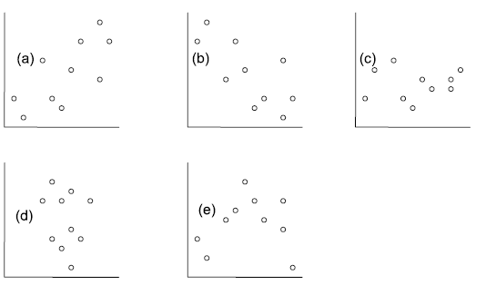


Bei der Pearson-Korrelation betrachtet man die beiden Parameter Kovarianz (reicht von −∞ bis +∞) und die Korrelation, welche die Kovarianz auf den Bereich von --1 bis +1 standardisiert. Pearsons Korrelationskoeffizient r ist der Schätzer für die Korrelation basierend auf der Stichprobe (Abbildung 2.6).

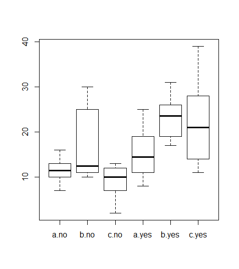{width="4.55in" height="1.9369477252843394in"}

Abbildung 2.6. Definition von Kovarianz und Pearson Korrelation (griechische Buchstaben beziehen sich auf den Wert in der Grundgesamtheit, römische auf den Schätzwert basierend auf der Stichprobe).

Die implizite Nullhypothese (H~0~) ist nun ρ = 0. Die Teststatistik ist das uns schon bekannte *t* mit $t = \ \frac{r}{s_{r}}$ , wobei *s~r~* für den Standardfehler von *r* steht und bei *n* -- 2 Freiheitsgraden getestet wird.

Die Pearson-Korrelation ist die parametrische Variante der Korrelationen. Ihre Anwendung hat zwei Voraussetzungen (in Klammern ist angegeben, wie man ihr Vorliegen visuell überprüfen kann):

- Linearität (Überprüfung mit einem *xy*-Scatterplot)
- Bivariate Normalverteilung (Überprüfung mit Boxplots beider Variablen)

Wenn diese Voraussetzungen ungenügend erfüllt sind, kann man auf nicht-parametrische Äquivalente ausweichen. Diese testen auf monotone, nicht auf lineare Beziehungen, liefern allerdings keine exakten Ergebnisse bei Bindungen (d. h. wenn der gleiche Wert mehrfach vorkommt):

- Für 7 ≤ *n* ≤ 30: **Spearman-Rang-Korrrelation (*r~s~*)** (im Prinzip Pearsons *r* für rangtransformierte Daten)
- Für *n* \> 30: **Kendall's tao (τ)**

Hier noch der R Code für alle drei Möglichkeiten:

```{.r}
cor.test(df$Speciesrichness, df$N.deposition, method = "pearson")
cor.test(df$Speciesrichness, df$N.deposition, method = "spearman")
cor.test(df$Speciesrichness, df$N.deposition, method = "kendall")
```

## Einfache lineare Regressionen

### Idee

Einfache lineare Regressionen sind konzeptionell und mathematisch ähnlich zu Pearson-Korrelationen. Oft werden beide Verfahren daher fälschlicherweise auch begrifflich durcheinandergeworfen. Der **entscheidende Unterschied** ist, dass wir für eine Regression eine **theoretisch vermutete Kausalität** haben müssen. Damit haben wir, anders als bei einer Korrelation, eine fundamentalte Unterscheidung in:

- ***X*: unabhängige Variable** (*independent variable*), Prädiktorvariable (*predictor*)
- ***Y*: abhängige Variable** (*dependent variable*), Antwortvariable (*response*)

Bei Visualisierungen ist zu beachten, dass die unabhängige Variable immer auf der *x*-Achse dargestellt wird, die abhängige dagegen auf der nach oben gerichteten *y*-Achse.

Mathematisch wird eine lineare Regression analysiert, indem die bestangepasste Gerade durch die Punktwolke des *xy*-Scatterplots gelegt wird. Dabei sieht das lineare Modell folgendermassen aus:

- **Geradengleichung**: $y = b_{0} + b_{1}x$
- **Statistisches Modell**: $y_{i} = \beta_{0} + \beta_{1}x_{i} + \epsilon$, wobei $\epsilon_{i}$ das Residuum des *i*-ten Daten­punktes ist, d. h. seine vertikale Abweichung vom vorhergesagten Wert

Mit einer einfachen linearen Regression testet man die folgenden beiden Nullhypothesen:

- $H_{0}$: $\beta_{0} = 0$ (Achsenabschnitt \[*intercept*\] der Grundgesamtheit ist Null) (diese erste Nullhypothese ist, ähnlich wie bei Varianzanalysen, in den meisten Fällen wissenschaftlich nicht relevant)
- $H_{0}$: $\beta_{1} = 0$ (Steigung \[*slope*\] der Grundgesamtheit ist Null)

Die folgende Abbildung veranschaulicht die verschiedenen Möglichkeiten:

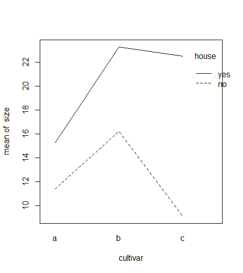{width="5.85in" height="1.8674114173228347in"}

Abb. Visualisierung, wie die Beziehung aussähe, abhängig von den Werten der beiden Parameter $_{}$ $_{}$ (aus Logan 2010).

### Statistische Umsetzung

Es mag vielleicht zunächst überraschen, aber ähnlich wie beim Vergleich von Mittelwerten zwischen kategorischen Ausprägungen kategorischer Variablen, liegt auch der linearen Regression eine **Varianzanalyse** zugrunde wie die folgende Tabelle zeigt. Die Bedeutung der verschiedenen Differenzen ist in Abbildung 2.7 visualisiert.

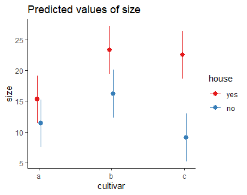{width="6.5in" height="2.4646194225721785in"}

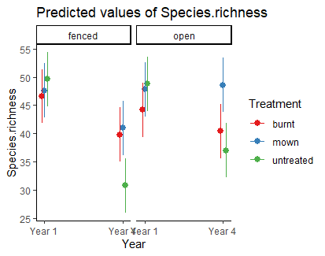{width="6.5in" height="4.72251968503937in"}

Abbildung 2.7. Visualisierung der verschiedenen Differenzen, die in die ANOVA-Tabelle einer linearen Regression einfliessen (aus Quinn & Keough 2002).

Wiederum ist die Teststatistik ein $F$-ratio, nämlich $F = \frac{\text{MS}_{\text{Regressionen}}}{\text{MS}_{\text{Residual}}}$, wobei MS für die mittleren Quadratsummen steht, also die Quadratsummen (SS) geteilt durch die Freiheitsgrade (df). Wie oben unter der Varianzanalyse schon erwähnt, folgt $F$ einer $t^{2}$-Verteilung.

### Implementierung in R

Das Kommando zum Berechnen einfacher linearer Regressionen lautet `lm`. Es legt eine gerade so in die Punktwolke, dass sie Summe der Abweichungsquadrate (quadrierte Residuen) minimal ist. Deswegen wird dieses gängige Regressionsverfahren auch als Ordinary least squares-Methode (OLS) bezeichnet. Wie bei einem Mittelwertvergleich mittels Varianzanalyse gibt es dann zwei verschiedene Ansichten des Ergebnis-Outputs, die jeweils verschiedene Teilaspekte zeigen (hier am Beispiel der Beziehung von Pflanzenartenreichtum zur Stickstoffdeposition):

Die **aov-Ansicht** liefert uns die oben besprochene ANOVA-Tabelle, einschliesslich der Signifikanz der Steigung (hier $$).

```{.r}
 <- lm(Speciesrichness~N.deposition, data = df)
summary.aov() # ANOVA-Tabelle
```

```{.default}
Response: Speciesrichness
             Df Sum Sq Mean Sq F value    Pr(>F)
N.deposition  1 233.91 233.908  28.028 0.0001453 ***
Residuals    13 108.49   8.346
```

Weitere erforderliche Aspekte des Ergebnisses sehen wir in der **summary-Ansicht**:

```{.r}
summary() # Regressionskoeffizienten
```

```{.default}
Coefficients:
             Estimate Std. Error t value Pr(>|t|)
(Intercept)  25.60502    1.26440  20.251 3.25e-11 ***
N.deposition -0.26323    0.04972  -5.294 0.000145 ***
[…]
Residual standard error: 2.889 on 13 degrees of freedom
Multiple R-squared:  0.6831,    Adjusted R-squared:  0.6588
F-statistic: 28.03 on 1 and 13 DF,  p-value: 0.0001453
```

Wie wir sehen, tauchen wiederum der *F*-Wert (28.03) und sogar zweimal der *p*-Wert der Steigung (0.0001) auf, daneben auch der i. d. R. bedeutungslose *p*-Wert des Achsenabschnitts (*intercept*) (3.25 x 10^-11^).

Werfen wir noch einmal einen Blick auf den Output von R:

{width="6.5in" height="1.4942115048118985in"}

Wir benötigen für eine Darstellung der Ergebnisse:

1. **Name des Verfahrens (Methode)**: Einfache lineare Regression (mit der Methode derkleinsten Quadrate).
2. ***Signifikanz (Verlässlichkeit des Ergebnisses)***: p-Wert der Steigung, nicht der p-Wert des Achsenabschnittes (wird nach üblicher Konvention auf drei Nachkommastellen gerundet oder, wenn unter 0.001, dann als p \< 0.001 angegeben).
3. ***Effektgrösse und -richtung (unser eigentliches Ergebnis!)***: Im Falle einer linearen Regression ist das die Funktionsgleichung, die sich aus den Schätzungen der Koeffizienten ergibt.
4. ***Erklärte Varianz (Relevanz des Ergebnisses)***: Wie viel der Gesamtvariabilität der Daten wird durch das Modell erklärt? Ob $R^{2}$ oder $R_{adj.}^{2}$ angegeben werden sollte, wird unterschiedlich gesehen, jedenfalls sollte man explizit sagen, was gemeint ist. *R*² ist übrigens der quadrierte Wert von Pearsons Korrelationskoeffizienten $r$.
5. **ggf. Wert der Teststatistik mit den Freiheitsgraden („Zwischenergebnisse")**: $_{}_{}$.

Ein adäquater Ergebnistext könnte daher wie folgt lauten:

::: {.callout}
Der Artenreichtum nahm hochsignifikant mit der Stickstoffdeposition ab (Funktionsgleichung: $0.$$$, $_{}_{}$, $p0.$, $R^{2} = 0.$.
:::

Bei einem signifikanten Ergebnis bietet sich auch noch eine Visualisierung mittels Scatterplots an, in den die Regressionsgerade geplottet ist:

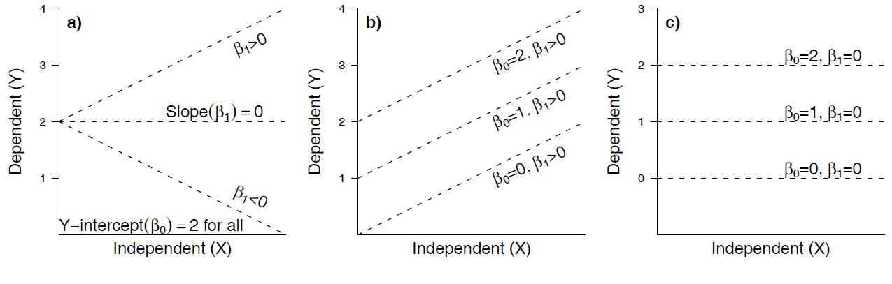{width="4.409254155730534in" height="3.1496062992125986in"}

### Voraussetzungen

Einfache lineare Regressionen basieren auf drei Voraussetzungen:

1. **Linearität**
2. **Normalverteilung** (der Residuen!)
3. **Varianzhomogenität**

Für das meistverwendete **Verfahren der kleinsten Abweichungsgquadrate** (wie bislang besprochen; ***ordinary least squares* = OLS** **= Befehl lm in R**), auch als **Modell I-Regressionen** bezeichnet, muss zudem gelten:

4. **Feste *x*-Werte**, d. h.

   - *x*-Werte vom Experimentator gesetzt ODER
   - Fehler in den *x*-Werten viel kleiner als in den *y*-Werten

- **Sowie auch für folgende Fälle**:

   - Hypothesentest $H_{0}:\beta_{1} = 0$ im Fokus, nicht der exakte Wert von β\~1
   - Für prädiktive Modelle
   - Wenn keine bivariate Normalverteilung vorliegt

### Alternativen zur Methode der kleinsten Quadrate (OLS)

In den allermeisten Fällen wird in der Praxis angenommen, dass eine der Möglichkeiten unter dem vorstehenden Punkt 4 zutrifft, mithin also OLS/lm zur Anwendung kommen kann. Wenn keine der oben unter Punkt 4 genannten Voraussetzungen erfüllt ist, dann sollte eine sogenannte **Modell-II-Regression (Nicht-OLS-Regression)** durchgeführt werden. Hier stehen als Möglichkeiten die *Major axis regression*, die *Ranged major axis regression* und die *Reduced major axis regression* zur Verfügung., die wir aber im Kurs nicht weiter besprechen. Details finden sich in Logan (2010: 173--175), woraus aus Abbildung 2.8 stammt:

{width="5.2in" height="4.069564741907262in"}

Abbildung 2.8. Visualisierung der Anwendung verschiedener Regressionstechniken auf den gleichen Datensatz (aus Logan 2010).

In R stehen solche Methoden u. a. im Paket `lmodel2` zur Verfügung (hier illustriert für einen fiktionalen Datensatz):

```{.r}
library(lmodel2)
lmodel2(b~a)
```

```{.default}
Regression results
  Method Intercept     Slope Angle (degrees) P-perm (1-tailed)
1    OLS  5.019254 0.4170422        22.63820                NA
2     MA  4.288499 0.4648040        24.92919                NA
3    SMA  3.067471 0.5446097        28.57314                NA
```

Wie man sieht, unterscheiden sich die beiden Modell-II-Ergebnisse deutlich von Modell I (OLS) bezüglich Achsenabschnitt, Steigung und damit auch Winkel.

## Polynomische Regressionen

Eine quadratische Regression (Polynom 2. Ordnung) ist die einfachste Möglichkeit, eine sogenannte unimodale (*hump shaped*) Beziehung von abhängiger zur unabhängigen Variablen mathematisch abzubilden. Unimodal/*humpshaped* meint, dass die Kurve ein Maximum hat, d. h. die abhängige Variable für mittlere Werte der Prädiktorvariablen den höchsten Wert aufweist. Für viele Beziehungen sind solche unimodalen Kurvenverläufe theoretische vorhergesagt und/oder theoretisch nachgewiesen. In der Ökologie gilt das z. B. für die Beziehung des Artenreichtums zu so unterschiedlichen Faktoren wie Störungshäufigkeit (*intermediate disturbance hypothesis*, IDH), Boden-pH-Wert und Produktivität/Biomasse.

Das statistische Modell für eine quadratische Beziehung ist:

$$y_{i} = \beta_{0} + \beta_{1}x_{i} + \beta_{2}x_{i}^{2}$$

In R wird eine quadratische Regression folgendermassen codiert:

Wichtig ist, dass man den quadratischen Term im `lm`-Befehl nicht einfach als «`e^2``»` eingeben kann, sondern «`I(e^2)``»` schreiben muss. Eine signifikante unimodale Beziehung ist dann gegeben, wenn die Parameterschätzung für den quadratischen Term (also `e^2`) negativ ist -- man hat eine nach unten offene Parabel. Ist der quadratische Term dagegen signifikant positiv, hat man eine nach oben offene Parabel, also eine u-förmige Beziehung (Minimum für die abhängige Variable bei intermediären Werten der Prädiktorvariablen).

Wichtig ist, dass man wie bei allen statistischen Modellen nachträglich die Modellvoraussetzungen prüft. Betrachten wir das jetzt für die simulierten Daten f und e, ohne Berücksichtigung eines quadratischen Terms, also f\~e. Gezeigt sind die Ergebnisdarstellung des Modells (samt Code) und die vier Residualplots.

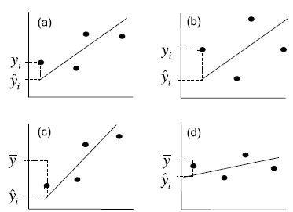{width="5.2in" height="2.9038035870516183in"}

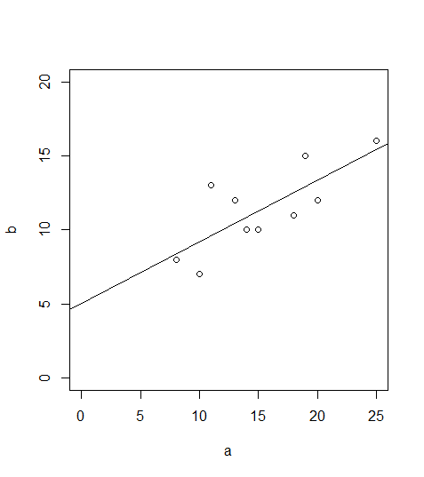{width="5.2in" height="3.5619991251093612in"}

Man ahnt schon im Scatterplot mit der gefitteten einfachen linearen Regression, dass das verwendete Modell für die Daten nicht adäquat ist, was durch die Bananenform im Residualplot links oben unterstrichen wird: die Beziehung ist evident nicht linear.

Wenn man einen quadratischen Term hinzufügt, also f\~e + I(e\^2), sieht man schon im Scatterplot mit der gefitteten Funktion, dass es viel besser passt, aber erst recht in den Residualplots. Mit `predict` kann man jede Funktion plotten, die als Ergebnis einer Regressionsanalyse herauskommt. Im Prinzip zerlegt man die *x*-Achse in viele kleine Segmente und plottet dann jeweils Geraden zwischen zwei aufeinander folgenden vorhergesagten Punkten:

{width="5.2in" height="2.9038035870516183in"}

{width="5.2in" height="3.5619991251093612in"}

Bezüglich des statistischen Vorgehens ist zu beachten, dass man den quadratischen Term nur im Modell behalten sollte, wenn er signifikant ist. Wenn das Modell nur einen quadratischen Term beinhaltet, gibt der *p*-Wert aus `summary`` `für diesen die Signifikanz an, (ansonst ggf. mit `anova` testen oder mit AICc-Werten vergleichen, siehe später). Dagegen muss der lineare Term (hier: e) dann beibehalten werden, wenn der quadratische Term signifikant ist, selbst wenn der lineare Term nicht signifikant ist. (Wenn beide nicht signifikant sind, fallen dagegen beide raus).

Wenn es theoretische Gründe gibt, kann man in gleicher Weise auch Polynome höherer Ordnung implementieren. Wichtig ist, im Hinterkopf zu behalten, dass eine polynomische Regression fast immer eine deutliche Simplifizierung der Realität darstellt. Sie ist ein probates und einfaches Mittel, um zu testen, ob die Beziehung signifikant unimodal ist. Dagegen ist sie problematisch als prädiktives Modell, da sie oft negative Werte für die abhängige Variable voraussagt, zumindest ausserhalb des gefitteten Bereichs. Negative Werte sind aber vielfach theoretisch unmöglich (z. B. Artenzahlen, Stoffkonzentrationen,...).

## Kovarianzanalyse (ANCOVA)

Wie wir schon bei "Lineare Modelle allgemein" in Statitik 2 gesehen haben, lassen sich metrische und kategoriale Variablen in einem einzigen linearen Modell kombinieren. Eine ANCOVA macht genau dieses, ist also im Prinzip eine Kombination aus ANOVA und linearer Regression. Stellen wir uns vor, wir hätten einen Datensatz von Körpergewichten von Kindern unterschiedlichen Alters (age: metrisch) und Geschlechts (sex: kategorial/binär, dargestellt als blau und rot). Eine ANCOVA testet nun, ob und wie sich das Gewicht in Abhängigkeit von beiden Faktoren verhält. Dabei gibt es im Prinzip sechs verschiedene Möglichkeiten/Ergebnisse, siehe Abbildung 3.1.

:::{layout-ncol="2"}
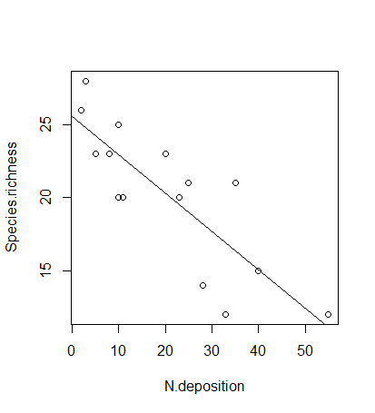{width="3.25in" height="1.7408038057742783in"}

(a) age: \*, sex: \*, age:sex: \*

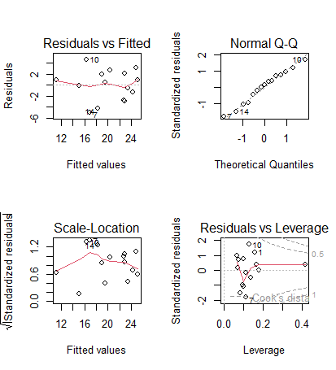{width="3.25in" height="1.7408038057742783in"}

(b) age: \*, sex: \*, age:sex: n.s.

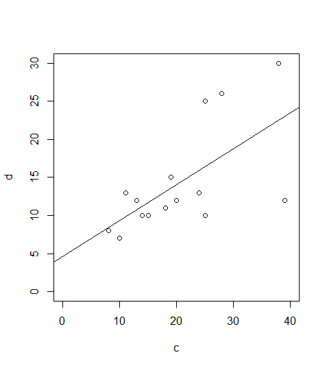{width="3.25in" height="1.7408038057742783in"}

(c) age: \*, sex: n.s., age:sex: \*

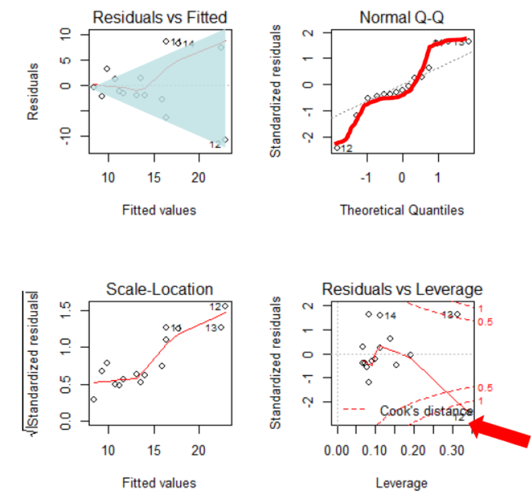{width="3.25in" height="1.7408038057742783in"}

(d) age: n.s., sex: \*, age:sex: n.s.

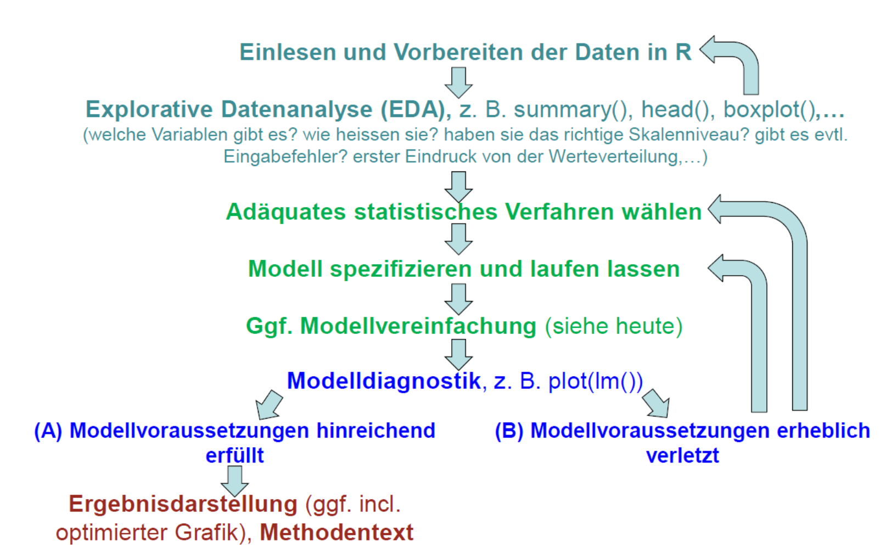{width="3.25in" height="1.7408038057742783in"}

(e) age: \*, sex: n.s., age:sex: n.s.

{width="3.25in" height="1.7408038057742783in"}

(f) age: n.s., sex: n.s., age:sex: n.s.
:::

Abbildung 3.1: Visualisierung der sechs möglichen Ergebnisse einer ANCOVA mit einem kategorialen und einem metrischen Prädiktor. (aus Crawley 2015).

Wie andere lineare Modelle auch, kann man eine ANCOVA mittels `aov` oder mittels `lm` spezifizieren. Es ist zu beachten, dass hier die Reihenfolge der Variablen wichtig ist:

Im vollen Modell (*full model,* *global model*) wurden vier Parameter gefittet (2 Steigungen und 2 Achsenabschnitte). Das haben wir durch das "\*"-Zeichen spezifiziert. Dieses sagt, dass nicht nur Alter und Geschlecht unabhängig voneinander einen (additiven) Effekt haben, sondern dass der Effekt des Alters je nach Geschlecht unterschiedlich sein könnte, also die Gewichtszunahme mit zunehmendem Alter je nach Geschlecht unterschiedlich sein kann. Jedoch sind oft nicht alle gefitteten Parameter bedeutsam. Es ist daher wichtig, das Modell so lange zu vereinfachen, bis nur noch bedeutsame Parameter übrig sind. Dann hat man das minimal adäquate Modell.

Für die **Modellvereinfachung** gibt es unterschiedliche Strategien (mehr dazu später bei den "Multiplen linearen Regressionen"). Man muss jedenfalls schrittweise vorgehen, d. h. immer nur einen Parameter löschen und dann das neue Modell anschauen. Von den Parametern, welche nicht signifikant sind, könnte man z. B. zunächst den am wenigsten signifikanten löschen und dann das neue Model betrachten, usw.

Alternativ kann man auch ANOVAs zum Vergleich zweier unterschiedlich komplexer Modelle verwenden. Das klingt zunächst schräg, da wir bislang ANOVAs verwendet haben, um innerhalb eines Modelles zu sehen, ob etwa die durch die Steigung erklärte Varianz signifikant ist. Den gleichen Ansatz kann man aber auch verwenden, um zwei unterschiedlich komplexe Modelle miteinander zu vergleichen, um zu sehen, ob die durch das komplexere Modell zusätzlich erklärte Varianz signifikant ist. Wichtig ist dabei, dass das eine Modell im anderen geschachtelt ist:

Das komplexere Modell ist jenes mit der Interaktion, das einfachere jenes ohne die Interaktion, da dort eine einheitliche Gewichtszunahme mit dem Alter angenommen wird. Wenn die ANOVA nun ein signifikantes Ergebnis liefert, heisst das, dass der zusätzliche Parameter des komplexeren Modells (die Interaktion Alter x Geschlecht) mehr erklärt als zufällig zu erwarten wäre und daher beibehalten werden sollte. Wenn die ANOVA ein nicht-signifikantes Ergebnis liefert, sollten wir uns für das einfachere Modell (jenes mit «+» statt mit «\*») entscheiden.

## Lineare Modelle allgemein

### Was macht ein lineares Modell aus?

Die meisten statistischen Verfahren, die wir bis zu diesem Punkt angeschaut haben, gehören zu den **linearen Modellen**. Dieser Begriff wird häufig weitgehend synonym mit "parametrischen Verfahren" verwendet, ist aber treffender. Von den bisherigen Verfahren gehören die folgenden zu den linearen Modellen:

- Pearson-Korrelation
- *t*-Test
- Varianzanalyse
- Einfache lineare Regression

Was macht nun lineare Modelle aus:

- Voraussetzungen: **Normalverteilung der Residuen und Varianzhomogenität**
- In R kann man sie (mit Ausnahme der Pearson-Korrelation) mit dem **Befehl lm** abbilden (ja, auch die Varianzanalyse!)
- Varianzanalysen und lineare Regressionen nutzen beide **ANOVA-Tabellen mit *F*-ratios** als Testverfahren
- Lineare Modelle lassen sich als **Linearkombination der Prädiktoren** schreiben, d. h.:
   - Prädiktoren werden *nicht* als Multiplikator, Divisor oder Exponent anderer Prädiktoren verwendet
   - die Beziehung muss aber *nicht zwingend linear* sein.

### Welche Verfahren gehören zu den linearen Modellen?

Neben den schon besprochenen einfachen Verfahren gehören auch eine ganze Reihe komplexerer Vefahren zu den linearen Modellen, die aber alle den vorstehenden Bedingungen entsprechen. Die meisten werden wir in Statistik 3 besprechen. Logan (2010: 165) hat eine recht umfassende folgende Übersicht erstellt (einschliesslich einiger Spezialfälle, die wir im Kurs nicht behandeln). Darin sind metrische Prädiktoren als x, x1 und x2 bezeichnet, kategoriale als A bzw. B. Was unter *R Model formula* steht, würde im jeweiligen Fall in die Klammern des lm-Befehls gesetzt (siehe Abbildung 2.9).

{width="5.309843613298337in" height="8.077272528433946in"}

Abbildung 2.9. Übersicht über die Vielzahl an linearen Modellen (Befehle lm, aov) in R möglich ist. Man beachte, dass in der R-Syntax «/» und «\*» nicht für Divisionen oder Multiplikationen steht, sondern für Schachtelungen bzw. den Einschluss von Interaktionen.

### Testen der Voraussetzungen von linearen Modellen (Modelldiagnostik)

Wie geschrieben, haben lineare Modelle bestimmte Voraussetzungen. Selbst wenn lineare Modelle recht robust gegen Verletzungen der Vorassetzungen sind, so muss man doch jedes Mal, nachdem man ein lineares Modell gerechnet hat, prüfen, ob die Voraussetzungen erfüllt waren. Es geht hier primär um die Voraussetzungen Varianzhomogenität, Normalverteilung der Residuen und Linearität.

Wichtig ist, zu verstehen, dass man zunächst das lineare Modell rechnen muss und erst nachträglich prüfen kann, ob die Voraussetzungen erfüllt waren. Das liegt daran, dass die Kernannahmen Varianzhomogenität und Normalverteilung der Residuen sich auf das Modell, nicht auf die Originaldaten beziehen. Einzig für *t-*Tests und ANOVAs kann man diese beiden Punkte auch in der explorativen Datenanalyse vor dem Berechnen des Modells erkunden, für lineare Regressionen und komplexere Modelle geht das nicht. Wenn der nachträgliche Test zeigt, dass eine der Voraussetzungen schwerwiegend verletzt war, bedeutet das, dass man das Modell neu spezifizieren muss, etwa durch eine geeignete Transformation der abhängigen Variablen.

Das **Überprüfen der Voraussetzungen (= Modelldiagnostik)** erfolgt visuell mittels der sogenannten Residualplots, die man mit dem generische plot-Befehl bekommt, wenn man als Argument das Ergebnis eines linearen Modells hat. Man bekommt dann vier Plots, die man am besten in einem 2 x 2-Arrangement ausgibt (das macht der erste Befehl):

```{.r}
par(mfrow = c(2, 2)) # 4 Plots in einem Fenster
plot(lm)
```

Betrachten wir zwei Fälle, zunächst das Beispiel von eben:

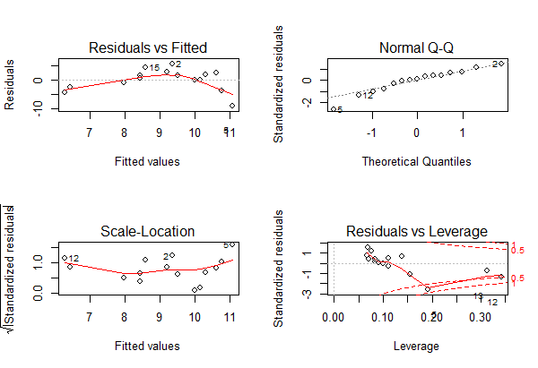{width="3.25in" height="3.5805074365704286in"}

und die zugehörigen Residualplots:

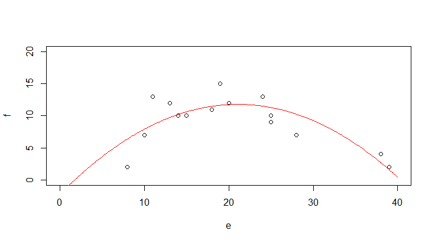{width="3.4705872703412073in" height="3.8235290901137358in"}

In diesem Fall ist **alles OK**. Man muss vor allem die oberen beiden Teilabbildungen betrachten. Links oben kann man gut erkennen, wenn Linearität oder Varianzhomogenität verletzt wären, rechts oben dagegen, wenn die Normalverteilung der Residuen verletzt wäre. Zu berücksichtigen ist, dass reale Daten nie perfekt linear, varianzhomogen und normalverteilt sind.

Uns interessieren nur **massive Abweichungen**. Wir würden sie wie folgt erkennen:

- **Linearität:** Eine Verletzung erkennen wir in der linken oberen Abbildung, wenn wir eine **"Wurst" bzw. "Banane"** sehen, also wenn die linken Punkte alle unter der gepunktelten Linie, die mittleren alle darüber und die rechten wieder alle darunter lägen (oder umgekehrt).
- **Varianzhomogenität:** Eine Verletzung erkennen wir in der linken oberen Abbildung, wenn die Punktwolke einen starken **Keil** (meist nach rechts offen) beschreibt.
- **Normalverteilung der Residuen:** Eine Verletzung erkennen wir in der rechten oberen Abbildung, wenn die Punkte sehr stark von der gestrichelten Linie abweichen, insbesondere wenn sie eine ausgeprägte **Treppenkurve** bilden.

Die beiden unteren Abbildungen sind für die Diagnostik weniger wichtig. Links unten haben wir eine skalierte Version der Abbildung links oben. Die Abbildung rechts unten zeigt uns, ob bestimmte Datenpunkte übermässigen Einfluss auf das Gesamtergebnis haben. Das wären Punkte mit einer *Cook's distance* über 0.5 und insbesondere über 1. In solchen Fällen sollten wir noch einmal kritisch prüfen, ob (a) evtl. ein Eingabefehler vorliegt und (b) der bezeichnete Punkt wirklich zur Grundgesamtheit gerechnet werden sollte. Wenn aber beide Aspekte nicht zu beanstanden sind, dann gibt es auch keinen Grund, den entsprechenden Datenpunkt auszuschliessen; wir müssen uns nur bewusst sein, dass er das Gesamtergebnis überproportional beeinflusst.

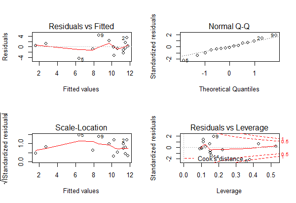{width="2.923145231846019in" height="3.2914337270341205in"}

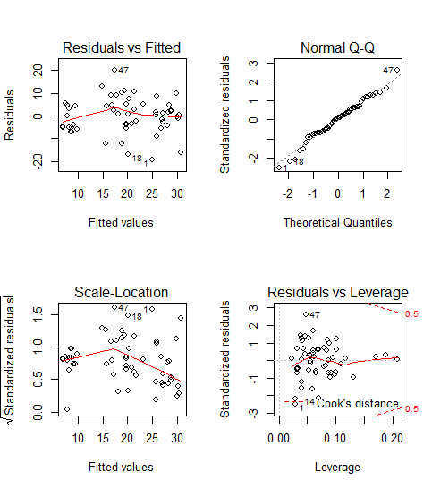{width="5.094950787401575in" height="4.721438101487314in"}

Abbildung 2.10: Die Modellvoraussetzungen sind klar nicht erfüllt.

Zum Schluss kommt noch ein Beispiel, bei dem die Modellvoraussetzungen einer linearen Regression klar nicht erfüllt sind (Abbildung 2.10): (a) es liegt starke **Varianzinhomogenität** vor (links oben als nach rechts offener Keil erkennbar, links unten als klar ansteigende Kurve); (b) die **Normalverteilung der Residuen ist auch nicht gegeben** (im Q-Q-Plot rechts oben weichen die Punkte stark von der theoretischen Kurve ab und bilden stattdessen eine Treppenkurve). Schliesslich sehen wir rechte unten auch noch, dass es einen extrem **einflussreichen Datenpunkt** mit *Cook's distance* \> 1 und einen weiteren mit *Cook's distance* \> 0.5 gibt.

In diesem Fall schlussfolgern wir, dass das **Modell fehlspezifiziert** war. Da die Varianz mit dem Mittelwert zunimmt, während zugleich keine Null-Werte unter der abhängigen Variablen auftreten, wäre eine Logarithmus-Transformation der abhängigen Variablen hier vermutlich ein zielführendes Vorgehen. Dieses sollten wir ausprobieren und anschliessend wiederum die Residualplots betrachten.

## Genereller Ablauf einer statistischen Analyse

Abschliessend sei der generellen Ablauf einer statistischen Analyse noch einmal schematisch zusammengefasst,, wie er für alle schon besprochenen und auch alle noch kommenden Verfahren gilt:

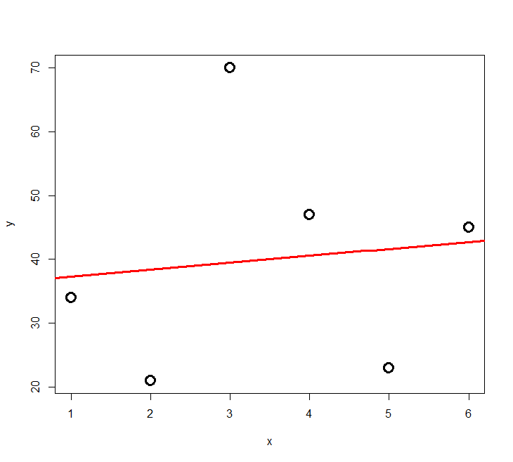{width="5.85in" height="3.6752777777777776in"}

Ein zentrales Element ist die Modelldiagnostik, die wir gerade behandelt behandelt haben. Leider wird sie oft vergessen! Basierend auf den Ergebnissen der Modelldiagnostik kann man entweder die Ergebnisse fertigstellen oder aber man muss zu den initialen Schritten zurückgehen. Möglicherweise war das gewählte statistische Verfahren schon nicht adäquat oder das Verfahren war in Ordnung, nur die Details der Spezifizierung (etwa Transformationen von Daten) müssen nachgebessert werden.

## Zusammenfassung

::: {.callout}
- **Korrelationen** testen auf einen linearen Zusammenhang zwischen zwei metrischen Variablen, **ohne Kausalität anzunehmen.**
- Einfache **lineare Regressionen** machen das Gleiche unter Annahme eines **gerichteten Zusammenhangs** (d. h. wenn es eine unabhängige und eine abhängige Variable gibt).
- Sowohl lineare Regressionen als auch ANOVAs gehören zu den **linearen Modellen** und können in R mit dem **Befehl lm** spezifiziert werden.
- Ob eine bestimmte statistische Analyse zulässig war, kann man oft erst nach der Durchführung anhand der Residualplots/Diagnostikplots entscheiden. Wenn sich dabei zeigt, dass Voraussetzungen schwerwiegend verletzt wurden, muss man die Modellspezifikationen ändern.
:::

## Weiterführende Literatur

- **Crawley, M.J. 2015. *Statistics -- An introduction using R*. 2nd ed. John Wiley & Sons, Chichester, UK: 339 pp.**
   - **Chapter 7 -- Regression: pp. 114--139**
   - **Chapter 8 -- Analysis of Variance: pp. 150--167**
- Fox, J. & Weisberg, S. 2019. *An R companion to applied regression*. 3rd ed. SAGE Publications, Thousand Oaks, CA, US: 577 pp.
- Logan, M. 2010. *Biostatistical design and analysis using R. A practical guide*. Wiley-Blackwell, Oxford, UK: 546 pp.
   - pp. 151-166 (lineare Modelle)
   - pp. 167-207 (Korrelation und einfache lineare Regression)
- Quinn, G.P. & Keough, M.J. 2002. *Experimental design and data analysis for biologists*. Cambridge University Press, Cambridge, UK: 537 pp.
- Warton, D.I. & Hui, F.K.C. 2011. The arcsine is asinine: the analysis of proportions in ecology. *Ecology* 92: 3--10.
- Wilson, J.B. 2007. Priorities in statistics, the sensitive feet of elephants, and don't transform data. *Folia Geobotanica* 42: 161--167.
