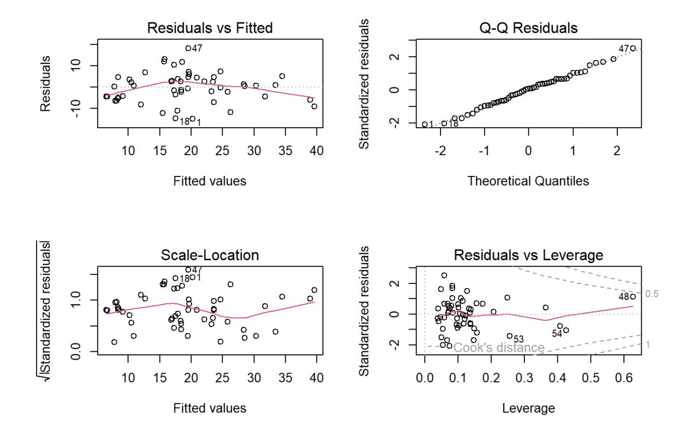
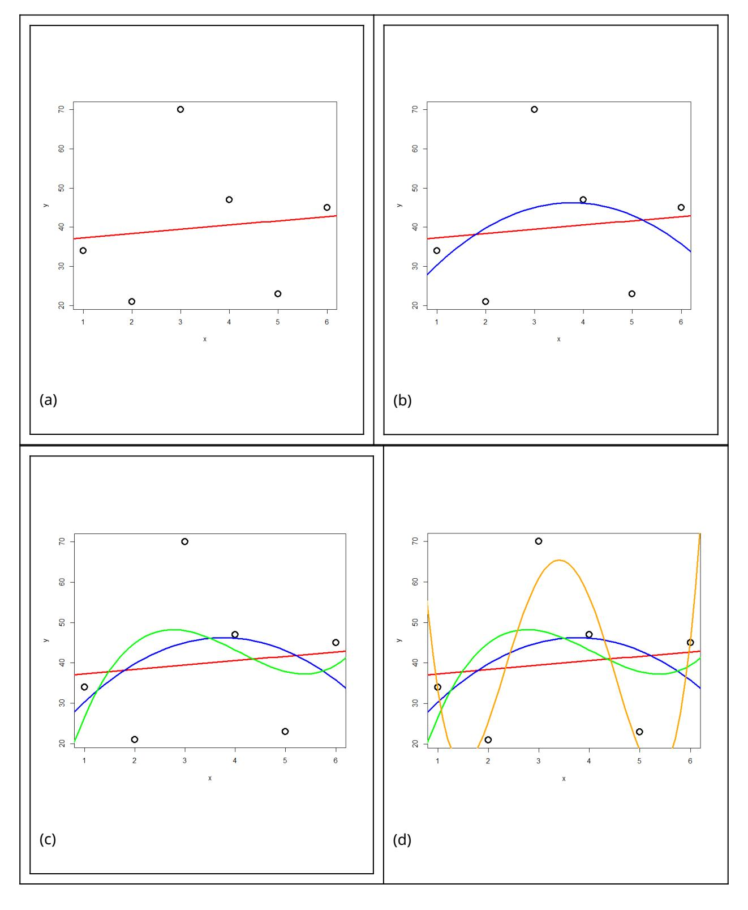
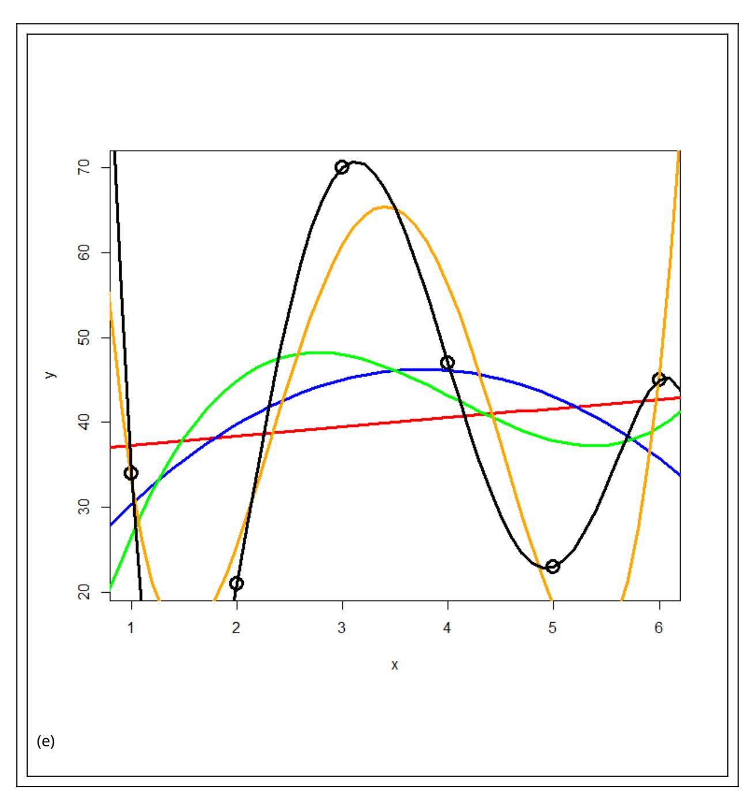
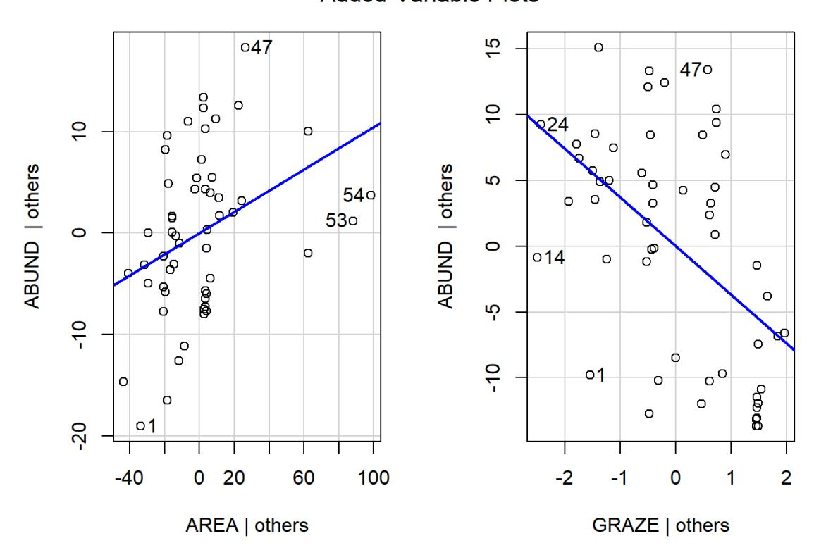

In Statistik 4 geht es um multiple Regressionen, die versuchen, eine abhängige Variable durch zwei oder mehr verschieden Prädiktorvariablen zu erklären. Wir thematisieren verschiedene dabei auftretende Probleme und ihre Lösung, insbesondere den Umgang mit korrelierten Prädiktoren und das Aufspüren des besten unter mehreren möglichen statistischen Modellen. Hieran wird auch der *informatian theoretician*-Ansatz der Statistik und die *multimodel inference* eingeführt.

## Lernziele

##### Ihr…

- könnt **lineare Regressionen mit mehreren Prädiktoren** in R implementieren und wisst, welche Aspekte ihr bei der Modellspezifikation und bei der Auswahl des "besten" Modells beachten müsst;
- wisst, warum **Kolinearität von Prädiktoren** in multiplen Regressionen ein Problem ist und wie ihr es lösen könnt; und
- kennt die Gütemasse des *information theoretician approach* und könnt sie interpretieren.

#### Multiple lineare Regressionen

#### Vorgehen

Analog zur mehrfaktoriellen ANOVA, sind multiple lineare Regressionen lineare Regressionen mit mehreren Prädiktoren. Das statistische Modell lautet also folgendermassen (wobei  $x_1 \dots x_j$  metrische Variablen sind):

In R wird das wie folgt codiert:

```{.r}
model1 <- lm(y \sim x1 + x2 + x3, data = mydata)
```

Möglich sind aber auch folgende komplexere Modelle:

```{.r}
model2 <- lm(y \sim x1 + x2 + I(x2^2), data = mydata)
model3 <- lm(y \sim x1 + x2 + log10(x3), data = mydata)
model4 <- lm(y \sim x1 + x2 + x1:x2, data = mydata)
```

Und für ein konkretes Beispiel (Abhängigkeit der Vogelabundanz in isolierten Waldinseln von verschiedenen Umweltvariablen (AREA = Fläche, AGE = Alter, DIST = Entfernung zum nächsten Waldstück, LDIST = Entfernung bis zum nächsten grösseren Waldstück, GRAZE = Beweidungsintensität, ALT = Meereshöhe):

```{.r}
Im_1 <- Im(ABUND ~ AGE + AREA + DIST + LDIST + GRAZE + ALT, data = loyn)
summary(Im_1)</pre>
```

Coefficients:

Estimate Std. Error t value Pr(>|t|)

(Intercept) 1.749e+01 6.599e+00 2.650 0.0109 \*

AGE -9.155e-02 5.430e-02 -1.686 0.0985.

AREA 1.232e-01 4.173e-02 2.953 0.0049 \*\*

DIST 3.751e-03 5.083e-03 0.738 0.4642

LDIST -5.331e-05 1.335e-03 -0.040 0.9683

GRAZE -1.783e+00 1.181e+00 -1.510 0.1378

ALT 4.731e-02 2.900e-02 1.631 0.1095

Und wie immer schauen wir die Residualplots an, die eigentlich ziemlich gut aussehen:

```{.r}
par(mfrow=c(2, 2))
plot(lm_1)
```



Allerdings dürfen wir uns hier im Falle einer multiplen Regression noch nicht zufrieden zurücklehnen, sondern müssen uns zunächst noch zwei potenziellen Problemen annehmen: (1) Korrelation zwischen den Prädiktoren und (2) Overfitting.

#### Problem 1: Korrelation zwischen den Prädiktoren

Damit lm verlässliche Parameterschätzungen liefern kann, müssen die Prädiktoren (hinreichend) **unabhängig** (man spricht auch von: orthogonal) sein. Das muss man vor dem Fitten des Models testen und dann von Paaren hochkorrelierter Variablen jeweils eine ausschliessen.

Es gibt zwei gängige Testmöglichkeiten:

- **Korrelationmatrix:** nur Parameter mit einem Korrelationskoeffizenten von **| r| < 0.7** werden beibehalten (manchmal findet man auch andere Schwellenwerte, etwa 0.6 oder 0.75: wie eigentlich alles in der Statistik, ist es keine Schwarz-weiss-Welt). 1.
- *Variance inflation factor* **(VIF):** , mit aus dem Modell Prädiktor *i* gegen alle übrigen Prädiktoren 2.

Der VIF sagt uns, dass der Standardfehler (SE) des Prädiktors um grösser ist als im orthogonalen Fall. Oder in anderen Worten: je höher der VIF eines Prädiktors, desto problematischer ist seine Schätzung wegen der Korrelationen mit anderen Prädiktoren. Meist werden Variablen bis , manchmal bis akzeptiert.

Die Berechnung der Korrelationsmatrix geht in R sehr einfach (hier für den Datensatz loyn):

```{.r}
cor <- cor(loyn[, 2:7])
```

cor

Das Ergebnis ist allerdings unübersichtlich. Man kann es vereinfachen, indem man die Nachkommastellen reduziert und nur jene Werte darstellt, die über dem selbstgewählten Schwellenwert (hier 0.6) liegen.

cor[abs(cor)<0.6] <- NA cor

AREA AGE DIST LDIST GRAZE ALT

AREA 1 NA NA NA NA NA

AGE NA 1.000 NA NA 0.661 NA

DIST NA NA 1 NA NA NA

LDIST NA NA NA 1 NA NA

GRAZE NA 0.661 NA NA 1.000 NA

ALT NA NA NA NA NA 1

Keine der Variablen ist mit einer anderen mit |*r*| ≥ 0.7 korreliert. Nach gängigem Verständnis könnten wir also alle sechs im vollen Modell behalten. Wenn man die Schwelle bei 0.6 ansetzen würde, müsste man also von den beiden Variablen GRAZE und AGE eine aus dem Modell entfernen, da sie relativ stark positiv korreliert sind. Dabei sind drei Dinge wichtig:

- Statistisch gibt es kein klares Argument, welche von mehreren hochkorrelierten Variablen man im vollen Modell streichen sollte (man könnte höchstens zusätzlich den VIF heranziehen). Inhaltlich macht es Sinn, diejenige Variable beizubehalten, die (a) besser interpretierbar ist oder (b) häufiger in vergleichbaren Studien gebraucht wurde.
- Man sollte im Methodenteil dokumentieren welche Variable(n) wegen positiver/negativer Korrelation mit welcher anderen aus dem vollen Modell gestrichen wurden.
- Bei der Interpretation der Ergebnisse stehen die beibehaltenen Variablen auch für die jeweils gestrichenen hochkorrelierten Variablen (zumindest zu einem erheblichen Teil).

Die Berechnung der VIF's (Variance inflation factors) geht wie folgt:

```{.r}
library(car) vif(lm_1)
```

AGE AREA DIST LDIST GRAZE ALT

1.874993 1.763605 1.220125 1.465810 2.784577 1.346572

Hier sieht man nicht, welche Variable mit welcher anderen korreliert ist, man bekommt nur ein Gesamtranking. Da die VIF-Werte allersechs Variablen unter 5 sind, können alle beibehalten werden. Wenn mehrere Variablen einen VIF > 5 haben, muss man schrittweise immer die Variable mit dem höchsten VIF-Wert entfernen und die VIF-Werte dann neuberechnen. Sie ändern sich, wenn eine Variable wegfällt, da sie die Gesamt-Korrelationsstruktur des Datensatzes widerspiegeln.

#### Problem 2: Overfitting

Das Problem des Overfitting soll mit der folgenden Simulation veranschaulicht werden: zu einer Stichprobe von sechs Beobachtungen mit zwei numerischen Variablen werden schrittweise polynomische Modelle höher Ordnung gefittet.





Abbildung 3.3: Overfitting. Die Simulation zeigt, dass die Anpassung des Models an die Daten immer besser wird, je komplexer ich das Modell mache (R2 steigt), in diesem Fall mit der Hinzunahme höherer Polynome.

Das Ergebnis ist in [Abbildung 3.2](#page-93-1) und [Abbildung 3.3](#page-93-2) ersichtlich. Wir sehen, dass die erklärte Varianz kontinuierlich vom 2-Parameter-Modell (Achsenabschnitt und Steigung) zum 6-Parameter-Modell (Achsenabschnitt, Parameter für bis ) zunimmt. Ein polynomisches Modell ()-ter Ordnung erzielt immer 100% Anpassung and die Daten (), wenn man Beobachtungen hat. Aber ist das Modell deswegen auch besonders korrekt oder aussagekräftig? Das darf bezweifelt werden. Ein gutes Modell wäre ja eines, welches die zugrunde liegende Gesetzmässigkeit erkennt und daher auch für die Interpolation und Extrapolation geeignet ist.

Es zeigt sich, dass die gute Anpassung an die Daten (good fit, hier gemessen als R2) nur der eine Aspekt eines guten Modells ist. Zugleich sollte es möglichst einfach (*parsimonous*) sein, d. h. das Beobachtete mit möglichst wenigen Annahmen erklären. Es gilt das folgende Prinzip, das auf den mittelalterlichen Philosophen Willliam of Ockham (ca. 1288–1347 zurückgeht).


(Skizze aus einer Handschrift von Ockhams Summa logicae)

Ockham's razor = *Law of parsimony* (Sparsamkeitsprinzip)

*Wesenheiten dürfen nicht über das Notwendige hinaus vermehrt werden*

Formulierung von Johannes Clauberg (1622–1665)

#### Modellvereinfachung

Nun stellt sich die Frage, wie wir vom **vollen Modell (***full model, global model***)** also jenem nach Entfernung hochkorrelierter Variablen zum "besten" Modell gelangt, das also eine bestmögliche Kombination von guter Anpassung an die Daten (Fit) und Parsimonie aufweist. Dieses anzustrebende statistische Modell wird auch **minimal adäquates Modell (***minimum adequate model***)** genannt.

Ganz generell gilt: Man sollte **maximal Parameter fitten, besser nur** (wobei *n* = Zahl der Datenpunkte/Beobachtungen und bei auch der Achsenabschnitt [] mitgezählt wird).

Mögliche **Kriterien für das "beste" Modell** (*minimum adequate model*):

- **Höchster** (vgl. ) 1.
- Ist nicht wirklich zielführend, da der "Strafterm" (um den reduziert wird) zu gering ist, um wirklich für Parsimonität zu sorgen, trotzdem sehr gebräuchlich.
- **Schrittweise Modellvereinfachung ausgehend vom "maximalen Modell"** 1.
- Durch: Entfernen von (a) nicht-signifikanten Interaktionen, (b) nichtsignifikanten quadratischen Termen und schliesslich (c) nicht-signifikanten linearen Variablen.

Die schrittweise Modellvereinfachung kann wiederum auf drei verschiedene Weisen geschehen (die meist, aber nicht immer, die gleichen Ergebnisse liefern):

- **Schrittweise die am wenigsten signifikanten Terme entfernen**, bis alle signifikant sind: 1.
- **Mittels** *likelihood ratio***-Test schrittweise Modelle vergleichen** und Terme hinzufügen, wenn signifikant, bzw. entfernen, wenn nicht 2.

```{.r}
lm_1 <- lm(ABUND ~ AGE + AREA + DIST + LDIST + GRAZE + ALT, data = loyn)
drop1(lm_1, test = "F")
lm_2 <- update(lm_1, ~ . - LDIST)
drop1(lm_2, test = "F")
```

Eine **automatische Funktion** zum schrittweisen Hinzufügen (*forward selection*) oder Löschen (*backward selection*) oder beidem verwenden (funktion «step»). 1.

Varianten a bis c sind im Prinzip OK, man muss sich aber bewusst sein, dass gerade bei vielen Variablen dieses schrittweise Vorgehen nicht zwingend das wirklich beste Modell findet, sondern man in einem "lokalen Optimum" landen kann (als Alternative siehe die dredge-Funktion unter "*Information theoretician approach* und *multimodel inference*" weiter unten).

#### Varianzpartitionierung

Wenn man das minimal adäquate Modell gefunden hat, will man oft noch wissen, wie bedeutsam die einzelnen enthaltenen Variablen sind. Bedeutsamkeit/Relevanz haben wir weiter oben als (erklärte Varianz) ausgedrückt. Wir können uns also anschauen, **welche Anteile der erklärten Varianz auf welche Variablen zurückgehen**. Da Variablen (auch nach einem Korrelationstest und Ausschluss der besonders hoch korrelierten) nie völlig orthogonal = unabhängig voneinander sind, verhalten sich die Varianzen nicht additiv. Vielmehr ist die erklärte Varianz in einem Modell mit zwei Variablen meist niedriger als die Summe der Varianzen der beiden Einzelmodelle. In einer Varianzpartitionierung wird die Varianz jeder Variablen daher in eine unabhängige (*independent*, I) und eine gemeinsame (*joint*, J) Komponente zerlegt:

```{.r}
library(relaimpo)
```

```{.r}
lm_1 <- lm(ABUND~YR.ISOL+ AREA + DIST + LDIST + GRAZE + ALT, data = loyn)
metrics <- calc.relimp(lm_1, type = c("lmg", "first"))
cbind(I = metrics$lmg, 
J = metrics$first - metrics$lmg, Total = metrics$first)
```

I J Total

AGE 0.11351597 0.1539730784 0.267489048

AREA 0.17941694 0.1596031200 0.339020063

DIST 0.01986977 0.0307746481 0.050644413

LDIST 0.00827103 -0.0007561283 0.007514902

GRAZE 0.19052943 0.2548693094 0.445398737

ALT 0.06061495 0.0610176713 0.121632624

Der grösste Teil der Varianz wird in diesem Sechs-Parameter-Modell daher durch die Variable "grazing" erklärt. Wenn den Wert für GRAZE in der Spalte I in Relation zur Summe aller Werte in I setzt, also 0.1905 / 0.5722 erhält man 0.3768; mithin werden gut ein Drittel der «unabhängigen Varianzanteile» durch "grazing" erkärt.

#### Ergebnisdarstellung: partielle Regressionen und 3-D-Grafiken

Während sich die ermittelte Beziehung zwischen Antwort- und Prädiktor-Variable auch bei nichtlinearen Verläufen einfach mit predict visualisieren lässt, solange man nur eine Prädiktorvariable hat (selbst wenn sie in transformierter Weise im lm eingespeist wird), ist das bei mehreren Prädiktoren eine Herausforderung. Hier seien zwei Möglichkeiten kurz erwähnt:

- **Partielle Regressionen** (sie zeigen, wie die Beziehung aussähe, wenn alle übrigen Faktoren konstant wären 1.
- library(car) avPlots(lm_5, layout = c(1, 2))



**3D Response surfaces** (es gibt Packages, um dasselbe auch für zwei Prädiktoren gleichzeitig zu machen; dies mach insbesondere Sinn, wenn auch quadratische Terme dabei sind; bei Interesse bitte googlen) 1.

## *Information theoretician approach* und *multimodel inference*

#### Vergleich mit *frequentist statistics*

Es gibt zwei grundlegende statistische Philosophien:

##### *Frequentist statistics* ("klassische" Statistik)

- Alles, was wir bislang gemacht haben
- *Grundannahme:* Es gibt ein einziges richtiges Modell der Wirklichkeit, dem man sich mit Irrtumswahrscheinlichkeitenannähern kann
- Nutzt *p***-Werte**

•

##### *Information theoretician approach*

- Das, was wir in diesem Unterkapitel besprechen
- *Grundannahme:* Es kann ähnlich gute Modelle der Wirklichkeit geben, es gibt nicht das eine wahre Modell

- Nutzt **keine** *p***-Werte**
- Dafür **AIC** (*Akaike information criterion*) oder **BIC** (*Bayesian information criterion*)
- **Modellmittelung** (*model averaging*) möglich

#### Masse der Modellgüte: AIC, BIC, AICc, , *Evidence ratios*, *Akaike weights*

Die folgende Übersicht zeigt die wichtigsten Gütemasse im Vergleich. Wie schon besprochen, berücksichtigt (nahezu) ausschliesslich den Fit (also die Anpassung der Kurve an die Daten). Dagegen berücksichtigen die Informationskriterien Fit und Komplexität (Komplexität meint das Gegenteil von Parsimonität). Bei AICc und BIC = SC fliesst schliesslich auch noch die Zahl der Datenpunkte ein:

| Model selection method                        | Calculation ^a^                                                         | Elements                                                             | Refs |
|-----------------------------------------------|----------------------------------------------------------------------------------|----------------------------------------------------------------------|------|
| Adjusted R ^2^                       | $R_{adj}^2 = 1 - \frac{RSS/n - p - 1}{\sum (y_i - \bar{y})^2/n - 1}$             | Fit                                                                  | [7]  |
| Likelihood ratio test                         | $LRT = -2\{ln[L(\hat{\theta}_p y] - ln[L(\hat{\theta}_{p+q} y)]\} \sim \chi_q^2$ | Fit and complexity                                                   | [7]  |
| Akaike information criterion (AIC)            | $AIC = -2ln[L(\hat{\theta}_p y] + 2p$                                            | Fit and complexity                                                   | [3]  |
| Small sample unbiased AIC (AIC ~c~ ) | $AIC_c = -2ln[L(\hat{\theta_p} y)] + 2p\left(\frac{n}{n-p-1}\right)$             | Fit and complexity (with bias correction term for small sample size) | [3]  |
| Schwarz criterion                             | $SC = -2\ln[L(\hat{\theta}_p y] + p \cdot \ln(n)$                                | Fit, complexity, and sample size                                     | [10] |

(aus Johnson & Omland 2004)

Dabei gilt für AIC:

mit:

- RSS = Residual sum of squares
- *k* = Parameter des Models, inkl. Achsenabschnitt
- *n* = Anzahl der Beobachtungen/Replikate

**AICc ist das AIC für "kleine" Stichprobengrössen** (wobei "klein" bis zu 40 *k* reicht, also bei 2 Parametern wie in einer einfachen linearen Regression "gross" erst bei n = 81 Datenpunkten begänne). Deshalb und da sich für grosses *n* AICc asymptotisch AIC nähert, sollte man einfach immer AICc verwenden.

AIC und BIC entstammen wiederum etwas unterschiedlichen Philosophien. Auf die Unterschiede gehen wir nicht im Detail ein. Die Ergebnisse basierend auf BIC und AICc sind in dem Kontext wie wir sie hier vorstellen (BIC mit nicht-informativen *priors*) nahezu gleich. BIC wird relevant, wenn man informative *priors* verwenden kann (aber das sprengt den Kurs).

Es gilt folgendes für AIC, AICc und BIC analog:

Der **absolute Wert eines Informationskriteriums ist belanglos** (ob also -1000, 0.1 oder +1'000'000). Informationskriterien können nur im Vergleich zweier Modelle für die gleichen Daten sinnvoll angewandt werden. Dann ist

das **Modell mit dem niedrigeren Wert das bessere** hinsichtlich Fit und Komplexität.

- ist die Differenz im AIC (oder eines anderen Informationskriteriums) zwischen einem bestimmten Modell i und dem jeweils besten Modell im Vergleich. Dabei wird meist die folgende Konvention verfolgt:
  - wenn : Modelle sind statistisch "gleichwertig"
  - wenn : Modell mit dem höheren Wert ist statistisch nicht relevant
- *Likelihood* von Modell für die Daten (je grösser, desto besser):
- *Evidence ratio***:** (etwa: wie vielfach besser ist das beste Modell verglichen mit Modell *i*? – je grösser, desto besser)
- *Akaike weights***:** Normalisierte *Likelihoods* über alle verglichenen Modelle:

, Likelihood, ER und Akaike weights stehen alle für die gleiche Information (statistische Eignung bezüglich Fit und Komplexität) in verschiedenen Darstellungen/Transformationen. Als besonders praktisch erweisen sich die **Akaike weights** . Nach ihrer Definition summieren sich die Akaike weights aller verglichenen Modelle zu 1. kann daher als die Wahrscheinlichkeit interpretiert werden, dass Modell unter den verglichenen Modellen das beste ist.

Da AIC und *p*-Werte aus verschiedenen und nicht kompatiblen statistischen Philosophien stammen, sollte man in einer mit Informationskriterien arbeitenden Studie nicht zusätzlich auch noch *p*-Werte angeben. -Werte sind dagegen in beiden "statistischen Welten" sinnvoll und wichtig.

#### *Multimodel inference*

Der Charme der Informationskriterien ist, dass sie sich besonders gut dann eignen, wenn man viele verschiedene Modelle vergleicht, etwa weil man viele potenziellen Prädiktoren erhoben hat, mit denen man eine abhängige Variable erklären will, etwas in einer multiplen Regression oder einer mehrfaktoriellen ANOVA oder einem sonstigen komplexen Modell. Denn die Anzahl aller möglichen Modellen steigt exponentiell mit der Anzahl berücksichtigten Terme. Wenn man sich ein globales Modell mit *n* Termen (Achsenabschnitt und n – 1 Steigungen (estimates) für Prädiktorvariablen, transformierte Prädiktorvariablen oder Interaktionen *zwischen* Prädiktorvariablen) vorstellt,

beinhaltet das 2*^n^* Einzelmodelle für alle möglichen Kombinationen der Terme von 0 bis *n* Prädiktoren. Bei *n* = 10 wären das bereits 1024 verschiedene Modelle. Diese alle zu berechnen ist ein grosser Aufwand, weswegen man früher versucht hat, in solchen Fällen das minimal adäquate Modell in einer weniger rechenaufwändigen Weise zu finden, indem man eine *stepwise forward/ backward variable selection* durchgeführt hat (siehe Kapitel "Modellvereinfachung" oben). Heute ist das Ausrechnen von 1000 Modellen selbst auf einem einfachen Notebook nur noch eine Sache von Sekunden, d. h. man kann seine Entscheidung effektiv auf dem Vergleich aller mit den verfügbaren Variablen möglichen Teilmodelle gründen. Die dredge-Funktion im MuMIn-Paket macht genau dieses. Bis etwa 15 Terme (d. h. 32768 zu vergleichende Modelle) funktioniert dredge auch auf einfachen Notebooks noch im Bereich weniger Minuten (aber man muss schon merklich auf das Ergebnis warten); jeder weitere Term führt aber zu einer Verdopplung der Rechenzeit.

Schauen wir uns das anhand des schon bekannten loyn-Datensatzes (Vogelvorkommen in Waldfragmenten) an:

```{.r}
library(MuMIn)
global_model <- lm(ABUND ~ AGE + AREA + DIST + LDIST + GRAZE + ALT, data = loyn)
options(na.action="na.fail")
allmodels <- dredge(global_model)
allmodels
```

Model selection table

(Intrc) AGE ALT AREA DIST GRAZE LDIST df logLik AICc delta weight

24 19.460 -0.09049 0.04249 0.1257 -1.954 6 -181.648 377.1 0.00 0.127

22 27.250 -0.09295 0.1187 -2.434 5 -183.025 377.3 0.22 0.114

23 20.180 0.04379 0.1120 -3.172 5 -183.186 377.6 0.54 0.097

8 13.020 -0.14830 0.05448 0.1607 5 -183.224 377.7 0.61 0.093

21 28.230 0.1045 -3.701 4 -184.568 378.0 0.87 0.082

16 10.990 -0.14310 0.06018 0.1522 0.005130 6 -182.621 379.0 1.95 0.048

32 17.440 -0.09167 0.04764 0.1226 0.003705 -1.787 7 -181.328 379.1 2.01 0.046

31 18.300 0.04861 0.1090 0.003463 -3.031 6 -182.922 379.6 2.55 0.035

[…]

Wie man sieht, wurde hier zunächst ein globales Modell mit den sechs Prädiktoren AGE, ALT, AREA, DIST, GRAZE und LDIST gerechnet. Im nächsten Schritt wurde dann mit der dredge-Funktion dann ein Objekt allmodels generiert, das die 2^6^ = 64 möglichen Teilmodelle enthält. In der Tabellenausgabe sieht man, dass unter diesen Modell Nr. 24, das den Achsenabschnitt und die Prädiktoren AGE, ALT, AREA und GRAZE enthält mit einem *Akaike weight* von 0.127 das beste Modell ist. Allerdings unterscheiden sich die besten sieben Modelle um weniger als 2 AICc-Einheiten, sind also als praktisch gleichwertig zu betrachten.

Anders als bei der *frequentist statistician*-Ansatz geht es nicht darum, ein einziges bestes Modell zu finden, sondern eine Aussage über ein Ensemble von plausiblen Modellen zu treffen. Es gibt hier zwei gängige Vorgehensweisen, um die Ergebnisse in solch einem Fall (also mehrere Modelle innerhalb von delta-AIC < 2) zu synthetisieren: *Variable importance* und *Model averaging*.

*Variable importance* steht dabei für die Summe der *Akaike weights* () aller Teilmodelle, die eine bestimmte Variable enthalten. Da selbst von 0 bis 1 reicht, gilt dies auch für die Variable importance. Eine Variable importance von 1 bedeutet dabei, dass alle plausiblen Modelle die entsprechende Variable beinhalten. Mithin sagt uns die Variable importance wie bedeutsam eine bestimmte Variable innerhalb der Menge der verglichenen Teilmodelle ist. Aber Achtung: *Variable importance* hat nichts mit Signifikanz oder *p*-Werten zu tun! Es gibt keine generelle Konvention, ab welcher *Variable importance* eine Variable als bedeutsam angesehen wird, aber häufig wird 50 % als Schwelle verwendet. In R geht das folgendermassen (sw steht für *sum of weights*):

```{.r}
sw(allmodels)
```

AREA GRAZE AGE ALT DIST LDIST

Sum of weights: 0.97 0.76 0.66 0.58 0.27 0.23

N containing models: 32 32 32 32 32 32

Während logischerweise jede der sechs Variablen in jeweils 32 Teilmodellen vorkommt, unterscheiden sie sich erheblich in der *Variable importance*. So liegt die *Variable importance* von GRAZE nahe 1, während jene von DIST und LDIST unter 0.5 liegt.

*Model averaging* ist eine andere interessante Möglichkeit des *Information theoretician*-Ansatzes und der Multimodel inference. Hier werden quasi alle möglichen Modelle (oder alle Modelle mit einem

unter einem bestimmten Schwellenwert) zu einem gemittelten Modell zusammengefasst, gewichtet nach ihrem *W^i^* -Wert. Am Ende bekommt man eine einzige gemittelte Funktion, deren

```{.r}
avgmodel <- model.avg(allmodels)
```

```{.r}
summary(avgmodel)
```

(full average)

Estimate Std. Error Adjusted SE z value Pr(>|z|)

(Intercept) 2.125e+01 7.540e+00 7.618e+00 2.790 0.00528 \*\*

Funktionsparameter man interpretieren und die man plotten kann.

AGE -7.527e-02 7.177e-02 7.236e-02 1.040 0.29823

ALT 2.811e-02 3.196e-02 3.231e-02 0.870 0.38427

AREA 1.235e-01 4.745e-02 4.818e-02 2.564 0.01035 \*

GRAZE -2.080e+00 1.621e+00 1.633e+00 1.273 0.20292

DIST 9.132e-04 3.061e-03 3.117e-03 0.293 0.76950

LDIST -4.925e-05 6.691e-04 6.839e-04 0.072 0.94259

Man beachte, dass der Output auch einen *p*-Wert enthält, obwohl dieser im AIC-Kontext nicht sinnvoll ist.

#### Zusammenfassung

##### Zusammenfassung

- **Multiple Regressionen** sind lineare Regressionen mit mehreren Prädiktoren.
- Bei multiplen Regressionen muss man die **weitgehende Unabhängigkeit** der ins globale Modell eingespeisten Variablen sicherstellen.
- Für die Suche nach dem **minimalen adäquaten Modell** kommen unterschiedliche Strategien infrage, wie die schrittweise Entfernung nicht-signifikanter Terme aus dem globalen Modell oder Auswahl des besten Modells aus allen möglichen Modellen mittels AICc.
- **AICc** ist ein Gütemass im *information theoretician approach*. AICc-Werte sind nur im Vergleich mit anderen AICc-Werten für die gleichen Daten informativ; dann bezeichnet der niedrigste AICc-Wert das beste Modell.
- "*Frequentist approach*" ("Standardstatistik") und "*information theoretician approach*" sind **zwei verschiedene statistische "Philosophien"**, die man nicht in ein und derselben Auswertung kombinieren sollte: also entweder *p*-Werte oder AICc-Werte; macht dagegen in beiden "Welten" Sinn.

### Weiterführende Literatur

- **Crawley, M.J. 2015.** *Statistics An introduction using R***. 2nd ed. John Wiley & Sons, Chichester, UK: 339 pp.**
  - **Chapter 7: Regression (pp. 140–141)**
  - **Chapter 9: Analysis of Covariance**
  - **Chapter 10: Multiple Regression**
  - **Chapter 12: Other Response Variables (p. 233 [AIC])**
- Burnham, K.P. & Anderson, D.R. 2002. *Model selection and multimodel inference – a practical information-theoretic approach*. 2nd ed. Springer, New York, US: 488 pp.
- Johnson, J.B. & Omland, K.S. 2004. Model selection in ecology and evolution. *Trends in Ecology and Evolution* 19: 101–108.
- Logan, M. 2010. *Biostatistical design and analysis using R. A practical guide*. Wiley-Blackwell, Oxford, UK: 546 pp., v.a.
  - pp. 208-253 (Multiple und nicht-lineare Regressionen)
- Quinn, P.Q. & Keough, M.J. 2002. *Experimental design and data analysis for biologists*. Cambridge University Press, Cambridge, UK: 537 pp.
