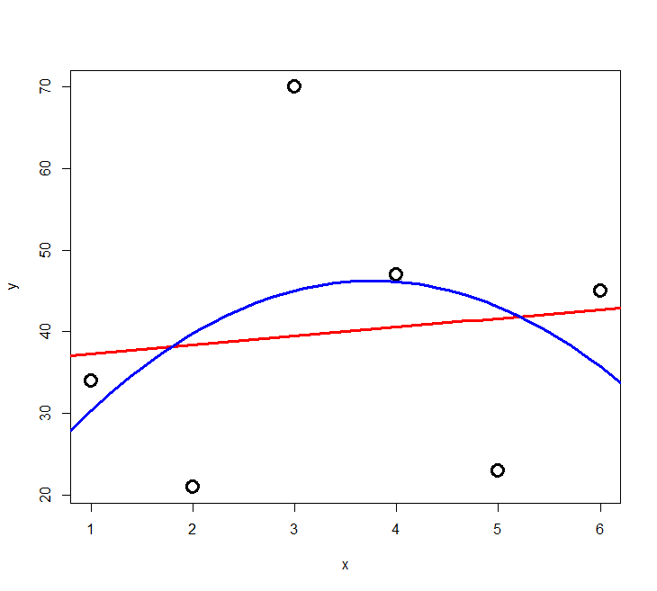
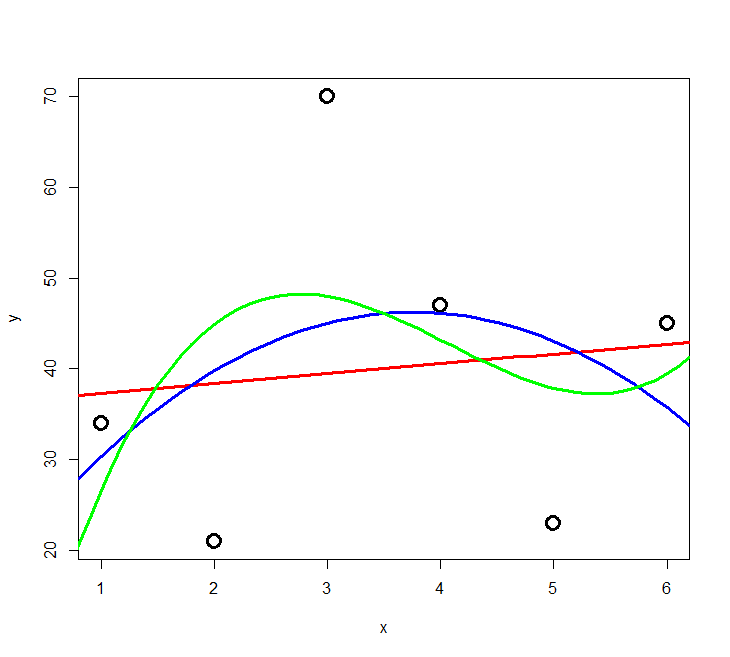
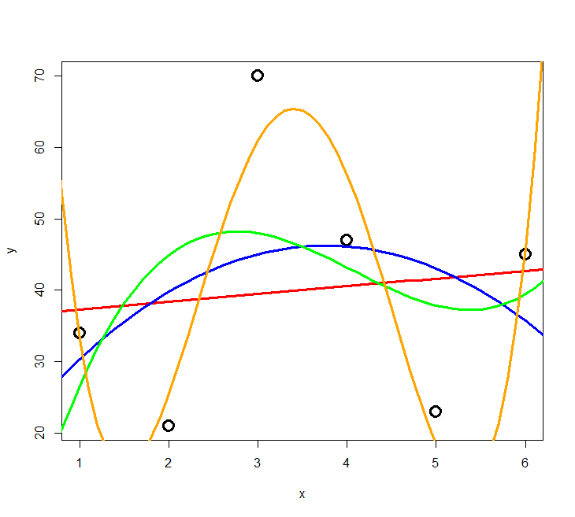
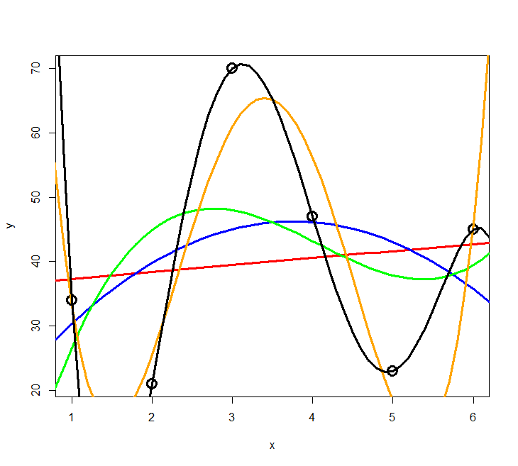
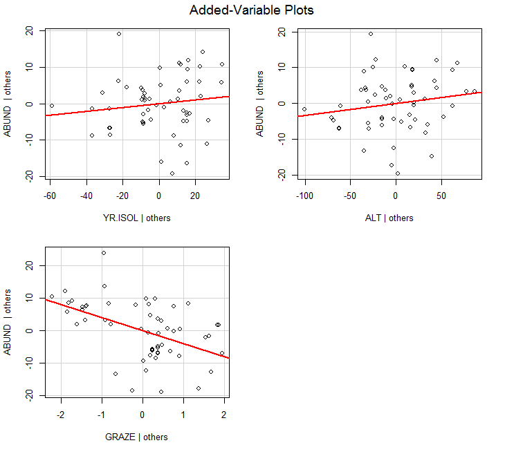
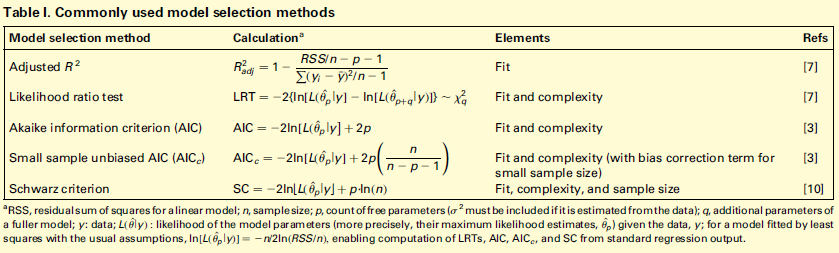

**In Statistik 4 geht es um multiple Regressionen, die versuchen, eine abhängige Variable durch zwei oder mehr verschiedene Prädiktorvariablen zu erklären.
Wir thematisieren verschiedene dabei auftretende Probleme und ihre Lösung, insbesondere den Umgang mit korrelierten Prädiktoren und das Aufspüren des besten unter mehreren möglichen statistischen Modellen.
Hieran wird auch der *information theoretician*-Ansatz der Statistik und die *multimodel inference* eingeführt.**

## Lernziele

::: {.callout}
Ihr...

- könnt **lineare Regressionen mit mehreren Prädiktoren** in R implementieren und wisst, welche Aspekte ihr bei der Modellspezifikation und bei der Auswahl des "besten" Modells beachten müsst;
- wisst, warum **Kolinearität von Prädiktoren** in multiplen Regressionen ein Problem ist und wie ihr es lösen könnt; und
- kennt die Gütemasse des **information theoretician approach** und könnt sie interpretieren.
:::


## Multiple lineare Regressionen

### Vorgehen 

Analog zur mehrfaktoriellen ANOVA, sind multiple lineare Regressionen einfach lineare Regressionen mit mehreren Prädiktoren.
Das statistische Modell lautet also folgendermassen (wobei *x*~1~ ... *x*~i~ metrische Variablen sind):

$$ y_i = \beta_0 + \beta_1 x_{1,i} + \beta_2 x_{2,i}+ (...) +\beta_j x_{j,i} $$

In R wird das wie folgt codiert:

```{.r}
model1 <- lm (y ~ x1 + x2 + x3, data = mydata)
```

Möglich sind aber auch folgende komplexere Modelle:

```{.r}
model2 <- lm (y ~ x1 + x2 + I(x2\^2), data = mydata)
model3 <- lm (y ~ x1 + x2 + log10(x3), data = mydata)
model4 <- lm (y ~ x1 + x2 + x1:x2, data = mydata)
```

Und für ein konkretes Beispiel (Abhängigkeit der Vogelabundanz in isolierten Waldinseln von verschiedenen Umweltvariablen (`YR.ISOL` = year since isolation, `ALT` = altitude, `GRAZE` = grazing):

```{.r}
model <- lm (ABUND ~ YR.ISOL + ALT + GRAZE, data=loyn)
summary(model)
```

```{.default}
Coefficients:
             Estimate Std. Error t value Pr(>|t|)    
(Intercept) -73.58185  107.24995  -0.686 0.495712    
YR.ISOL       0.05143    0.05393   0.954 0.344719    
ALT           0.03285    0.02679   1.226 0.225618    
GRAZE        -4.01692    0.99881  -4.022 0.000188 ***
```

Und wie immer schauen wir die Residualplots an, die eigentlich ziemlich gut aussehen:

```{.r}
par(mfrow=c(2,2))
plot(model)
```

{width=60% fig-align="center"}

Allerdings dürfen wir uns hier im Falle einer multiplen Regression noch nicht zufrieden zurücklehnen, sondern müssen uns zunächst noch zwei potenziellen Problemen annehmen: (1) Korrelation zwischen den Prädiktoren und (2) Overfitting.

### Problem 1: Korrelation zwischen den Prädiktoren

Damit lm verlässliche Parameterschätzungen liefern kann, müssen die Prädiktoren (hinreichend) **unabhängig** (man spricht auch von: orthogonal) sein.
Das muss man vor dem Fitten des Models testen und dann von Paaren hochkorrelierter Variablen jeweils eine ausschliessen.

Es gibt zwei gängige Testmöglichkeiten:
 
1. **Korrelationmatrix:** nur Parameter mit einem Korrelationskoeffizenten von \|r\| < 0.7 werden beibehalten (manchmal findet man auch andere Schwellenwerte, etwa 0.6 oder 0.75: wie eigentlich alles in der Statistik, ist es keine Schwarz-weiss-Welt).
2. ***Variance inflation factor* (VIF):** $\text{VIF}_{i}\  = \frac{1}{1 - R_{i}^2}$ , mit $R_i^2$ aus dem Modell Prädiktor *i* gegen alle übrigen Prädiktoren

Der VIF sagt uns, dass der Standardfehler (SE) des Prädiktors um $\sqrt{VIF}$ grösser ist als im orthogonalen Fall.
Oder in anderen Worten: je höher der VIF eines Prädiktors, desto problematischer ist seine Schätzung wegen der Korrelationen mit anderen Prädiktoren.
Meist werden Variablen bis $VIF = 5$, manchmal bis $VIF = 10$ akzeptiert.

Die Berechnung der Korrelationsmatrix geht in R sehr einfach:

```{.r}
cor <- cor(loyn[, c("YR.ISOL", "ALT", "GRAZE")]) 
 
cor
```

Das Ergebnis ist allerdings unübersichtlich.
Man kann es vereinfachen, indem man die Nachkommastellen reduziert und nur jene Werte darstellt, die über dem selbstgewählten Schwellenwert (hier 0.6) liegen.

```{.r}
cor <- round(cor, digits = 3) 
cor[abs(cor)<0.6] <- NA 
cor 
```

```{.default}
        YR.ISOL ALT  GRAZE 
YR.ISOL   1.000  NA -0.636 
ALT          NA   1     NA 
GRAZE    -0.636  NA  1.000 
```

Wenn man die Schwelle bei 0.6 ansetzt, müsste man also von den beiden Variablen `GRAZE` und `YR.ISOL` eine aus dem Modell entfernen, da sie zu stark negativ korreliert sind.
Dabei sind drei Dinge wichtig:

- Statistisch gibt es kein klares Argument, welche von mehreren hoch-korrelierten Variablen man im vollen Modell streichen sollte (man könnte höchstens zusätzlich den VIF heranziehen). Inhaltlich macht es Sinn, diejenige Variable beizubehalten, die (a) besser interpretierbar ist oder (b) häufiger in vergleichbaren Studien gebraucht wurde.
- Man sollte im Methodenteil dokumentieren welche Variable(n) wegen positiver/negativer Korrelation mit welcher anderen aus dem vollen Modell gestrichen wurden.
- Bei der Interpretation der Ergebnisse stehen die beibehaltenen Variablen auch für die jeweils gestrichenen hochkorrelierten Variablen (zumindest zu einem erheblichen Teil).

Die Berechnung der VIF’s (Variance inflation factors) geht wie folgt:

```{.r}
library(car)
vif(model)
```

```{.default}
 YR.ISOL      ALT    GRAZE 
1.679995 1.200372 1.904799 
```

Hier sieht man nicht, welche Variable mit welcher anderen korrliert ist, man bekommt nur ein Gesamtranking.
Da die VIF-Werte aller drei Variablen unter 5 sind, können alle beibehalten werden.
Wenn mehrere Variablen einen VIF \> 5 haben, muss man schrittweise immer die Variable mit dem höchsten VIF-Wert entfernen und die VIF-Werte dann neuberechnen.
Sie ändern sich, wenn eine Variable wegfällt, da sie die Gesamt-Korrelationsstruktur des Datensatzes widerspiegeln.

### Problem 2: Overfitting

Das Problem des Overfitting soll mit der folgenden Simulation veranschaulicht werden: zu einer Stichprobe von sechs Beobachtungen mit zwei numerischen Variablen werden schrittweise polynomische Modelle höher Ordnung gefittet.

Der Code dafür ist:

```{.r}
lm=lm(y~x)
xy <- seq(from=0,to=10,by=0.1)
yv <- predict(lm,list(x=xv))
lines(xv,yv)
lm2=lm(y~x+I(x\^2))
xy <- seq(from=0,to=10,by=0.1)
yv <- predict(lm2,list(x=xv))
lines(xv,yv)

[usw.]
```

:::{#fig-overfitting-1 layout-ncol="2"}

{#fig-overfitting-1a}

{#fig-overfitting-1b}

Overfitting (1)
:::

:::{#fig-overfitting-2 layout-ncol="2"}

{#fig-overfitting-2a}

{#fig-overfitting-2b}

{#fig-overfitting-2c}

Overfitting (2)
:::

<!-- hier weitermachen -->

Das Ergebnis ist in @fig-overfitting-1 und @fig-overfitting-2 ersichtlich.
Wir sehen, dass die erklärte Varianz kontinuierlich vom 2-Parameter-Modell (Achsenabschnitt und Steigung) zum 6-Parameter-Modell (Achsenabschnitt, Parameter für $x$ bis $x^5$) zunimmt.
Ein polynomisches Modell ($n – 1$)-ter Ordnung erzielt immer 100% Anpassung and die Daten ($R^2 = 1$), wenn man $n$ Beobachtungen hat.
Aber ist das Modell deswegen auch besonders korrekt oder aussagekräftig?
Das darf bezweifelt werden.
Ein gutes Modell wäre ja eines, welches die zugrunde liegende Gesetzmässigkeit erkennt und daher auch für die Interpolation und Extrapolation geeignet ist.

Es zeigt sich, dass die gute Anpassung an die Daten (good fit, hier gemessen als R2) nur der eine Aspekt eines guten Modells ist.
Zugleich sollte es möglichst einfach (*parsimonous*) sein, d. h. das Beobachtete mit möglichst wenigen Annahmen erklären.
Es gilt das folgende Prinzip, das auf den mittelalterlichen Philosophen Willliam of Ockham (ca. 1288--1347 zurückgeht).

<!-- https://upload.wikimedia.org/wikipedia/commons/a/ab/William_of_Ockham\_-\_Logica_1341.jpg --> {width=50%}

::: {.callout}
Ockham's razor = Law of parsimony (Sparsamkeitsprinzip)

***Wesenheiten dürfen nicht über das Notwendige hinaus vermehrt werden***

Formulierung von Johannes Clauberg (1622--1665)
:::

### Modellvereinfachung 

Nun stellt sich die Frage, wie wir vom **vollen Modell (*full model, global model*)** also jenem nach Entfernung hochkorrelierter Variablen zum "besten" Modell gelangt, das also eine bestmögliche Kombination von guter Anpassung an die Daten (Fit) und Parsimonie aufweist.
Dieses anzustrebende statistische Modell wird auch **minimal adäquates Modell (*mininum adequate model*)** genannt.

:::{.callout}
Ganz generell gilt: Man sollte **maximal $p = \frac{n}{3}$ Parameter fitten** (wobei *n* = Zahl der Datenpunkte/Beobachtungen und bei $p$ auch der Achsenabschnitt [$b_0$] mitgezählt wird).
:::

Mögliche **Kriterien für das "beste" Modell** (*minimum adequate model*):

1. **Höchster** $R^2_{adj.}= 1 - \frac{\text{SS}_\text{Resudial}/[n - (p + 1)]}{\text{SS}_\text{Total}/ (n - 1)}$ (vgl. $R^2 = \frac{\text{SS}_\text{Regression}}{\text{SS}_\text{Total}} = 1-\frac{\text{SS}_\text{Regression}}{\text{SS}_\text{Total}}$) 

Ist nicht wirklich zielführend, da der "Strafterm" (um den $R^2$ reduziert wird) zu gering ist, um wirklich für Parsimonität zu sorgen.

2. **Schrittweise Modellvereinfachung ausgehend vom "maximalen Modell"** 

Durch: Entfernen von (a) nicht-signifikanten Interaktionen, (b) nicht-signifikanten quadratischen Termen und schliesslich (c) nicht-signifikanten linearen Variablen.

Die schrittweise Modellvereinfachung kann wiederum auf drei verschiedene Weisen geschehen (die meist, aber nicht immer, die gleichen Ergebnisse liefern):

a. **Schrittweise die am wenigsten signifikanten Terme entfernen**, bis alle signifikant sind:

   ```{.r}
   model1 <- lm (ABUND ~ YR.ISOL + ALT + GRAZE, data=loyn)
   summary(model1)
   model2 <- update(model1,~.-YR.ISOL)
   summary(model2)
   ```

b. **Mittels ANOVA schrittweise Modelle vergleichen** und Terme hinzufügen, wenn signifikent, bzw. entfernen, wenn nicht
    
   ```{.r}
   anova(model1,model2)
   ```

c.
Eine **automatische Funktion** zum schrittweisen Hinzufügen (*forward selection*) oder Löschen (*backward selection*) oder beidem verwenden (es gibt verschiedene Packages, bei Interesse bitte googlen).

Varianten a bis c sind im Prinzip OK, man muss sich aber bewusst sein, dass gerade bei vielen Variablen dieses schrittweise Vorgehen nicht zwingend das wirklich beste Modell findet, sondern man in einem "lokalen Optimum" landen kann (als Alternative siehe die `dredge`-Funktion unter "*Information theoretician approach* und *multimodel inference*").

### Varianzpartitionierung 

Wenn man das minimal adäquate Modell gefunden hat, will man oft noch wissen, wie bedeutsam die einzelnen enthaltenen Variablen sind.
Bedeutsamkeit/Relevanz haben wir weiter oben als $R^2$ (erklärte Varianz) ausgedrückt.
Wir können uns also anschauen, **welche Anteile der erklärten Varianz auf welche Variablen zurückgehen**.
Da unsere Variablen (auch nach einem Korrelationstest und Ausschluss der besonders hoch korrelierten) nicht völlig orthogonal = unabhängig voneinander sind, verhalten sich die Varianzen nicht additiv.
Vielmehr ist die erklärte Varianz in einem Modell mit zwei Variablen meist niedriger als die Summe der Varianzen der beiden Einzelmodelle.
In einer Varianzpartitionierung wird die Varianz jeder Variablen daher in eine unabhängige (*independent*, `I`) und eine gemeinsame (*joint*, `J`) Komponente zerlegt:

```{.r}
library(relaimpo)

lm_1 <- lm(ABUND~YR.ISOL+ AREA +  DIST + LDIST + GRAZE + ALT, data = loyn)

metrics <- calc.relimp(lm_1, type = c("lmg", "first", "last","betasq", "pratt"))
IJ <- cbind(I = metrics$lmg, J = metrics$first - metrics$lmg, Total = metrics$first)

IJ
```

```{.default}
$IJ
                 I            J       Total
YR.ISOL 0.11827368  0.135095338 0.253369016
AREA    0.02359769  0.041923060 0.065520747
DIST    0.02566349  0.030085610 0.055749104
LDIST   0.01270789 -0.005112317 0.007595573
GRAZE   0.25879164  0.207030145 0.465821782
ALT     0.07275743  0.076112117 0.148869552
```

Der grösste Teil der Varianz wird in diesem Sechs-Parameter-Modell daher durch die Variable „grazing“ erklärt.
Wenn den Wert für `GRAZE` in der Spalte `I` in Relation zur Summe aller Werte in `I` setzt, also 0.2588 / 0.5119 erhält man 0.5056; mithin werden gut die Hälfte der erklärten Varianz durch „grazing“ erkärt.

### Ergebnisdarstellung: partielle Regressionen und 3-D-Grafiken

Während sich die ermittelte Beziehung zwischen Antwort- und Prädiktor-Variable auch bei nichtlinearen Verläufen einfach mit `predict` visualisieren lässt, solange man nur eine Prädiktorvariable hat (selbst wenn sie in transformierter Weise im lm eingespeist wird), ist das bei mehreren Prädiktoren eine Herausforderung.
Hier seien zwei Möglichkeiten kurz erwähnt:

1. **Partielle Regressionen** (sie zeigen wie die Beziehung aussähe, wenn all übrigen Faktoren konstant wären

   ```{.r} 
   library(car)
   avPlots(model, ask=F)
   ```

{width=80% fig-align="center"}

2. **3D Response surfaces **(es gibt Packages, um dasselbe auch für zwei Prädiktoren gleichzeitig zu machen; dies mach insbesondere Sinn, wenn auch quadratische Terme dabei sind; bei Interesse bitte googlen)

## Information theoretician approach und multimodel inference

### Vergleich mit frequentist statistics 

Es gibt zwei grundlegende statistische Philosophien:

***Frequentist statistics* ("klassisiche" Statistik)**

- Alles, was wir bislang gemacht haben
- *Grundannahme:* Es gibt ein einziges richtiges Modell der Wirklichkeit, dem man sich mit Irrtumswahrscheinlichkeitenannähern kann
- Nutzt ***p*-Werte**

**Information theoretician approach**

- Das, was wir in diesem Unterkapitel besprechen
- *Grundannahme:* Es kann ähnlich gute Modelle der Wirklichkeit geben, es gibt nicht das eine wahre Modell
- Nutzt **keine *p*-Werte**
- Dafür **AIC** (*Akaike information criterion*) oder **BIC** (*Bayesian information criterion*)
- **Modellmittelung** (*model averaging*) möglich

### Masse der Modellgüte: AIC, BIC, AICc, $\Delta_i$, Evidence ratios, Akaike weights 

Die folgende Übersicht zeigt die wichtigsten Gütemasse im Vergleich.
Wie schon besprochen, berücksichtigt $R_\text{adj.}^2$  (nahezu) ausschliesslich den Fit (also die Anpassung der Kurve an die Daten).
Dagegen berücksichtigen die Informationskriterien Fit und Komplexität (Komplexität meint das Gegenteil von Parsimonität).
Bei AICc und BIC = SC fliesst schliesslich auch noch die Zahl der Datenpunkte ein:

{width=100% fig-align="center"}

Dabei gilt für AIC:

$AIC = \text{n}(ln(RSS)) - \text{n} \times ln(n) + 2 (k+1)$ mit:

- RSS = Residual sum of squares
- *k* = Parameter des Models, inkl. Achsenabschnitt
- *n* = Anzahl der Beobachtungen/Replikate

**AICc ist das AIC für "kleine" Stichprobengrössen** (wobei "klein" bis zu 40 *k* reicht, also bei 2 Parametern wie in einer einfachen linearen Regression "gross" erst bei n = 81 Datenpunkten begänne).
Deshalb und da sich für grosses *n* AICc asymptotisch AIC nähert, sollte man einfach immer AICc verwenden.

AIC und BIC entstammen wiederum etwas unterschiedlichen Philosophien.
Auf die Unterschiede gehen wir nicht im Detail ein.
Die Ergebnisse basierend auf BIC und AICc sind in dem Kontext wie wir sie hier vorstellen (BIC mit nicht-informativen *priors*) nahezu gleich.
BIC wird relevant, wenn man informative *priors* verwenden kann (aber das sprengt den Kurs).

Es gilt folgendes für AIC, AICc und BIC analog:

- Der **absolute Wert eines Informationskriteriums ist belanglos** (ob also -1000, 0.1 oder +1'000'000). Informationskriterien können nur im Vergleich zweier Modelle für die gleichen Daten sinnvoll angewandt werden. Dann ist das **Modell mit dem niedrigeren Wert das bessere** hinsichtlich Fit und Komplexität.
- $\Delta_i = \text{AIC}_i - \text{AIC}_{\text{min}}$ 

$\Delta_i$ ist die Differenz im AIC (oder eines anderen Informationskriteriums) zwischen einem bestimmten Modell i und dem jeweils besten Modell im Vergleich.
Dabei wird meist die folgende Konvention verfolgt:
  - wenn $\Delta_i \leq 2$: Modelle sind statistisch "gleichwertig"
  - wenn  $\Delta_i > 4$: Modell mit dem höheren Wert ist statistisch nicht relevant 
- ***Likelihood*** von Modell $g_i$ für die Daten (je grösser, desto besser):
$L = exp(-\frac{1}{2}\Delta_i)$
- ***Evidence ratio*:** (etwa: wie vielfach besser ist das beste Modell verglichen mit Modell *i*? -- je grösser, desto besser)
$ER = \frac{L_{best}}{L_i}$
- ***Akaike weights*:** Normalisierte *Likelihoods* über alle verglichenen Modelle: $W_i = \frac{exp(-\frac{1}{2}\Delta_i)}{\sum{[exp(-\frac{1}{2}\Delta_j]}}$

$\Delta_i$, Likelihood, ER und Akaike weights stehen alle für die gleiche Information (statistische Eignung bezüglich Fit und Komplexität) in verschiedenen Darstellungen/Transformationen.
Als besonders praktisch erweisen sich die **Akaike weights** $W_i$.
Nach ihrer Definition summieren sich die Akaike weights aller verglichenen Modelle zu 1. $W_i$ kann daher als die Wahrscheinlichkeit interpretiert werden, dass Modell $i$ unter den verglichenen Modellen das beste ist.

<!-- Hier weitermachen -->

Da AIC und *p*-Werte aus verschiedenen und nicht kompatiblen statistischen Philosophien stammen, sollte man in einer mit Informationskriterien arbeitenden Studie nicht zusätzlich auch noch *p*-Werte angeben. $R^2$-Werte sind dagegen in beiden "statistischen Welten" sinnvoll und wichtig.

### Multimodel inference

Der Charme der Informationskriterien ist, dass sie sich besonders gut dann eignen, wenn man viele verschiedene Modelle vergleicht, etwa weil man ein grössere Zahl von potenziellen Prädiktoren erhoben hat, mit denen man eine abhängige Variable erklären will, etwas in einer multiplen Regression oder einer mehrfaktoriellen ANOVA oder einem sonstigen komplexen Modell.
Denn die Anzahl aller möglichen Modellen steigt exponetiell mit der Anzahl berücksichtigten Terme.
Wenn man sich ein globales Modell mit *n* Termen (Achsenabschnitt und n – 1 Steigungen (estimates) für Prädiktorvariablen, transformierte Prädiktorvariablen oder Interaktionen zwischen Prädiktorvariablen) vorstellt, beinhaltet das 2*^n^* Einzelmodelle für alle möglichen Kombinationen der Terme von 0 bis *n* Prädiktoren.
Bei *n* = 10 wären das bereits 1024 verschiedene Modelle.
Diese alle zu berechnen ist ein grosser Aufwand, weswegen man früher versucht hat, in solchen Fällen das minimal adäquate Modell in einer weniger rechenaufwändigen Weise zu finden, indem man eine *stepwise forward/backward variable selection* durchgeführt hat (siehe Kapitel "Modellvereinfachung" oben).
Heute ist das Ausrechnen von 1000 Modellen selbst auf einem einfachen Notebook nur noch eine Sache von Sekunden, d. h. man kann seine Entscheidung effektiv auf dem Vergleich aller mit den verfügbaren Variablen möglichen Teilmodelle gründen.
Die `dredge`-Funktion im `MuMIn`-Paket macht genau dieses.
Bis etwa 15 Terme (d. h. 32768 zu vergleichende Modelle) funktioniert `dredge` auch auf einfachen Notebooks noch im Bereich weniger Minuten (aber man muss schon merklich auf das Ergebnis warten); jeder weitere Term führt aber zu einer Verdopplung der Rechenzeit.

Schauen wir uns das anhand des schon bekannten `loyn`-Datensatzes (Vogelvorkommen in Waldfragmenten) an:

```{.r}
library(MuMIn)
global.model <- lm (ABUND ~ YR.ISOL + ALT + GRAZE, data=loyn)
options(na.action="na.fail")
allmodels <- dredge(global.model)
allmodels
```

```{.default}
Model selection table 
     (Int)     ALT    GRA  YR.ISO df   logLik  AICc delta weight
3   34.370         -4.981          3 -194.315 395.1  0.00  0.407
4   28.560 0.03191 -4.597          4 -193.573 395.9  0.84  0.267
7  -62.750         -4.440 0.04898  4 -193.886 396.6  1.46  0.196
8  -73.580 0.03285 -4.017 0.05143  5 -193.087 397.4  2.28  0.130
6 -348.500 0.07006        0.18350  4 -200.670 410.1 15.03  0.000
5 -392.300                0.21120  3 -203.690 413.8 18.75  0.000
2    5.598 0.09515                 3 -207.358 421.2 26.09  0.000
1   19.510                         2 -211.871 428.0 32.88  0.000
```

Wie man sieht, wurde hier zunächst ein globales Modell mit den drei Prädiktoren `YR.ISOL`, `ALT` und `GRAZE` erstellt.
Im nächsten Schritt wurde dann mit der dredge-Funktion dann ein Objekt allmodels generiert, das die 2^3^ = 8 möglichen Teilmodelle enthält.
In der Tabellenausgabe sieht man, dass unter diesen Modell Nr. 3, das nur einen Achsenabschnitt und `GRAZE` enthält mit einem Akaike weight von 0.407 das beste Modell ist.
Allerdings unterscheiden sich die Modelle Nr. 4 und 7 um weniger als 2 AICc-Einheiten, sind also als praktisch gleichwertig zu betrachten.
Sie haben daher auch nur etwas geringere Akaike weights von 0.267 und 0.196.

Anders als bei der frequentist statistician-Ansatz geht es nicht darum, ein einziges bestes Modell zu finden, sondern eine Aussage über ein Ensemble von plausiblen Modellen zu treffen.
Es gibt hier zwei gängige Vorgehensweisen, um die Ergebnisse in solch einem Fall (also mehrere Modelle innerhalb von delta-AIC < 2) zu synthetisieren: ***Variable importance*** und ***Model averaging***.

*Variable importance* steht dabei für die Summe der Akaike weights ($W_i$) aller Teilmodelle, die eine bestimmte Variable enthalten.
Da $W_i$ selbst von 0 bis 1 reicht, gilt dies auch für die Variable importance.
Eine Variable importance von 1 bedeutet dabei, dass alle plausiblen Modelle die entsprechende Variable beinhalten.
Mithin sagt uns die Variable importance wie bedeutsam eine bestimmte Variable innerhalb der Menge der verglichenen Teilmodelle ist.
Aber Achtung: *Variable importance* hat nichts mit Signifikanz oder *p*-Werten zu tun!
Es gibt keine generelle Konvention, ab welcher Variable importance eine Variable als bedeutsam angesehen wird, aber häufig wird 50 % als Schwelle verwendet.
In R geht das folgendermassen:

```{.r}
importance(allmodels)
```

```{.default}
                     GRAZE ALT  YR.ISOL
Importance:          1.00  0.40 0.33   
N containing models:    4     4    4 
```
Während logischerweise jede der drei Variablen in jeweils vier Teilmodellen vorkommt, unterscheiden sie sich erheblich in der Variable importance.
Alle nach der obigen Tabelle relevanten Modelle ($\Delta i < 4$) enthalten `GRAZE`, während die beiden anderen nur in je zwei Modellen vorkommen.
Entsprechend ist die *Variable importance* von `GRAZE` nahe 1, während sie von `ALT` und `YR.ISOL` unter 0.5 liegt.

**Model averaging** ist eine andere interessante Möglichkeit des Information theoretician-Ansatzes und der Multimodel inference.
Hier werden quasi alle möglichen Modelle (oder alle Modelle mit einem $\Delta i$ unter einem bestimmten Schwellenwert) zu einem gemittelten Modell zusammengefasst, gewichtet nach ihrem Wi-Wert.
Am Ende bekommt man eine einzige gemittelte Funktion, deren Funktionsparameter man interpretieren und die man plotten kann.

```{.r}
avgmodel <- model.avg(get.models(dredge(model,rank="AICc"),subset=TRUE))
summary(avgmodel)
```

```{.default}
full average) 
            Estimate Std. Error Adjusted SE z value Pr(>|z|)    
(Intercept) -0.29874   77.23966    78.39113   0.004    0.997    
GRAZE       -4.64605    0.89257     0.91048   5.103    3e-07 ***
ALT          0.01282    0.02311     0.02340   0.548    0.584    
YR.ISOL      0.01631    0.03883     0.03941   0.414    0.679 
```

Man beachte, dass der Output auch einen *p*-Wert enthält, obwohl dieser im AIC-Kontext nicht sinnvoll ist.

## Zusammenfassung

::: {.callout}
## Zusammenfassung

- Eine **ANCOVA** kommt zur Anwendung, wenn auf die abhängige Variable sowohl eine kategoriale als auch eine metrische Prädiktorvariable einwirken.
- Auch eine **polynomiale Regression** ist ein lineares Modell und kann u. a. dazu dienen, auf einfache Weise einen unimodalen Zusammenhang zu beschreiben.
- **Multiple Regressionen** sind lineare Regressionen mit mehreren Prädiktoren.
- Bei multiplen Regressionen muss man die **weitgehende Unabhängigkeit** der ins globale Modell eingespeisten Variablen sicherstellen.
- Für die Suche nach dem **minimalen adäquaten Modell** kommen unterschiedliche Strategien infrage, wie die schrittweise Entfernung nicht-signifikanter Terme aus dem globalen Modell oder Auswahl des besten Modells aus allen möglichen Modellen mittels AICc.
- **AICc** ist ein Gütemass im ***information theoretician approach***. AICc-Werte sind nur im Vergleich mit anderen AICc-Werten für die gleichen Daten informativ; dann bezeichnet der niedrigste AICc-Wert das beste Modell.
- "Frequentist approach" ("Standardstatistik") und "information theoretician approach" sind **zwei verschiedene statistische "Philosophien"**, die man nicht in ein und derselben Auswertung kombinieren sollte: also entweder *p*-Werte oder AICc-Werte; $R^2$ macht dagegen in beiden "Welten" Sinn.
:::

## Weiterführende Literatur

- **Crawley, M.J. 2015. *Statistics -- An introduction using R*. 2nd ed. John Wiley & Sons, Chichester, UK: 339 pp.**
  - **Chapter 7: Regression (pp. 140--141)**
  - **Chapter 9: Analysis of Covariance**
  - **Chapter 10: Multiple Regression**
  - **Chapter 12: Other Response Variables (p. 233 [AIC])**
- Burnham, K.P. & Anderson, D.R. 2002. *Model selection and multimodel inference -- a practical information-theoretic approach*. 2nd ed. Springer, New York, US: 488 pp.
- Johnson, J.B. & Omland, K.S. 2004. Model selection in ecology and evolution. *Trends in Ecology and Evolution* 19: 101--108.
- Logan, M. 2010. *Biostatistical design and analysis using R. A practical guide*. Wiley-Blackwell, Oxford, UK: 546 pp., v.a.
  - pp. 208-253 (Multiple und nicht-lineare Regressionen)
- Quinn, P.Q. & Keough, M.J. 2002. *Experimental design and data analysis for biologists*. Cambridge University Press, Cambridge, UK: 537 pp.
