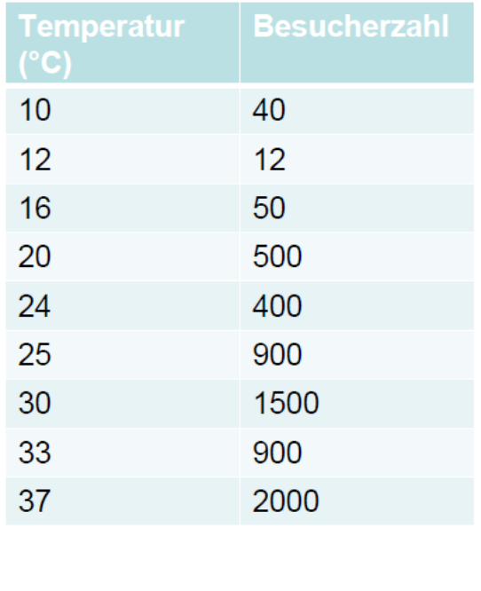
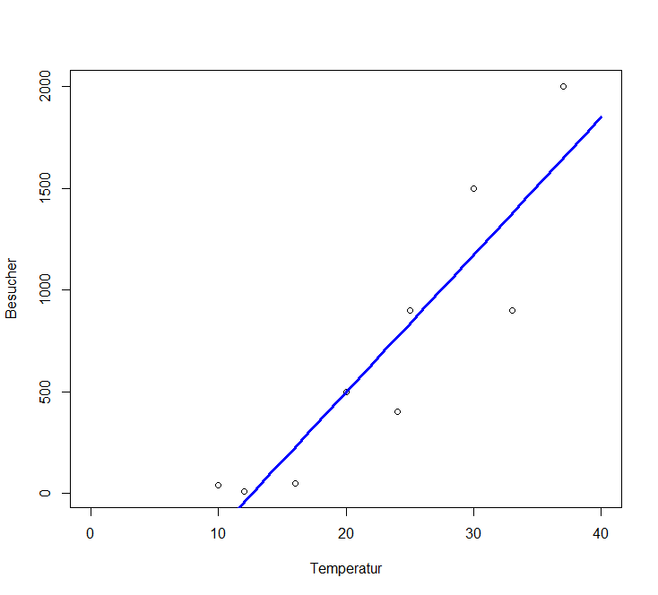
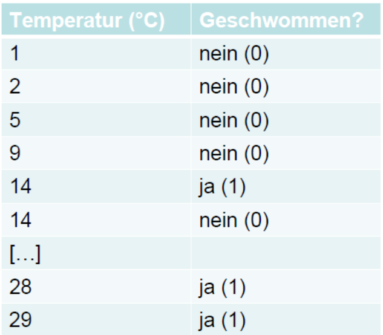
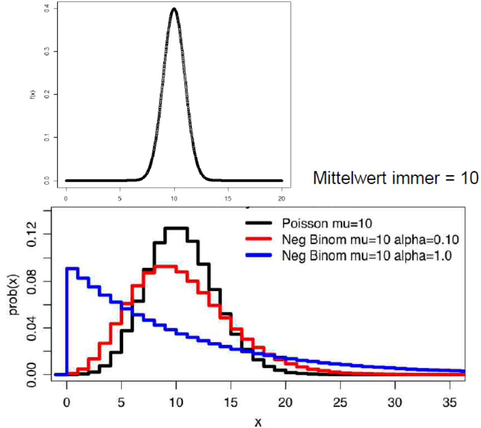
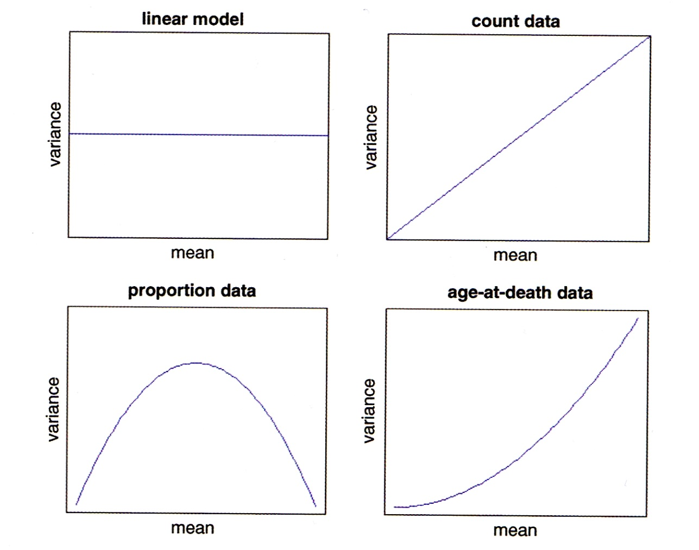
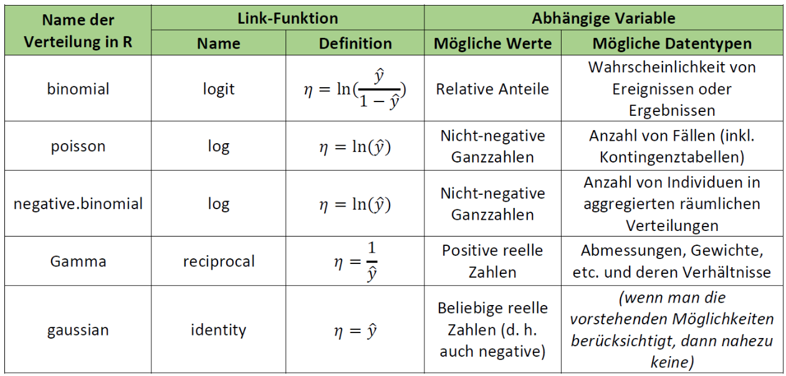
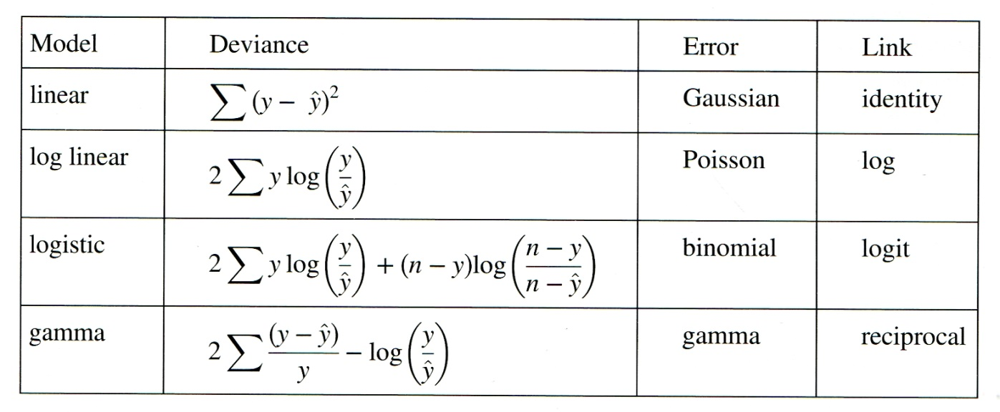
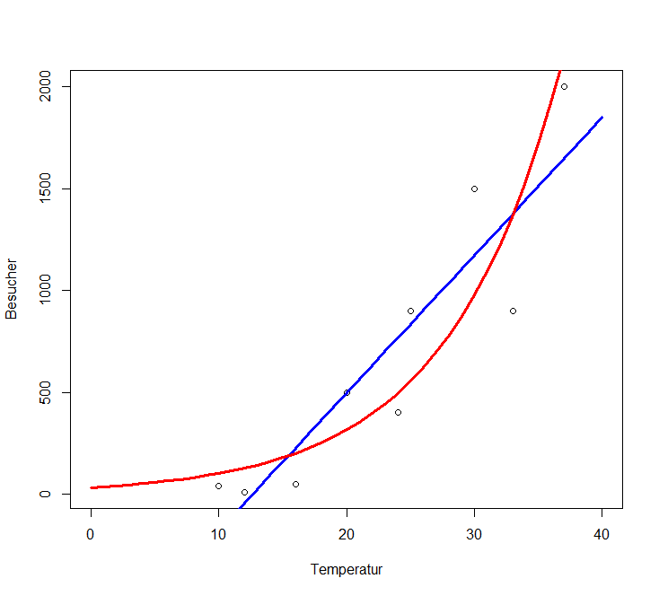
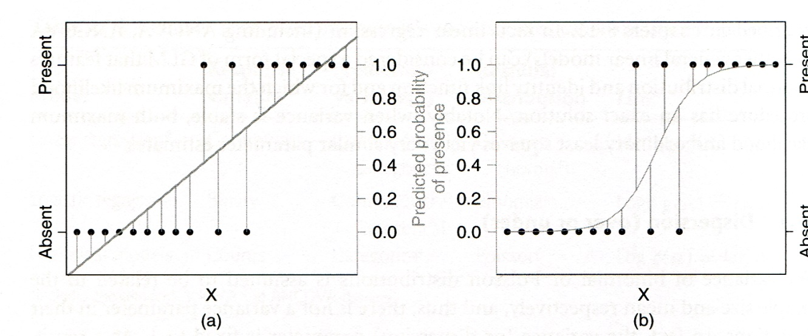
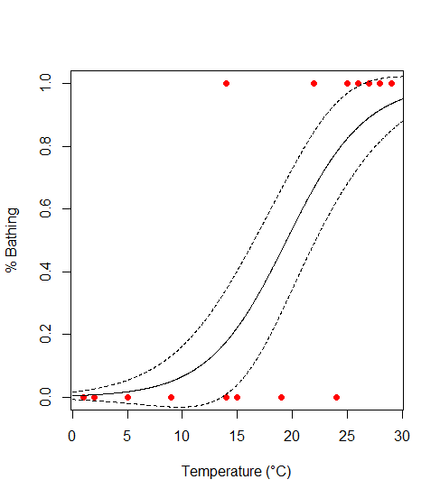

**In Statistik 5 geht es um *generalized linear models* (GLMs), die einige wesentliche Limitierungen von linearen Modellen überwinden.
Indem sie Fehler- und Varianzstrukturen explizit modellieren, ist man nicht mehr an Normalverteilung der Residuen und Varianzhomogenität gebunden.
Bei *generalized linear models* muss man sich zwischen verschiedenen Verteilungen und Link-Funktionen entscheiden.
Spezifisch werden wir uns die Poisson-Regressionen für Zähldaten und die logistische Regression für binäre Daten anschauen.**

## Lernziele

::: {.callout}
Ihr...

- habt verstanden, worin sich **GLMs** von linearen Modellen unterscheiden und wann sie zur Anwendung kommen;
- könnt die beiden häufigsten GLM-Typen **logistische Regression** und **(Quasi-) Poisson-Regression** in R richtig anwenden und die Ergebnisse interpretieren; und
- wisst, wie man **Overdispersion** bei GLMs erkennt und behandelt.
:::

## Von linearen Modellen zu GLMs

### Zwei Beispiele

Nehmen wir an, wir wollten modellieren, wie viele Besucher an einem Strandabschnitt zur Mittagszeit in Abhängigkeit von der herrschenden Lufttemperatur anzutreffen sind.
Unsere Daten sehen folgendermassen aus und mit den bekannten Methoden können wir ein lm rechnen, dessen Ergebnis signifikant ist und sogar recht viel der Gesamtvarianz erklärt:

:::{layout="[40, 60]" layout-valign="bottom"}



:::

Unsere abhängige Variable ist eine Zählung und verhält sich daher anders als eine echte metrische Variable (etwa einer Messung des pH-Wertes). **Zähldaten** stellen lineare Modelle (lm) vor **vier Probleme:**

- Lineare Modelle sagen immer auch das Auftreten **negativer Werte** voraus, wohingegen **absolute Häufigkeiten immer positive Ganzzahlen** sind (im obigen Beispiel würde das Modell bereits im gefitteten Bereich, unter etwa 12 °C, eine negative Anzahl Menschen vorhersagen).
- Nahezu immer sind Zähldaten **rechtsschief verteilt**, also nicht normalverteilt und auch nicht symmetrisch
- Bei Zähldaten nimmt nahezu immer die **Varianz mit dem Mittelwert zu**.
- Zähldaten folgen keiner kontinuierlichen (wie die Normalverteilung), sondern einer **diskreten Verteilung**.

Theoretisch sind also die Voraussetzungen für ein lineares Modell bei Zähldaten nie erfüllt.
In der Praxis gibt es aber Situationen, wo die Verletzung der Annahmen für das Modell nicht weiter problematisch ist und man mit einem lm zu korrekten Aussagen gelangen kann.
Relativ problemlos funktioniert das (und wird auch noch häufig getan), wenn (a) alle Werte der Antwortvariablen weit von 0 entfernt sind und (b) die Werte der Antwortvariable um deutlich weniger als eine Grössenordnung (d. h.
Faktor 10) variieren.
Im obigen Beispiel beträgt der Quotient des grössten und kleinsten Wertes der Antwortvariablen 2000 / 12 = 167.
Mit etwas Erfahrung sehen wir schon im Scatterplot, dass hier Linearität und Varianzhomogenität verletzt sind.

Ein anderes Beispiel, bei dem ein lineares Modell offensichtlich und immer scheitern würde, wäre eine Befragung von Touristen an Tagen unterschiedlicher Temperatur, ob sie schwimmen gegangen sind.
Das Ergebnis könnte wie folgt aussehen (stark gekürzte Tabelle, an jedem Tag (d. h. bei gleicher Temperatur) wurden jeweils mehrere Touristen befragt):

{width=50% fig-align="center"}

Bei solchen "binären Daten" bestehen zwei hauptsächliche Probleme für lineare Modelle:

- Die Werteverteilung ist nach unten und nach oben begrenzt.
- Es gibt überhaupt nur zwei mögliche Werte, nein und ja, als 0 und 1 codiert.

### Die Idee der Generalized linear models (GLMs)

**Generalized linear models (GLMs)** verallgemeinern **lineare Modelle (LMs)**, um Fälle wie die geschilderten (Zähldaten, Binärdaten, für weitere Beispiele siehe Crawley (2015)) modellieren zu können.
"Generalisiert" heissen die GLMs aus folgenden drei Gründen:

- Alle LMs sind im Begriff GLM eingeschlossen (aber viele GLMs sind keine LMs).
- Die **Verteilung der "Zufallskomponente"** (= Residuen) kann sich **von einer Normalverteilung unterscheiden** (muss aber aus der exponentiellen Familie von Verteilungen sein).
- Die abhängige Variable kann **auf verschiedene Weise mit den Prädiktoren verknüpft** (*linked*) sein.

### Die drei Komponenten eines GLM

Ein GLM setzt sich aus drei Komponenten zusammen, die relativ frei kombiniert werden können (aber für bestimmte Zufallskomponenten gibt es Standard-Link-Funktionen):

1. **Zufallskomponente (d. h. die Verteilung der Residuen):**
   - normal
   - binomial: z. B. ja/nein, tot/lebendig
   - Poisson: Zähldaten (funktioniert aber nicht immer)
   - gamma
   - negativ binomial (Dispersionsparameter muss geschätzt werden)
2. **Systematische Komponente (d. h. die *x*-Werte):** es ist alles möglich, was wir schon von LMs her kennen:
   - kontinuierliche (metrische) Prädiktoren
   - kategoriale Prädiktoren
   - Interaktionen von Prädiktoren
   - polynomiale Funktionen
   - jewede Kombination aus den vorhergehenden Elementen
3. Link-Funktion:
   - Identität (*identity*)
   - log (für Zähldaten)
   - logit (für Binärdaten)

### Mögliche Verteilungen von Werten und von Varianzen

Was mit verschiedenen **Verteilungen der Residuen** gemeint ist, veranschaulichen die folgenden beiden Abbildungen von vier Häufigkeitsverteilungen mit dem gleichen Mittelwert.
Oben sind die **kontinuierliche Normalverteilung** und unten drei unterschiedliche diskrete Verteilungen (Poisson, negativ-binomial) zu sehen:

{width=90% fig-align="center"}

Auch die **Beziehung von Varianzen zum (vorhergesagten) Mittelwert** müssen keinesfalls immer konstant sein, wie wir das von den linearen Modellen kennen.
Vielmehr zeigen viele Datentypen eine systematische Veränderung der Varianz mit dem Mittelwert:

{width=80% fig-align="center"}

### Typen von GLMs

Eine Übersicht gängige GLM-Typen bietet die folgende Tabelle (man beachte die uneinheitliche Gross-/Kleinschreibung der Verteilungen):

{width=100% fig-align="center"}

Man beachte, dass ein GLM mit Normalverteilung (gaussian) und identity-Link identisch mit einem LM ist.

Wenn man dieser Anleitung strikt folgen würde (was auch Smilauer 2017 nicht tut), dürfte man LMs nur dann verwenden, wenn die Antwortvariable auch negative Werte annehmen kann und ansonsten ein Gamma-GLM rechnen.
In Realität werden Gamma-GLMs aber fast ausschliesslich für *death and failure*-Daten verwendet, bei denen die Varianz mit dem Quadrat des Mittelwertes zunimmt.

GLMs mit binomialer, Poisson, Gamma- und Gauss (Normal)-Verteilung sind in Base R implementiert, für `negative.binomial` benötigt man das Package `MASS`.
In diesem Kurs gehen wir im Detail nur auf die beiden meistbenutzten GLM-Typen ein, **Poisson-Regression für Zähldaten** und **logistische Regression für Binärdaten**.
Mehr zu den übrigen Typen findet man u. a. in Crawley (2015), Dunn & Smyth (2018) und Fox & Weisberg (2019)

### Das Fitten und die Modellgüte von GLMs

Bei einem **linearen Modell (LM)** wird die Lösung durch **Minimierung der Summe der Abweichungsquadrate** erzielt.
Diese Lösung lässt sich direkt, immer eindeutig und sogar von Hand ausrechnen.
GLMs dagegen fitten die Modelle in einem iterativen Verfahren, indem die ***Likelihood* maximiert** wird.
Deswegen spricht man auch von *Maximum likelihood* (ML).
Nach erfolgtem Fitten werden die Werte mit der **Umkehrfunktion der Link-Funktion** auf die originale Skala zurücktransformiert.

Als Mass der Variabilität oder lack of fit wird bei GLMs die Devianz *D* verwendet, die folgendermassen definiert ist:

$$ D_i = -2 × \text{log likelihood} (\text{Modell}_i | \text{Daten}) $$

Je nach GLM-Typ wird die Devianz anders berechnet:

{width=100% fig-align="center"}

## Poisson-Regressionen für Zähldaten

### Berechnung

Die Struktur des `glm`-Befehls in R ist genau identisch mit jenem des `lm`-Befehls.
Nur muss man zusätzlich die Verteilung (`family`) und ggf. die Link-Funktion (wenn nicht die Standard-Link-Funktion der jeweiligen Verteilung) angeben.
Schauen wir uns nun die Ergebnisse für unsere Zähldaten der Strandbesucher an, zunächst mit einem LM, dann mit einem Gauss-GLM und schliesslich mit einem Poisson-GLM:

```{.r}
lm.strand <- lm(Besucher~Temperatur)
glm.gaussian <- glm(Besucher~Temperatur,family=gaussian)
glm.poisson <- glm(Besucher~Temperatur,family=poisson)

summary(lm.strand)
```

```{.default}
Coefficients:
            Estimate Std. Error t value Pr(>|t|)    
(Intercept)  -855.01     290.54  -2.943 0.021625 *  
Temperatur     67.62      11.80   5.732 0.000712 ***
```

```{.r}
summary(glm.gaussian)
```

```{.default}
Coefficients:
            Estimate Std. Error t value Pr(>|t|)    
(Intercept)  -855.01     290.54  -2.943 0.021625 *  
Temperatur     67.62      11.80   5.732 0.000712 ***
```

```{.r}
summary(glm.poisson)
```

```{.default}
Coefficients:
            Estimate Std. Error z value Pr(>|z|)    
(Intercept) 3.500301   0.056920   61.49   <2e-16 ***
Temperatur  0.112817   0.001821   61.97   <2e-16 ***
```

Wie nach den Erläuterungen im vorigen Kapitel zu erwarten war, sind die Ergebnisse des LMs und des Gauss-GLMs vollkommen identisch.
Jene des Poisson-GLMs sind dagegen anders, insbesondere viel höher signifikant.

### Interpretation und Visualisierung der Ergebnisse

Im Falle des `lm` können wir aus den Parameter-Schätzungen (Spalte `Estimate` im `summary`) direkt die sich ergebende Funktionsgleichung aufschreiben:

$$ \text{Besucher} = -855 + 68 \times \text{Temperatur}/\text{°C} $$

Bei einem glm sind die Parameter-Schätzungen dagegen nicht direkt interpretierbar, da sie sich auf eine transformierte Skala beziehen, welche durch die Link-Funktion angegeben ist.
Die Standard-Link-Funktion bei einem Poisson-GLM ist `log`, also der natürliche Logarithmus (ln).
Unser Ergebnis lässt sich damit wie folgt schreiben:

$$ \ln(\text{Besucher}) = 3.50 + 0.11 \times \text{Temperatur}/\text{°C} $$

Da uns aber nicht ln (Besucher), sondern die Besucherzahl selbst interessiert, müssen wir die Umkehrfunktion der Link-Funktion anwenden.
Die Umkehrfunktion von ln ist exp. Es ergibt sich:

$$ \text{Besucher} = \exp(3.50 + 0.11 \times \text{Temperatur}/\text{°C}) $$

Damit können wir auch die vorhergesagten Werte für verschiedene Temperaturen berechnen:

\begin{align*} 0 \text{°C}: \text{Besucher} &= \exp(3.50) = 33 \\ 30 \text{°C}: \text{Besucher} &= \exp(3.50 + 30 \times 0.11) = \exp(6.83) = 925 \end{align*}

Wenn wir das Ganze plotten wollen, benötigen wir den `predict`- und den `lines`-Befehl.
Wie man sieht, muss auch hier auf die vorhergesagten Werte beim Plotten noch die Umkehrfunktion (`exp`) angewandt werden:

```{.r}
xv <- rep(0:40,by=.1)
plot(Temperatur,Besucher,xlim=c(0,40))
yv <- predict(lm.strand,list(Temperatur=xv))
lines(xv, yv,lwd=3,col="blue")
yv2 <- predict(glm.poisson,list(Temperatur=xv))
lines(xv, exp(yv2),lwd=3,col="red")
```

{width=80% fig-align="center"}

### Overdispersion als Problem

Mathematisch beschreibt die Poisson-Verteilung Ereignisse pro Zeiteinheit, wenn sie mit einer bestimmten Rate (Mittelwert) erfolgen, die Ereignisse selbst aber unabhängig voneinander sind.
Für ökologische/umweltwissenschaftliche Zähldaten sind diese Voraussetzungen oft nicht exakt gegeben, sie folgen daher nicht immer genau einer Poisson-Verteilung, sondern weisen teilweise eine *Overdispersion* auf. *Overdispersion* bedeutet dass die gemessene Variation in den Daten die theoretisch erwartete Variation übersteigt.
Für eine Poisson-Regression wird eine $\text{Dispersion} = \frac{\text{Residual deviance}}{\text{Residual degrees of freedom}} = 1$ angenommen.
Wenn die Dispersion wesentlich/signifikant grösser als 1 ist, liegt *Overdispersion* vor.
Residual deviance und Residual degrees of freedom findet man im `summary` des `glm`:

```{.r}
summary(glm.poisson)
```

```{.default}
[…]
(Dispersion parameter for poisson family taken to be 1)
    Null deviance: 6011.8  on 8  degrees of freedom
Residual deviance: 1113.7  on 7  degrees of freedom
AIC: 1185.1
```

Man sieht hier, dass der Quotient von 1113.7 und 7 weit höher als 1 ist.
Mit dem Dispersionstest im Package `performance` kann man formal auf einen signifikanten Unterschied testen:

```{.r}
library(performance)
check_overdispersion(glm.poisson)
```

```{.default}
data:  glm.poisson
z = 3.8576, p-value = 5.726e-05
alternative hypothesis: true dispersion is greater than 1
sample estimates:
dispersion 
  116.5467 
```

Wenn man eine signifikante *Overdispersion* gefunden hat, gibt es zwei Lösungsmöglichkeiten:

1. **Quasi-Poisson-Verteilung:** Hierbei schätzt der Algorithmus den Dispersionsparameter aus den Daten und passt die angenommene Verteilung entsprechend an. Die Methode ist im Befehl glm in Base R implementiert:

   ```{.r}
   glm.quasi <- glm(Besucher~Temperatur,family=quasipoisson)
   summary(glm.quasi)
   ```

   ```{.default}
   Coefficients:
               Estimate Std. Error t value Pr(>|t|)   
   (Intercept)  3.50030    0.69639   5.026  0.00152 **
   Temperatur   0.11282    0.02227   5.065  0.00146 **
   ---
   Signif. codes:  0 ‘***’ 0.001 ‘**’ 0.01 ‘*’ 0.05 ‘.’ 0.1 ‘ ’ 1
   (Dispersion parameter for quasipoisson family taken to be 149.6826)
   ```
   
Man sieht, dass im Vergleich zur Berechnung mit einem einfachen Poisson-GLM die Parameterschätzungen nicht verändert haben, jedoch die Signifikanzen niedriger ausgefallen sind (d. h. höhere *p*-Werte).

2. **Negativ-binomiale Verteilung:** Oftmals erzielt man damit ähnliche, in besonderen Fällen allerdings auch deutlich andere Ergebnisse. Was besser ist, hängt vom Einzelfall ab und ist u. U. recht "tricky". Weitere Details, siehe Ver Hoef & Boveng (2007).

## Logistische Regressionen für Binärdaten

Logistische Regressionen werden für alle binären Antwortvariablen verwendet, etwa für Vorkommensdaten (Inzidenzdaten).
Das folgende Abbildungspaar zeigt links, was passieren würde, wenn man solche Daten mit einem `lm` fitten würde und rechts, die korrekte Modellierung mit einem logistischen `glm`:

{width=80% fig-align="center"}

### Prinzipielles Vorgehen

- Die abhängige Variable muss als Vektor vorliegen, der entweder nur die Ganzzahlen 0 und 1 enthält oder aber ein Faktor mit genau zwei Levels ist.
- Es wird ein **`glm` mit `family=binomial`** gerechnet.
- Der voreingestellte **Link ist logit**, alternativ geht auch log-log.
- Overdispersion ist bei Binärdaten nicht relevant.
- Wie bei allen (multiplen) Modellen müssen wir eine **Modellvereinfachung** des vollen Modells vornehmen, wofür im Prinzip die gleichen drei Methoden zur Verfügung stehen, die wir schon kennen:
   - **Modellselektion I:** sukzessive Vereinfachung durch Entfernen nicht-signifikanter Terme.
   - **Modellselektion II:** sukzessive Vereinfachung mittels Vergleich der Devianzen zweier Modelle mit Chi-Quadrat-Test (Achtung: Unterschied zu lm, wo wir eine ANOVA, d. h. eine F-Test verwendet haben).
   - **Modellselektion III:** mittels AICc: Berechnung aller möglichen Modelle und dann entweder Auswahl jenes mit dem niedrigsten AICc oder Multimodel inference.

### Die Theorie dahinter

Das **"logit" (*L*)** ist ein zentrales Element der logistischen Regression.
Ein logit ist als der natürliche Logarithmus eines "odds" definiert. **"Odds"** hatten wir im Prinzip (ohne es so zu nennen) schon kurz beim Vierfelder-Assoziationstest (Chi-Quadrat- bzw.
Fishers exakter Test).
Sie bezeichnen die Wahrscheinlichkeit $p$ eines Ereignisses durch die "Gegenwahrscheinlichkeit".
Es gilt also Folgendes:

$$ L = \ln\left( \frac{p}{1 - p} \right) $$

Warum arbeitet man mit "odds" und "logits"?
Wenn man nur p modellieren würde, wären die möglichen Werte auf 0 ... 1 begrenzt.
"Odds" dagegen können Werte zwischen 0 und ∞ annehmen.
Der Logarithmus schliesslich sorgt für eine symmetrische Verteilung der originalen Wahrscheinlichkeiten unter 50 % (jetzt zwischen --∞ und 0) und der originalen Wahrscheinlichkeiten über 50 % (jetzt zwischen 0 und +∞).

Bei GLMs wir ja immer die abhängige Variable mit der Link-Funktion transformiert.
Damit modelliert eine logistische Regression das folgende Modell (in einer multiplen logistischen Regression ggf. auch mit *x*~1~, *x*~2~ usw.):

$$ \ln\left( \frac{\pi(y)}{1 - \pi(y)} \right) = \ \beta_{0} + \beta_{1}x $$

### Modelldiagnostik und Ergebnisse

Die Beurteilung von Validität und Güte/Relevanz eines logistischen Modells unterscheidet sicher erheblich von einem lm:

- Eine visuelle Inspektion der Residualplots ist hier nicht informativ.
- Es gibt diverse numerische ***Goodness-of-fit*-Tests** für das Modell, am einfachten der Vergleich der Abweichung der Devianz ($G^2$) von der geforderten $\chi^2$-Verteilung.
- Das konventionelle Gütemass $R^2$ funktioniert ebenfalls nicht. Stattdessen kann man die Modellgüte mit einem **Pseudo-$R^2$** ausdrücken:

$$ R^2= 1 - \frac{\text{Devianz Total}}{\text{Devianz Residuen}} $$

Da nicht die abhängige Variable (d. h. die Auftretenswahrscheinlichkeit), sondern ihr *logit* modelliert wurde, muss man die beiden Parameterschätzungen erst in informative Grössen übersetzen.
Es sind diese:

- **Lagemass** (d. h. bei welchem *x*~1~-Wert ist die Wahrscheinlichkeit von 0 und 1 gleich hoch; auch als "LD50" = "lethal" dose for 50% of the individuals" bezeichnet, basierend auf Anwendungen on logistischen Regressionen in Toxizitätstests): $- \beta_0 / \beta_0$
- **Steilheitsmass** (d. h. wie scharf/steil ist der Übergang von 0 zu 1, ausgedrückt als die relative Änderung der "odds" bei Zunahme von *x*~1~ um eine Einheit): $\exp(\beta_1)$

### Umsetzung in R

Schauen wir uns diese ganzen Schritte im Fall unseres Bade-Beispiels an, also der Wahrscheinlichkeit, dass eine Person am Strand schwimmen geht in Abhängigkeit von der Temperatur.
Die Definition des Modells in R ist wie gehabt einfach:

```{.r}
model <- glm(bathing~temperature,data=bathing,family="binomial")
summary(model)
```

```{.default}
Coefficients
            Estimate Std. Error z value Pr(>|z|)  
(Intercept)  -5.4652     2.8501  -1.918   0.0552 .
temperature   0.2805     0.1350   2.077   0.0378 *
```

Die uns interessierenden Aspekte **Modelldiagnostik, Modellgüte und Kurvenverlauf** müssen wir händisch aus dem abgespeicherten Objekt `model` extrahieren, indem wir auf einzelne darin abgespeicherte Daten zurückgreifen:

```{.r}
# Modeldiagnostik (wenn nicht signifikant, dann OK)
1 - pchisq(model$deviance,model$df.resid)
```

```{.default}
[1] 0.6251679
```

```{.r}
# Modellgüte (pseudo-R2)
1 - (model$dev/model$null)
```

```{.default}
[1] 0.4775749
```

```{.r}
# Steilheit der Beziehung (relative Änderung der 
# odds von x + 1 vs.x)

exp(model$coefficients[2])
```

```{.default}
temperature
1.323807
```

```{.r}
# LD50 (also hier: Temperatur, bei der 50% der Touristen baden)
-model$coefficients[1]/model$coefficients[2]
```

```{.default}
(Intercept)
19.48311
```

Der erste Wert gibt die Steilheit der Beziehung an und ob sie ansteigend oder fallend ist, wobei 1 keinen Effekt, \>1 eine ansteigende Häufigkeit und < 1 eine fallende Häufigkeit bezeichnen.
Der zweite Wert (man beachte das Minus-Zeichen in der Formel!) gibt den *x*-Wert an, für den die berechnete Wahrscheinlichkeit (Vorkommenswahrscheinlichkeit, Sterbewahrscheinlichkeit, usw.) genau 50 % ist.

Ganz einfach vorzustellen ist eine logistische Funktion auch mit diesen Werten noch nicht.
Deswegen sollten wir im Falle signifikanter logistischer Regressionen immer zwei Dinge tun: (1) Die Funktionsgleichung angeben und (2) Das Ergebnis visualisieren.

(1) Die Funktionsgleichung zu extrahieren, ist etwas vertrackt, da wir ja nicht die Auftretenswahrscheinlichkeit *y*, sondern ihren *logit* modelliert haben.
Übersetzt bedeuten die `Estimate`-Werte unseres `summary` also:

$$ \ln{(y/1-y}) = b_0 + b_1x $$

Wir formen sukzessive um, um nach y aufzulösen:

\begin{align*} \ln{(y/1-y}) &= b_0 + b_1x \\ \\ y/(1-y) &= \exp(b_0 + b_1x)\\ \\ y &= (\exp(b_0 + b_1 x))(1-y) \\ \\ y + y \exp(b_0+b_1 x) &= \exp(b_0 + b_1 x)\\ \\ y (1 + \exp(b_0+b_1 x)) &= \exp(b_0 + b1 x)\\ \\ y &= \exp(b_0 + b_1 x)/(1+ \exp(b_0+b_1x)) \end{align*}

Oder mit den Werten in unserem Fall:

$$ y = \exp(-5.47 + 0.28 x)/(1+ \exp(-5.47 + 0.28 x)) $$

(2) Zum Visualisieren den `predict`-Befehl nutzen (hier einschliesslich Standardfehler):

   ```{.r}
   xs <- seq(0,30,l=1000)
   model.predict <-predict(model,type="response",se=T,newdata=data.frame(temperature=xs))
   plot(bathing~temperature, 
         data=bathing, 
         xlab="Temperature (°C)",
         ylab="% Bathing",
         pch=16, 
         col="red")
   points(model.predict$fit ~ xs,type="l")
   lines(model.predict$fit+model.predict$se.fit ~ xs, type="l",lty=2)
   lines(model.predict$fit-model.predict$se.fit ~ xs, type="l",lty=2)
   ```

{width=60% fig-align="center"}


## Zusammenfassung

::: {.callout}
- ***Generalized linear models* (GLMs)** erlauben Regressionen mit **anderen Varianzstrukturen und Residuenverteilungen** als lineare Regressionen.
- Unter den GLMs sind zwei besonders gebräuchlich: **logistische Regressionen** werden für **binäre Daten**, **(Quasi-) Poisson-Regressionen** für **Zähldaten** verwendet.
- **Nicht-lineare Regressionen** erlauben die direkte **Modellierung nicht-linearer und nicht-polynomialer Beziehungen**.
- Typische Fälle für nicht-lineare Regressionen sind die **Potenzfunktion** und verschiedene **"Sättigungsfunktionen"** (z. B. Michaelis-Menten-Funktion).
- **LOWESS** dient der **Visualisierung eines Trends** (explorative Datenanalyse).
- ***Generalized additive models* (GAMs)** können sowohl zum selben Zweck aber auch zum Aufbauen von **prädiktiven Modellen** verwendet werden, haben aber anders als typische Regressionstechniken keine leicht interpretier- und vergleichbare Parameter.
:::

## Weiterführende Literatur

- **Crawley, M.J. 2015. *Statistics -- An introduction using R*. 2nd ed. John Wiley & Sons, Chichester, UK: 339 pp.**
   - **Chapter 7: Regression (pp. 142--145 [Non-linear regression], pp. 146--148 [GAMs])**
   - **Chapter 12: Other Response Variables**
   - **Chapter 13: Count Data**
   - **Chapter 15: Binary Response Variable**
- Dengler, J. 2009. Which function describes the species-area relationshipbest? -- A review and empirical evaluation. *Journal of Biogeography* 36: 728--744.
- Dunn, P.K. & Smyth, G.K. 2018. *Generalized linear models with examples in R*. Springer, New York, US: 562 pp.
- Fox, J. & Weisberg, S. 2019. *An R companion to applied regression*. 3rd ed. SAGE Publications, Thousand Oaks, CA, US: 577 pp.
- Logan, M. 2010. *Biostatistical design and analysis using R. A practical guide*. Wiley-Blackwell, Oxford, UK: 546 pp., v.a.
   - pp. 178-179 (Smoother)
   - pp. 208-253 (Multiple und nicht-lineare Regressionen)
   - pp. 525-530 (GAMs)
   - pp. 483-530 (GLMs)
- Nekola, J.C. & Brown, J.H. 2007. The wealth of species: ecological communities, complex systems and the legacy of Frank Preston. *Ecology Letters* 10: 188--196.
- Quinn, P.Q. & Keough, M.J. 2002. *Experimental design and data analysis for biologists*. Cambridge University Press, Cambridge, UK: 537 pp.
- Ritz, C. & Streibig, J.C. 2008. *Nonlinear regression with R*. Springer, New York, US: 114 pp.
- Šmilauer, P. 2017. *Modern regression methods. Chapter 2: Generalised linear models for counts and ratios*. Unpublished script, České Budějovice*,* CZ.
- Ver Hoef, J.M. & Boveng, P.L. 2007. Quasi-Poisson vs. negative binomial regression: how should we model overdispersed count data? *Ecology* 88:2766--2772.
