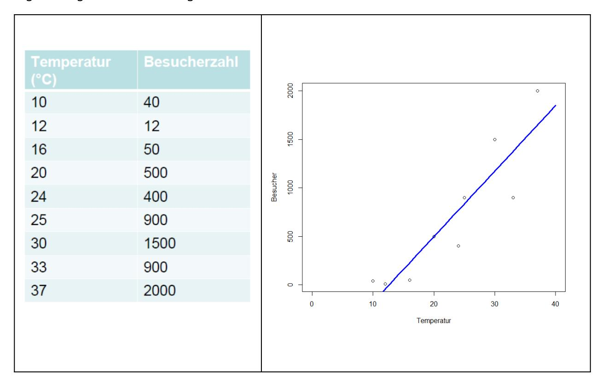
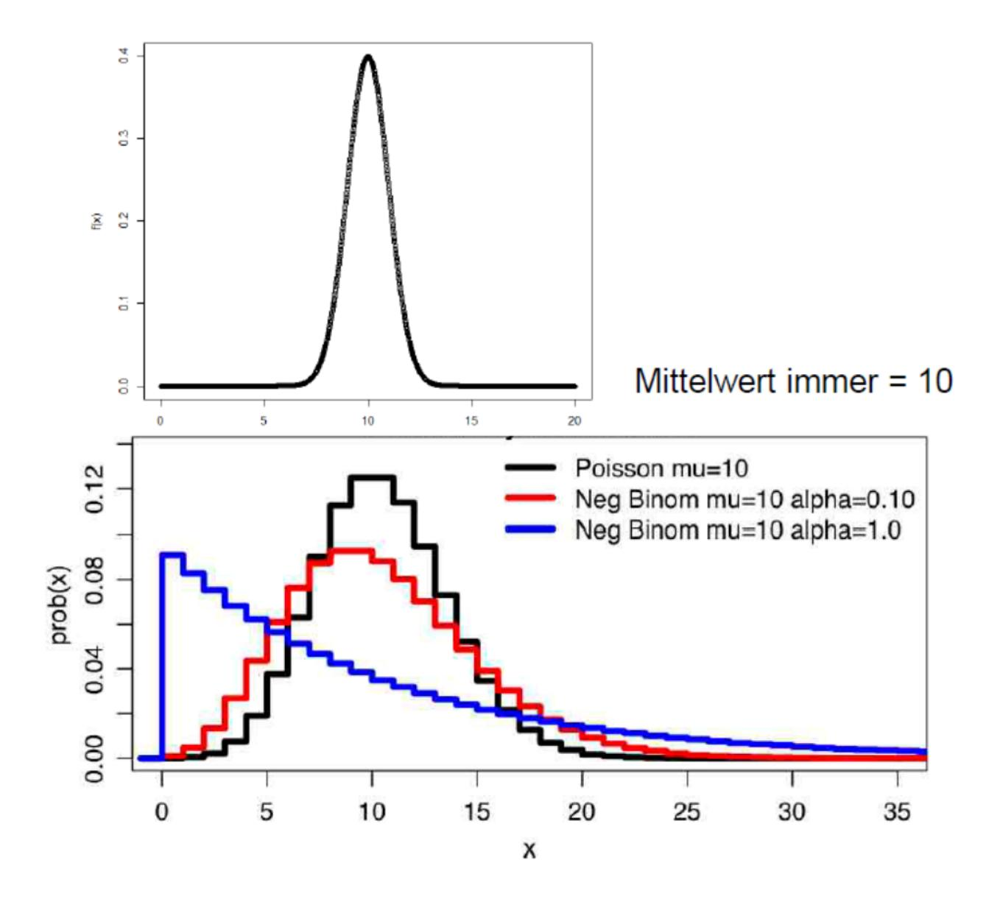
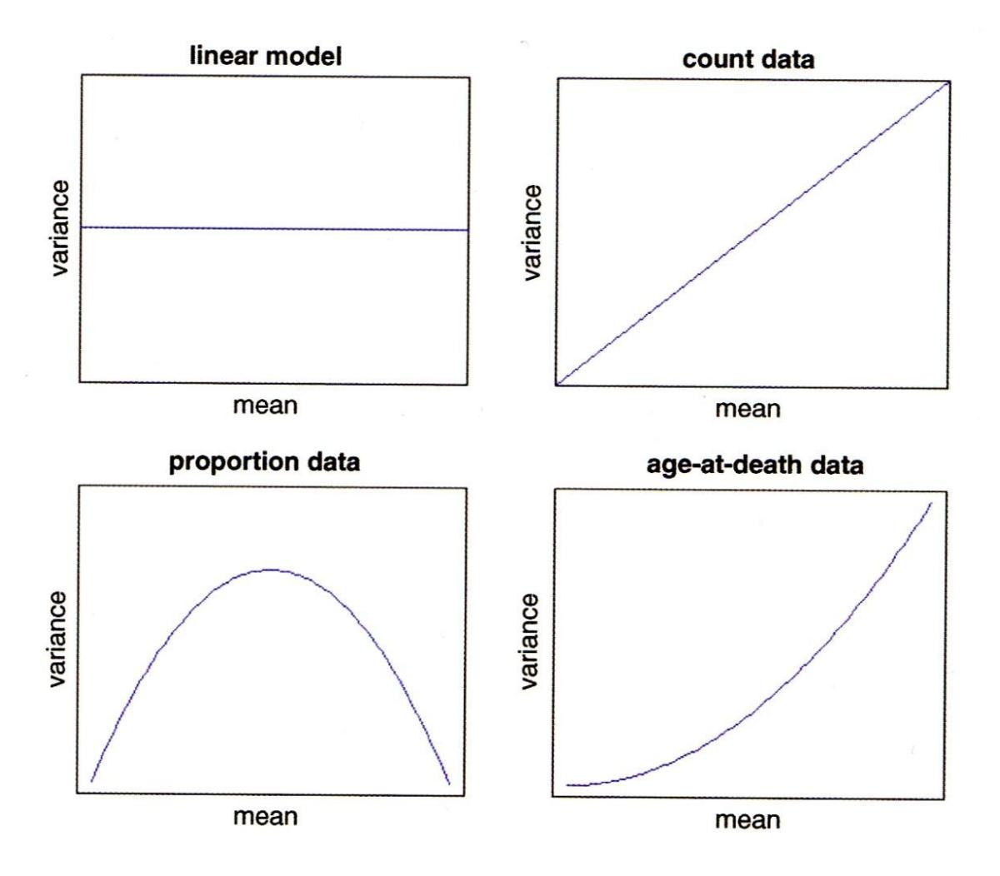
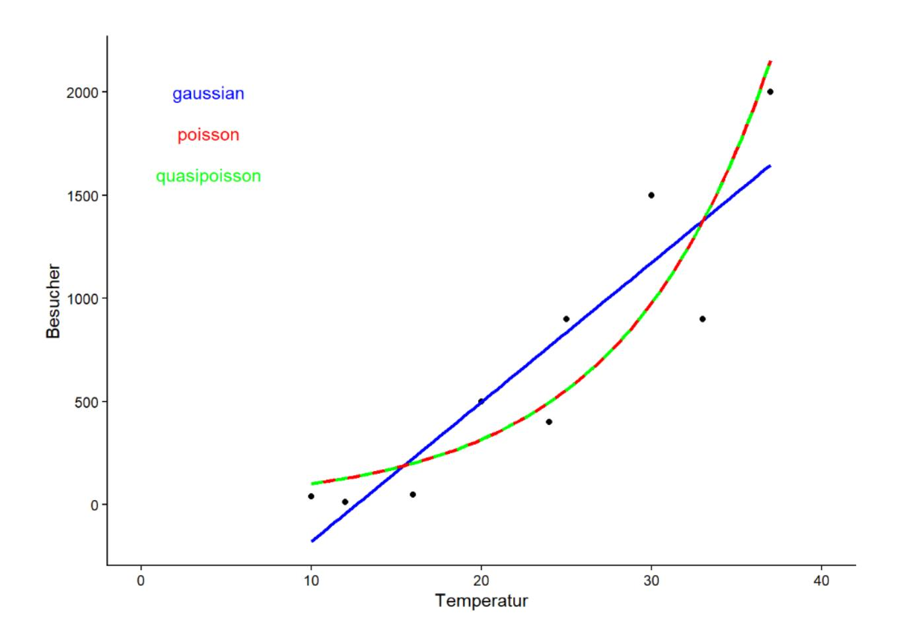
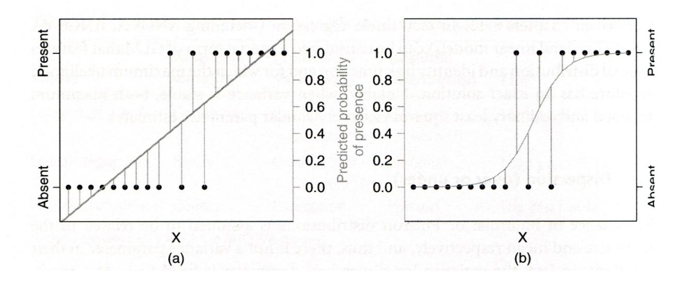
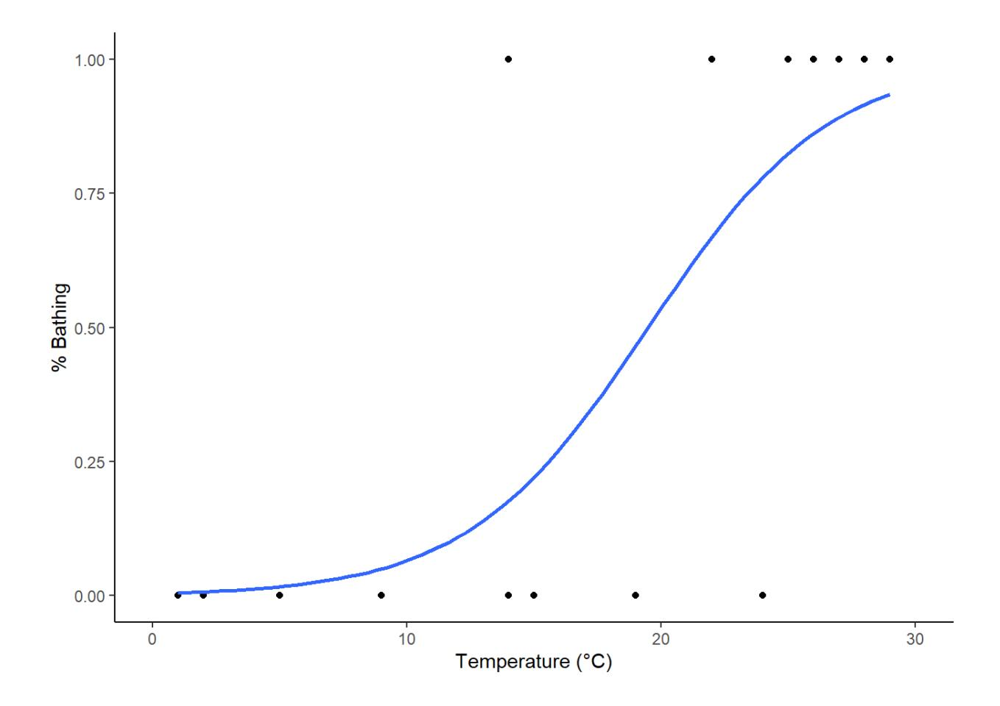
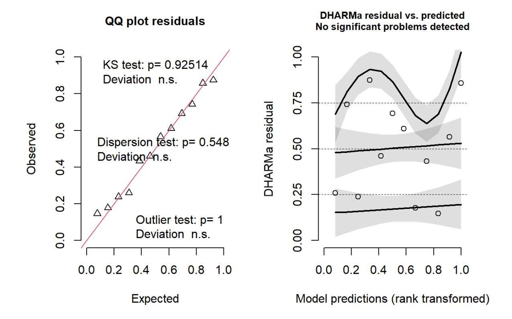

Heute geht es um *generalized linear models* (GLMs), die einige wesentliche Limitierungen von linearen Modellen überwinden. Indem sie Fehler- und Varianzstrukturen explizit modellieren, ist man nicht mehr an Normalverteilung der Residuen und Varianzhomogenität gebunden. Bei *generalized linear regressions* muss man sich zwischen verschiedenen Verteilungen und link-Strukturen entscheiden. Spezifisch werden wir uns die Poisson-Regressionen für Zähldaten und die binomiale Regression für ja/nein-Daten anschauen.

### Lernziele

Ihr…

- habt verstanden, worin sich **GLMs** von linearen Regressionen unterscheiden und wann sie zur Anwendung kommen; und
- könnt die beiden häufigsten GLM-Typen **(Quasi-) Poisson-Regression** für Zähldaten und **binomiale Regression** für Binär- und Proportionsdaten in R richtig anwenden und die Ergebnisse interpretieren.

## Von linearen Modellen zu GLMs

#### Zwei Beispiele

Nehmen wir an, wir wollten modellieren, wie viele Besucher an einem Strandabschnitt zur Mittagszeit in Abhängigkeit von der herrschenden Lufttemperatur anzutreffen sind. Unsere Daten sehen folgendermassen aus und mit den bekannten Methoden können wir ein lm rechnen, dessen Ergebnis signifikant ist und sogar recht viel der Gesamtvarianz erklärt:



Unsere abhängige Variable ist eine Zählung und verhält sich daher anders als eine echte metrische Variable (etwa einer Messung des pH-Wertes). **Zähldaten** stellen lineare Modelle (lm) vor **vier Probleme:**

- Lineare Modelle sagen immer auch das Auftreten **negativer Werte** voraus, wohingegen **absolute Häufigkeiten immer positive Ganzzahlen** sind (im obigen Beispiel würde das Modell bereits im gefitteten Bereich, unter etwa 12 °C, eine negative Anzahl Menschen vorhersagen).
- Nahezu immer sind Zähldaten **rechtsschief verteilt**, also nicht normalverteilt und auch nicht symmetrisch
- Bei Zähldaten nimmt nahezu immer die **Varianz mit dem Mittelwert zu**.
- Zähldaten folgen keiner kontinuierlichen (wie die Normalverteilung), sondern einer **diskreten Verteilung**.

Theoretisch sind also die Voraussetzungen für ein lineares Modell bei Zähldaten nie erfüllt. In der Praxis gibt es aber Situationen, wo die Verletzung der Annahmen für das Modell nicht weiter problematisch ist und man mit einem lm zu korrekten Aussagen gelangen kann. Relativ problemlos funktioniert das (und wird auch noch häufig getan), wenn (a) alle Werte der Antwortvariablen weit von 0 entfernt sind und (b) die Werte der Antwortvariable um deutlich weniger als eine

Grössenordnung (d. h. Faktor 10) variieren. Im obigen Beispiel beträgt der Quotient des grössten und kleinsten Wertes der Antwortvariablen 2000 / 12 = 167. Mit etwas Erfahrung sehen wir schon im Scatterplot, dass hier Linearität und Varianzhomogenität verletzt sind.

Ein anderes Beispiel, bei dem ein lineares Modell offensichtlich und immer scheitern würde, wäre eine Befragung von Touristen an Tagen unterschiedlicher Temperatur, ob sie schwimmen gegangen sind. Das Ergebnis könnte wie folgt aussehen (stark gekürzte Tabelle, an jedem Tag (d. h. bei gleicher Temperatur) wurden jeweils mehrere Touristen befragt):

| Temperatur (°C) | Geschwommen? |
|-----------------|--------------|
| 1               | nein (0)     |
| 2               | nein (0)     |
| 5               | nein (0)     |
| 9               | nein (0)     |
| 14              | ja (1)       |
| 14              | nein (0)     |
| []              |              |
| 28              | ja (1)       |
| 29              | ja (1)       |

Bei solchen "binären Daten" bestehen zwei hauptsächliche Probleme für lineare Modelle:

- Die Werteverteilung ist nach unten und nach oben begrenzt.
- Es gibt überhaupt nur zwei mögliche Werte, nein und ja, als 0 und 1 codiert.

#### Die Idee der Generalized linear models (GLMs)

**Generalized linear models (GLMs)** verallgemeinern **lineare Modelle (LMs)**, um Fälle wie die geschilderten (Zähldaten, Binärdaten, für weitere Beispiele siehe Crawley (2015)) modellieren zu können. "Generalisiert" heissen die GLMs aus folgenden drei Gründen:

- Alle LMs sind im Begriff GLM eingeschlossen (aber viele GLMs sind keine LMs).
- Die **Verteilung der "Zufallskomponente"** (= Residuen) kann sich **von einer Normalverteilung unterscheiden** (muss aber aus der exponentiellen Familie von Verteilungen sein).
- Die abhängige Variable kann **auf verschiedene Weise mit den Prädiktoren verknüpft** (*linked*) sein.

#### Die drei Komponenten eines GLM

Ein GLM setzt sich aus drei Komponenten zusammen, die relativ frei kombiniert werden können (aber für bestimmte Zufallskomponenten gibt es Standard-Link-Funktionen):

1. **Zufallskomponente (d. h. die Verteilung der Residuen):**
   - normal
   - binomial: z. B. ja/nein, tot/lebendig
   - Poisson: Zähldaten (funktioniert aber nicht immer)
   - gamma
   - negativ binomial (Dispersionsparameter muss geschätzt werden)
2. **Systematische Komponente (d. h. die** *x***-Werte):** es ist alles möglich, was wir schon von LMs her kennen:
   - kontinuierliche (metrische) Prädiktoren
   - kategoriale Prädiktoren
   - Interaktionen von Prädiktoren
   - polynomiale Funktionen
   - jewede Kombination aus den vorhergehenden Elementen
3. **Link-Funktion (d.h. was auf der linken Seite der Funktionsgleichung steht):** entweder y oder eine Transformation von y, siehe Details unten:
   - Identität (*identity*)
   - log (für Zähldaten)
   - logit (für Binärdaten)

#### Mögliche Verteilungen von Werten und von Varianzen

Was mit verschiedenen **Verteilungen der Residuen** gemeint ist, veranschaulichen die folgenden beiden Abbildungen von vier Häufigkeitsverteilungen mit dem gleichen Mittelwert. Oben sind die **kontinuierliche Normalverteilung** und unten drei unterschiedliche diskrete Verteilungen (Poisson, negativ-binomial) zu sehen:



Auch die **Beziehung von Varianzen zum (vorhergesagten) Mittelwert** müssen keinesfalls immer konstant sein, wie wir das von den linearen Modellen kennen. Vielmehr zeigen viele Datentypen eine systematische Veränderung der Varianz mit dem Mittelwert:



(aus Crawley 2015)

#### Typen von GLMs

Eine Übersicht gängige GLM-Typen bietet die folgende Tabelle (man beachte die uneinheitliche Gross-/Kleinschreibung der Verteilungen):

| Name der          | Link-Funktion |                                           | Abhängige Variable                                  |                                                                                      |
|-------------------|---------------|-------------------------------------------|-----------------------------------------------------|--------------------------------------------------------------------------------------|
| Verteilung in R   | Name          | Definition                                | Mögliche Werte                                      | Mögliche Datentypen                                                                  |
| binomial          | logit         | $\eta = \ln(\frac{\hat{y}}{1 - \hat{y}})$ | Relative Anteile                                    | Wahrscheinlichkeit von<br>Ereignissen oder<br>Ergebnissen                            |
| poisson           | log           | $\eta = \ln(\hat{y})$                     | Nicht-negative<br>Ganzzahlen                        | Anzahl von Fällen (inkl.<br>Kontingenztabellen)                                      |
| negative.binomial | log           | $\eta = \ln(\hat{y})$                     | Nicht-negative<br>Ganzzahlen                        | Anzahl von Individuen in<br>aggregierten räumlichen<br>Verteilungen                  |
| Gamma             | reciprocal    | $\eta = \frac{1}{\hat{y}}$                | Positive reelle<br>Zahlen                           | Abmessungen, Gewichte, etc. und deren Verhältnisse                                   |
| gaussian          | identity      | $\eta = \hat{y}$                          | Beliebige reelle<br>Zahlen (d. h.<br>auch negative) | (wenn man die<br>vorstehenden Möglichkeiten<br>berücksichtigt, dann nahezu<br>keine) |

(übersetzt und modifiziert nach Šmilauer 2017)

Man beachte, dass ein GLM mit Normalverteilung (gaussian) und identity-Link identisch mit einem LM ist.

Wenn man dieser Anleitung strikt folgen würde (was auch Šmilauer 2017 nicht tut), dürfte man LMs nur dann verwenden, wenn die Antwortvariable auch negative Werte annehmen kann. De facto können viele/die meisten Antwortvariablen, mit denen wir arbeiten, nur positive Werte annehmen (etwa Biomasse, Niederschläge, Stoffkonzentrationen, Einkommen). Die Abweichungen von der Normalverteilung (durch die fehlenden negativen Werte) sind aber in der Praxis so gering, dass in solchen Fällen meist trotzdem ein Gaussian-GLM = LM das beste Verfahren darstellt.

GLMs mit binomialer, Poisson, Gamma- und Gauss (Normal)-Verteilung sind in Base R implementiert, für negative binomial («glm.nb») benötigt man das Package MASS. In diesem Kurs gehen wir im Detail nur auf die beiden meistbenutzten GLM-Typen ein, **Poisson-Regression für Zähldaten** und **binomiale Regressionen für Binärdaten und Proportionaldaten**. Mehr zu den übrigen Typen findet man u. a. in Crawley (2015), Dunn & Smyth (2018) und Fox & Weisberg (2019)

#### Das Fitten und die Modellgüte von GLMs

Bei einem **linearen Modell (LM)** wird die Lösung durch **Minimierung der Summe der Abweichungsquadrate** erzielt. Diese Lösung lässt sich direkt, immer eindeutig und sogar von Hand ausrechnen. GLMs dagegen fitten die Modelle in einem iterativen Verfahren, indem die *Likelihood* **maximiert** wird. Deswegen spricht man auch von *Maximum likelihood* (ML). Nach erfolgtem Fitten werden die Werte mit der **Umkehrfunktion der Link-Funktion** auf die originale Skala zurücktransformiert.

Als Mass der Variabilität oder lack of fit wird bei GLMs die Devianz *D* verwendet, die folgendermassen definiert ist:

Je nach GLM-Typ wird die Devianz anders berechnet:

| Model      | Deviance                                                                                   | Error    | Link       |
|------------|--------------------------------------------------------------------------------------------|----------|------------|
| linear     | $\sum (y - \hat{y})^2$                                                                     | Gaussian | identity   |
| log linear | $2\sum y\log\left(\frac{y}{\hat{y}}\right)$                                                | Poisson  | log        |
| logistic   | $2\sum y \log\left(\frac{y}{\hat{y}}\right) + (n-y)\log\left(\frac{n-y}{n-\hat{y}}\right)$ | binomial | logit      |
| gamma      | $2\sum \frac{(y-\hat{y})}{y} - \log\left(\frac{y}{\hat{y}}\right)$                         | gamma    | reciprocal |

(aus Crawley 2015)

#### Erklärte Varianz in GLMs

Im strikten Sinne gibt es eine erklärte Varianz ( $R^2$ ) nur für lineare Modelle, die mit der Methode der kleinsten Abweichungsquadrate ermittelt wurden (lineare Regressionen, ANOVAs, ANCOVAs). Da aber auch in GLMs der Wunsch besteht, zu quantifizieren, wie umfänglich ein Modell die Realität abbildet (also wie vollständig die Prädiktoren sind), wurden dafür sogenannte Pseudo- $R^2$ -Werte geschaffen. Analog zu  $R^2$  reichen sie auch von 0 (Modell erklärt Muster in der abhängigen Variable gar nicht) bis 1 (Modell erklärt Muster in der abhängigen Variable vollständig).

Es gibt je nach GLM-Typ unterschiedliche Pseudo- $R^2$ -Werte als Masse für die Modellgüte. Bis vor einiger Zeit, musste man sie «händisch» aus Parametern des Modell-Outputs berechnen. Jetzt kann man das mit dem Befehl r2 aus dem performance-Package machen. Der Befehlt r2 erkennt, um welche Art von Regressionsmodell es sich handelt und berechnet (und benennt) automatisch den passenden Pseudo- $R^2$ -Wert (oder manchmal mehrere Alternativen), etwa Nagelkerkes, McFaddens oder Tjurs  $R^2$ . In einem Ergebnistext bitte immer angeben, um welches Pseudo- $R^2$  es sich handelt. Man beachte, dass  $R^2$ -Werte zwischen verschiedenen Modelltypen nicht direkt vergleichbar sind, innerhalb eines GLM-Typs dagegen schon.

#### Testen der Modellvoraussetzungen (Modellvalidierung) in GLMs

Der höheren Komplexität von GLMs verglichen mit linearen Modellen ist auch die Modellvalidierung zwar genauso wichtig, aber komplexer. Bis vor einiger Zeit, musste man sich die jeweils passenden Diagnostik-Plots oder -Kennzahlen mehr oder weniger «händisch» erstellen. Jetzt leistet der das Package DHARMa die Arbeit.

## Poisson-Regressionen für Zähldaten

#### Berechnung

Die Struktur des glm-Befehls in R ist genau identisch mit jenem des lm-Befehls. Nur muss man zusätzlich die Verteilung (family) und ggf. die Link-Funktion (wenn nicht die Standard-Link-Funktion der jeweiligen Verteilung) angeben. Schauen wir uns nun die Ergebnisse für unsere Zähldaten der Strandbesucher an, zunächst mit einem LM, dann mit einem Gauss-GLM und schliesslich mit einem Poisson-GLM:

```{.r}
lm_strand <- lm(Besucher~Temperatur)
glm_gaussian <- glm(Besucher~Temperatur, family = gaussian)
glm_poisson <- glm(Besucher~Temperatur, family = poisson)
```

```{.r}
summary(lm_strand)
```

```
Coefficients:
              Estimate Std. Error t value Pr(>|t|)
(Intercept) -855.01     290.54  -2.943  0.021625 *
Temperatur    67.62      11.80   5.732  0.000712 ***
```

```{.r}
summary(glm_gaussian)
```

```
Coefficients:
              Estimate Std. Error t value Pr(>|t|)
(Intercept) -855.01     290.54  -2.943  0.021625 *
Temperatur    67.62      11.80   5.732  0.000712 ***
```

```{.r}
summary(glm_poisson)
```

```
Coefficients:
             Estimate Std. Error z value Pr(>|z|)
(Intercept) 3.500301   0.056920   61.49  <2e-16 ***
Temperatur  0.112817   0.001821   61.97  <2e-16 ***
```

Wie nach den Erläuterungen im vorigen Kapitel zu erwarten war, sind die Ergebnisse des LMs und des Gauss-GLMs vollkommen identisch. Jene des Poisson-GLMs sind dagegen anders, insbesondere viel höher signifikant.

#### Interpretation und Visualisierung der Ergebnisse

Im Falle des lm können wir aus den Parameter-Schätzungen (Spalte Estimate im summary) direkt die sich ergebende Funktionsgleichung aufschreiben:

Bei einem glm sind die Parameter-Schätzungen dagegen nicht direkt interpretierbar, da sie sich auf eine transformierte Skala beziehen, welche durch die Link-Funktion angegeben ist. Die Standard-Link-Funktion bei einem Poisson-GLM ist log, also der natürliche Logarithmus (ln). Unser Ergebnis lässt sich damit wie folgt schreiben:

Da uns aber nicht ln (Besucher), sondern die Besucherzahl selbst interessiert, müssen wir die Umkehrfunktion der Link-Funktion anwenden. Die Umkehrfunktion von ln ist exp. Es ergibt sich:

Damit können wir auch die vorhergesagten Werte für verschiedene Temperaturen berechnen.

Wenn wir das Ganze plotten wollen, benötigen wir die funktion geom_smooth welche den Befehl im Hintergrund ausführt. und die die Umkehrfunktion (exp) anwendet:

```{.r}
ggplot(data = strand, aes(x = Temperatur, y = Besucher)) +
geom_point() +
xlim(0, 40) + 
stat_smooth(method = "lm", color = "blue", se = FALSE) +
geom_smooth(method = "glm", method.args = list(family = "poisson"), 
color = "red", se = FALSE) +
geom_smooth(method = "glm", method.args = list(family = "quasipoisson"), 
color = "green", linetype = "dashed", se = FALSE) +
annotate(geom = "text", x = 4, y = 2000, label = "gaussian", color = "blue") +
annotate(geom = "text", x = 4, y = 1800, label = "poisson", color = "red") +
annotate(geom = "text", x = 4, y = 1600, label = "quasipoisson", 
color = "green") +
theme_classic()
```



#### Overdispersion als Problem

Mathematisch beschreibt die Poisson-Verteilung Ereignisse pro Zeiteinheit, wenn sie mit einer bestimmten Rate (Mittelwert) erfolgen, die Ereignisse selbst aber unabhängig voneinander sind. Für ökologische/umweltwissenschaftliche Zähldaten sind diese Voraussetzungen oft nicht exakt gegeben, sie folgen daher nicht immer genau einer Poisson-Verteilung, sondern weisen teilweise eine *Overdispersion* auf. *Overdispersion* bedeutet dass die gemessene Variation in den Daten die theoretisch erwartete Variation übersteigt. Für eine Poisson-Regression wird eine angenommen. Wenn die Dispersion wesentlich/signifkant grösser als 1 ist, liegt *Overdispersion* vor. Residual deviance und Residual degrees of freedom findet man im summary des glm:

```{.r}
summary(glm_poisson)
```

```
[…]

(Dispersion parameter for poisson family taken to be 1)

    Null deviance: 6011.8 on 8 degrees of freedom
Residual deviance: 1113.7 on 7 degrees of freedom

AIC: 1185.1
```

Man sieht hier, dass der Quotient von 1113.7 und 7 weit höher als 1 ist. Mit dem Dispersionstest im Package performance kann man formal auf einen signifikanten Unterschied testen:

```{.r}
p_load("performance")
check_overdispersion(glm_poisson)
```

```
# Overdispersion test

dispersion ratio = 149.683
Pearson's Chi-Squared = 1047.778
p-value = < 0.001

Overdispersion detected.
```

Wenn man eine signifikante *Overdispersion* gefunden hat, gibt es zwei Lösungsmöglichkeiten:

1. **Quasi-Poisson-Verteilung:** Hierbei schätzt der Algorithmus den Dispersionsparameter aus den Daten und passt die angenommene Verteilung entsprechend an. Die Methode ist im Befehl glm in Base R implementiert:

```{.r}
glm_quasipoisson <- glm(Besucher~Temperatur, family = quasipoisson)
summary(glm_quasipoisson)
```

```
Coefficients:
            Estimate Std. Error t value Pr(>|t|)
(Intercept)  3.50030    0.69639   5.026  0.00152 **
Temperatur   0.11282    0.02227   5.065  0.00146 **
---
Signif. codes: 0 '***' 0.001 '**' 0.01 '*' 0.05 '.' 0.1 ' ' 1

(Dispersion parameter for quasipoisson family taken to be 149.6826)
```

   Man sieht, dass im Vergleich zur Berechnung mit einem einfachen Poisson-GLM die Parameterschätzungen nicht verändert haben, jedoch die Signifikanzen niedriger ausgefallen sind (d. h. höhere *p*-Werte).

2. **Negativ-binomiale Verteilung:** Oftmals erzielt man damit ähnliche, in besonderen Fällen allerdings auch deutlich andere Ergebnisse. Was besser ist, hängt vom Einzelfall ab und ist u. U. recht "tricky". Weitere Details, siehe Ver Hoef & Boveng (2007).

## Logistische Regressionen für Binärdaten

Logistische Regressionen werden für alle binären Antwortvariablen verwendet, etwa für Vorkommensdaten (Inzidenzdaten). Das folgende Abbildungspaar zeigt links, was passieren würde, wenn man solche Daten mit einem lm fitten würde und rechts, die korrekte Modellierung mit einem logistischen glm:



(aus Logan 2010)

#### Prinzipielles Vorgehen

- Die abhängige Variable muss als Vektor vorliegen, der entweder nur die Ganzzahlen 0 und 1 enthält oder aber ein Faktor mit genau zwei Levels ist.
- Es wird ein **glm mit family=binomial** gerechnet.
- Der voreingestellte **Link ist logit**, alternativ geht auch log-log.
- Overdispersion ist bei Binärdaten nicht relevant.
- Wie bei allen (multiplen) Modellen müssen wir eine **Modellvereinfachung** des vollen Modells vornehmen, wofür im Prinzip die gleichen drei Methoden zur Verfügung stehen, die wir schon kennen:
  - **Modellselektion I:** sukzessive Vereinfachung durch Entfernen nichtsignifkanter Terme.

  - **Modellselektion II:** sukzessive Vereinfachung mittels Vergleich der Devianzen zweier Modelle mit Chi-Quadrat-Test (Achtung: Unterschied zu Im, wo wir eine ANOVA, d. h. einen F-Test verwendet haben).
  - **Modellselektion III:** mittels AICc: Berechnung aller möglichen Modelle und dann entweder Auswahl jenes mit dem niedrigsten AICc oder Multimodel inference.

##### Die Theorie dahinter

Das "logit" (L) ist ein zentrales Element der logistischen Regression. Ein «logit» ist als der natürliche Logarithmus eines "odds" definiert. "Odds" hatten wir im Prinzip (ohne es so zu nennen) schon kurz beim Vierfelder-Assoziationstest (Chi-Quadrat- bzw. Fishers exakter Test). Sie bezeichnen die Wahrscheinlichkeit eines Ereignisses durch die "Gegenwahrscheinlichkeit". Es gilt also Folgendes:

Warum arbeitet man mit "odds" und "logits"? Wenn man nur p modellieren würde, wären die möglichen Werte auf 0 ... 1 begrenzt. "Odds" dagegen können Werte zwischen 0 und  $\infty$  annehmen. Der Logarithmus schliesslich sorgt für eine symmetrische Verteilung der originalen Wahrscheinlichkeiten unter 50 % (jetzt zwischen  $-\infty$  und 0) und der originalen Wahrscheinlichkeiten über 50 % (jetzt zwischen 0 und  $+\infty$ ).

Bei GLMs wir ja immer die abhängige Variable mit der Link-Funktion transformiert. Damit modelliert eine logistische Regression das folgende Modell (in einer multiplen logistischen Regression ggf. auch mit  $x_1$ ,  $x_2$  usw.):

#### Modelldiagnostik und Ergebnisse

Die Beurteilung von Validität und Güte/Relevanz eines logistischen Modells unterscheidet sicher erheblich von einem Im:

- Eine visuelle Inspektion der Residualplots ist hier nicht informativ.
- Es gibt diverse numerische *Goodness-of-fit-*Tests für das Modell, am einfachten der Vergleich der Abweichung der Devianz () von der geforderten Verteilung.
- Das konventionelle Gütemass funktioniert ebenfalls nicht. Stattdessen kann man die Modellgüte mit einem **Pseudo**- ausdrücken:

Da nicht die abhängige Variable (d. h. die Auftretenswahrscheinlichkeit), sondern ihr *logit* modelliert wurde, muss man die beiden Parameterschätzungen erst in informative Grössen übersetzen. Es sind diese:

- **Lagemass** (d. h. bei welchem  $x_1$ -Wert ist die Wahrscheinlichkeit von 0 und 1 gleich hoch; auch als "LD50" = "lethal" dose for 50% of the individuals" bezeichnet, basierend auf Anwendungen on logistischen Regressionen in Toxizitätstests):
- **Steilheitsmass** (d. h. wie scharf/steil ist der Übergang von 0 zu 1, ausgedrückt als die relative Änderung der "odds" bei Zunahme von  $x_1$  um eine Einheit):

#### Umsetzung in R

Schauen wir uns diese ganzen Schritte im Fall unseres Bade-Beispiels an, also der Wahrscheinlichkeit, dass eine Person am Strand schwimmen geht in Abhängigkeit von der Temperatur. Die Definition des Modells in R ist wie gehabt einfach:

```{.r}
glm_logistic <- glm(bathing~temperature, family = "binomial", data = bathing)
summary(glm_logistic)
```

```
Coefficients:
             Estimate Std. Error z value Pr(>|z|)
(Intercept)  -5.4652     2.8501  -1.918   0.0552 .
temperature   0.2805     0.1350   2.077   0.0378 *
```

Die uns interessierenden Aspekte **Modelldiagnostik, Modellgüte und Kurvenverlauf** müssen wir händisch aus dem abgespeicherten Objekt model extrahieren, indem wir auf einzelne darin abgespeicherte Daten zurückgreifen (manches geht auch mit den Packages MASS oder performance):

```{.r}
# Modelldiagnostik (wenn nicht signifikant, dann OK)
1 - pchisq(glm_logistic$deviance, glm_logistic$df.resid)
# [1] 0.6251679

# Area Under the ROC Curve (AUC)
library("performance")
performance_roc(glm_logistic)

# Modellgüte (Eine Version von pseudo-R2)
1 - (glm_logistic$dev / glm_logistic$null)
# [1] 0.4775749

# Modellgüte (Tjur's pseudo-R2)
r2(glm_logistic)
# R2 for Logistic Regression
# Tjur's R2: 0.538

# Steilheit der Beziehung (relative Änderung der odds von x + 1 vs. x)
exp(glm_logistic$coefficients[2])
# temperature
# 1.323807

# LD50 (also hier: Temperatur, bei der 50% der Touristen baden)
-glm_logistic$coefficients[1] / glm_logistic$coefficients[2]
# (Intercept)
# 19.48311
```

```{.r}
# LD50-Berechnung mit dem MASS-package
p_load(MASS)
dose.p(glm_logistic, p = 0.5)
```

```
              Dose      SE
p = 0.5: 19.48311 2.779485
```

Der erste Wert gibt die Steilheit der Beziehung an und ob sie ansteigend oder fallend ist, wobei 1 keinen Effekt, >1 eine ansteigende Häufigkeit und < 1 eine fallende Häufigkeit bezeichnen. Der zweite Wert (man beachte das Minus-Zeichen in der Formel!) gibt den *x*-Wert an, für den die berechnete Wahrscheinlichkeit (Vorkommenswahrscheinlichkeit, Sterbewahrscheinlichkeit, usw.) genau 50 % ist.

Ganz einfach vorzustellen ist eine logistische Funktion auch mit diesen Werten noch nicht. Deswegen sollten wir im Falle signifkanter logistischer Regressionen immer zwei Dinge tun: (1) Die Funktionsgleichung angeben und (2) Das Ergebnis visualisieren.

Die Funktionsgleichung zu extrahieren, ist etwas vertrackt, da wir ja nicht die Auftretenswahrscheinlichkeit *y*, sondern ihren *logit* modelliert haben. Übersetzt bedeuten die Estimate-Werte unseres summary also:

Wir formen sukzessive um, um nach y aufzulösen:

Oder mit den Werten in unserem Fall:

Zum Visualisieren den geom_smooth verwenden:

```{.r}
# Plotting
ggplot(data = bathing, aes(x = temperatur, y = badend)) +
geom_point() +
xlim(0, 30) +
labs(x = "Temperature (°C)", y = "% Bathing") +
geom_smooth(method = "glm", method.args = list(family = "binomial"), se = FALSE) +
theme_classic()
```



### Binomial-Regressionen für Proportionen

Stellen wir uns nun vor, im vorigen Beispiel, hätten wir für jedes Temperaturintervall nicht die ja/ nein-Daten für jede einzelne Person erhoben, sondern vielmehr viele Personen beobachtet und den Anteil Badender/Nicht-Badender Personen ermittelt. Inhaltlich hat sich nicht viel verändert: Statt der Wahrscheinlichkeit des Badens für eine Einzelperson würden wir jetzt den vorhergesagten Anteil der Badenden unter allen Personen am Strand ermitteln. Wiederum sind die Werte zwischen 0 (0 %) und 1 (100 %) beschränkt und die Varianz ist zu den extremen Enden gering, bei 50 % jedoch am grössten.

Das bedeutet, wir können diesen Fall wiederum mit einem binomialen Modell mit logit-Link berechnen. Allerdings können wir nicht die Proportionen der Badenden für die einzelnen Temperaturen direkt übergeben, da R sonst nicht wüsste, auf wie vielen Einzelbeobachtungen jede Proportion beruht, was aber essenziell ist, um die Modellparameter und die *p*-Werte verlässlich zu schätzen. Insofern muss man R für jeden Temperaturwert nicht einen einzelnen y-Wert, sondern zwei übergeben. Dafür gibt es zwei Optionen (siehe im Beispiel).

#### Beispiel und Umsetzung in R

Wir haben Daten zum Überleben von Raupen der Mottenart (*Choristoneura frumiferana*; englisch «budworm») bei einer Behandlung mit Insektizid in unterschiedlichen Dosen (eingebauter Datensatz budworm aus dem Paket MASS). Es wurden jeweils 20 männliche und 20 weibliche Raupen bei Insektizidgaben von sechs unterschiedlichen Konzentrationen (1, 2, 4, 8, 16, 32) untersucht und ermittelt, wie viele davon gestorben sind. Der Dataframe hat daher vier Spalten:

```
'data.frame': 12 obs. of 4 variables:
 $ sex   : Factor w/ 2 levels "female","male": 2 2 2 2 2 2 1 1 1 1 ...
 $ dose  : int 1 2 4 8 16 32 1 2 4 8 ...
 $ ndead : int 1 4 9 13 18 20 0 2 6 10 ...
 $ ntotal: int 20 20 20 20 20 20 20 20 20 20 ...
```

Da die Insektiziddosen geometrisch mit sukzessiven Verdopplungen skaliert sind, macht es Sinn, sie vor der Erstellung des Modells mit log2 zu transformieren (einer der relativ seltenen Fälle, in denen man eine Prädiktorvariable transformieren sollte):

```{.r}
budworm$ldose <- log2(budworm$dose)
```

Das Modell (hier globales Modell mit zwei Prädiktoren und ihrer Interaktion) können wir nun auf zwei alternative Weisen spezifizieren:

- Statt eines Vektors der y-Werte, übergeben wir einen Dataframe mit zwei Spalten, bestehend aus den toten und lebenden Individuen. Dann können wir das binomiale Modell wie oben in der logistischen Regression spezifizieren.
- Alternativ übergeben wir den Anteil der toten Individuen, müssen dann aber zusätzlich die Zahl der untersuchten Individuen pro Kombination von Dosis und Geschlecht im Parameter weights übergeben.

```{.r}
glm_binomial <- glm(cbind(ndead, ntotal-ndead) ~ ldose*sex, family = binomial, data = budworm)
```

```{.r}
glm_binom <- glm(ndead/ntotal ~ ldose*sex, family = binomial, weights = ntotal, data = budworm)
```

Die Ergebnisse sind identisch (hier nur für das erste Modell gezeigt):

```{.r}
coef(glm_binomial)
```

```
(Intercept)       ldose     sexmale ldose:sexmale
 -2.9935418   0.9060364   0.1749868     0.3529130
```

Wie üblich folgt die Modellvereinfachung (die Interaktion ist nicht signifikant und fällt heraus, die beiden einzelnen Prädiktoren sind signifikant und verbleiben im Modell):

```{.r}
# Model optimierung
```

```{.r}
drop1(glm_binomial, test = "Chisq")
```

```
Single term deletions

Model:
cbind(ndead, ntotal - ndead) ~ ldose * sex

          Df Deviance    AIC    LRT Pr(>Chi)
<none>       4.9937  43.104
ldose:sex  1  6.7571  42.867 1.7633   0.1842
```

```{.r}
glm_binomial_2 <- update( glm_binomial, .~.-sex:ldose)
```

```{.r}
drop1(glm_binomial_2, test = "Chisq")
```

```
Single term deletions

Model:
cbind(ndead, ntotal - ndead) ~ ldose + sex

       Df Deviance    AIC     LRT Pr(>Chi)
<none>     6.757   42.867
ldose   1 118.799  152.909 112.042 < 2.2e-16 ***
sex     1  16.984   51.094  10.227  0.001384 **
---
Signif. codes: 0 '***' 0.001 '**' 0.01 '*' 0.05 '.' 0.1 ' ' 1
```

Danach müssen wir das Modell noch validieren und ggf. anpassen (das umfasst bei GLMs den Test auf «overdispersion» und die normale Modellvalidierung (letztere derzeit am besten mit dem Package DHARMa)):

```{.r}
# Validate Model
check_overdispersion(glm_binomial_2)
```

```
# Overdispersion test

dispersion ratio = 0.929
p-value = 0.592
No overdispersion detected.
```

```{.r}
# Validate Model
library(DHARMa)
set.seed(123)
simulateResiduals(glm_binomial_2, plot = TRUE, n = 1000)
```

##### DHARMa residuals



Hier gibt es keine Probleme. glm_binomial_2 ist daher unser minimal adäquates Modell. Wir brauchen jetzt nur noch ein Pseudo-*R*^2^ und eine Visualisierung (siehe Demo-Vorführung).

## Zusammenfassung

- *Generalized linear models* (GLMs) erlauben Regressionen mit anderen Varianzstrukturen und Residuenverteilungen als lineare Regressionen.
- Unter den GLMs sind zwei besonders gebräuchlich: (Quasi-) Poisson-Regressionen werden für Zähldaten, binomiale Regressionen werden für binäre Daten («logistische Regression») und Proportionen, verwendet.

#### Weiterführende Literatur

- Crawley, M.J. 2015. *Statistics An introduction using R*. 2nd ed. John Wiley & Sons, Chichester, UK: 339 pp.
  - Chapter 12: Other Response Variables
  - Chapter 13: Count Data
  - Chapter 14: Proportion Data
  - Chapter 15: Binary Response Variable

- Dunn, P.K. & Smyth, G.K. 2018. *Generalized linear models with examples in R*. Springer, New York, US: 562 pp.
- Fox, J. & Weisberg, S. 2019. *An R companion to applied regression*. 3rd ed. SAGE Publications, Thousand Oaks, CA, US: 577 pp.
- Logan, M. 2010. *Biostatistical design and analysis using R. A practical guide*. Wiley-Blackwell, Oxford, UK: 546 pp., v.a.
  - pp. 483-530 (GLMs)
- Quinn, P.Q. & Keough, M.J. 2002. *Experimental design and data analysis for biologists*. Cambridge University Press, Cambridge, UK: 537 pp.
- Šmilauer, P. 2017. *Modern regression methods. Chapter 2: Generalised linear models for counts and ratios*. Unpublished script, České Budějovice*,* CZ.
- Ver Hoef, J.M. & Boveng, P.L. 2007. Quasi-Poisson vs. negative binomial regression: how should we model overdispersed count data? *Ecology* 88:2766– 2772.
