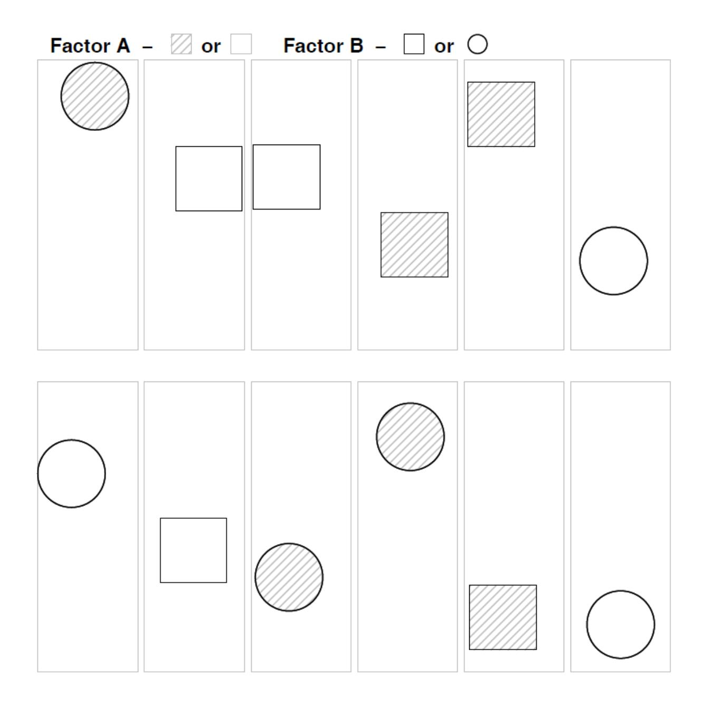
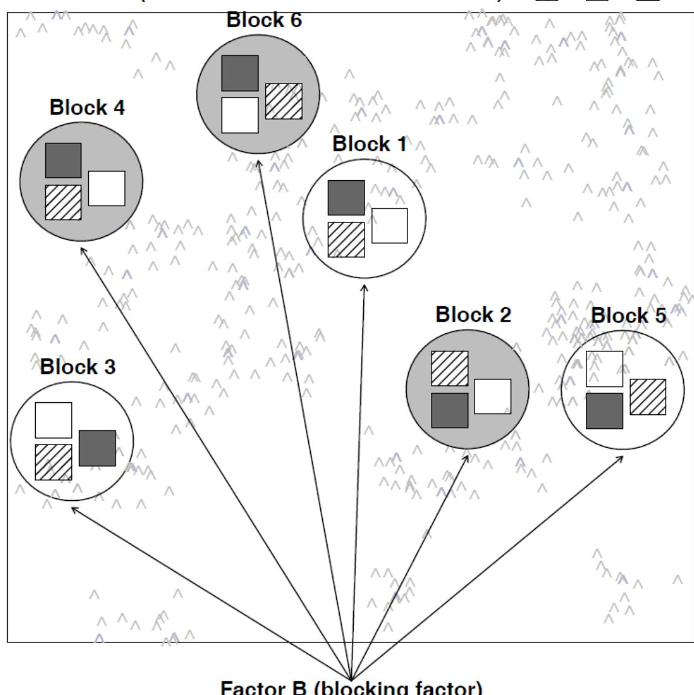
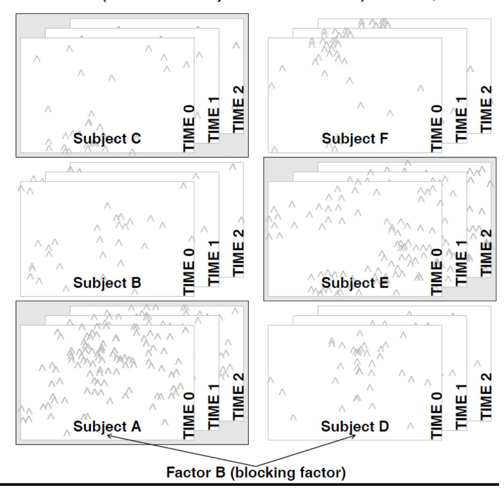
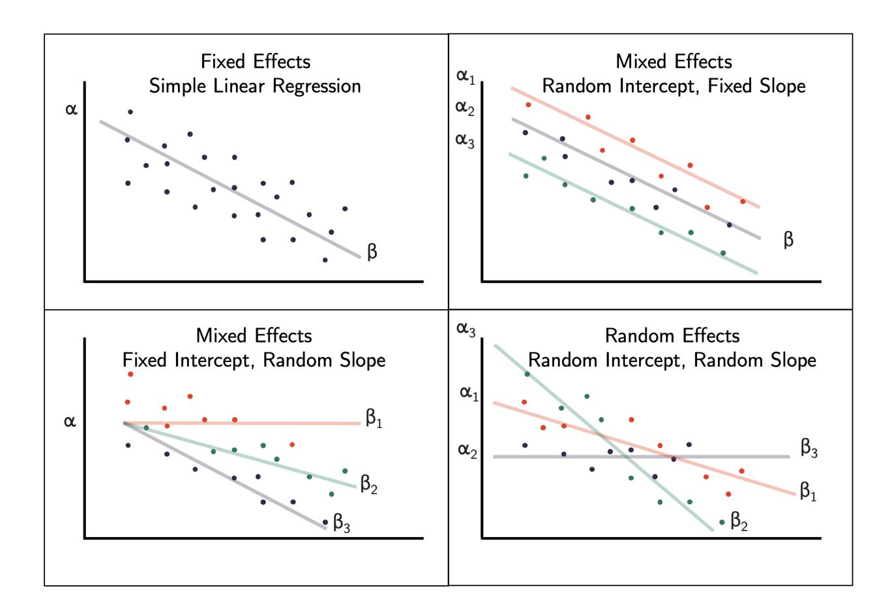
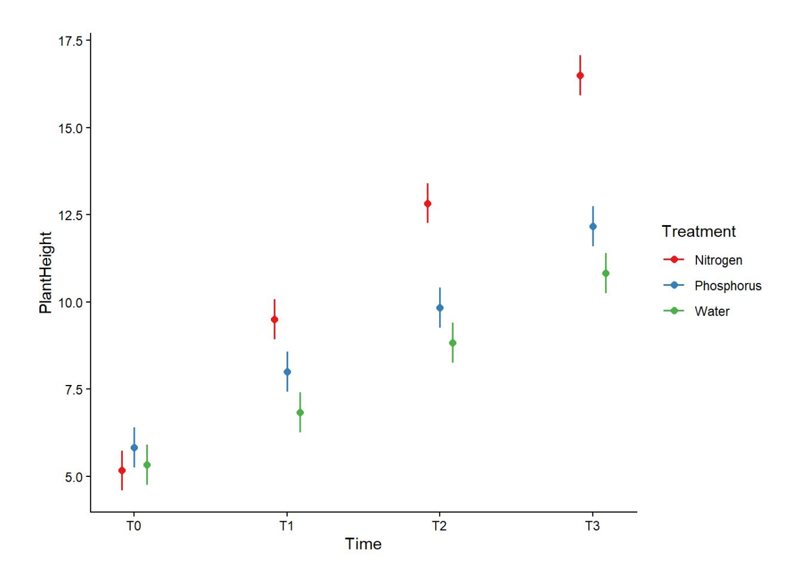
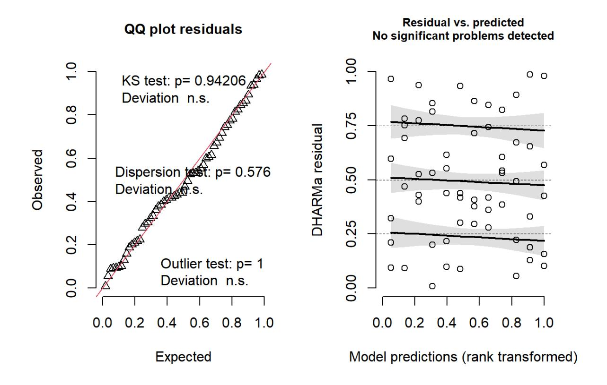
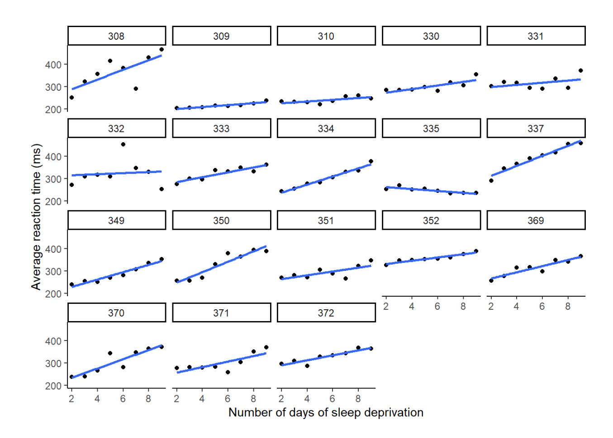
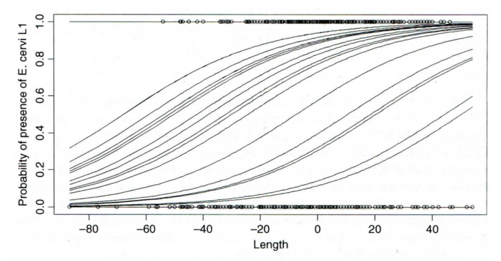
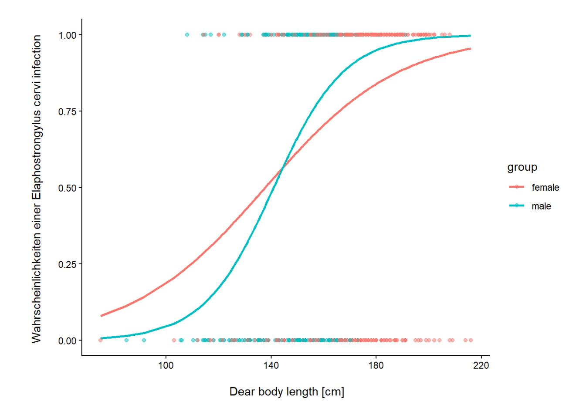

**In Statistik 6 lernen die Studierenden Lösungen kennen, welche die diversen Limitierungen von linearen Modellen überwinden. Während** *generalized linear models* **(GLMs) aus Statistik 5 bekannt sind, geht es jetzt um** *linear mixed effect models* **(LMMs) und** *generalized linear mixed effect models* **(GLMMs). Dabei bezeichnet** *generalized* **die explizite Modellierung anderer Fehler- und Varianzstrukturen und** *mixed* **die Berücksichtigung von Abhängigkeiten bzw. Schachtelungen unter den Beobachtungen. Einfachere Fälle von LMMs, wie** *split-plot* **und**  *repeated-measures* **ANOVAs, lassen sich noch mit dem aov-Befehl in Base R bewältigen, für komplexere Versuchsdesigns/Analysen gibt es spezielle R packages. Abschliessend gibt es eine kurze Einführung in GLMMs, die eine Analyse komplexerer Beobachtungsdaten z. B. mit räumlichen Abhängigkeiten, erlauben.**

#### **Lernziele**

Ihr…

- habt verstanden, welche Versuchsdesigns mit einer **normalen (Typ I) zweifaktoriellen ANOVA** analysiert werden können und welche die **Spezifikation eines random factors** erfordern; •
- könnt einfache Fälle von **Repeated measures- und Split-plot ANOVAs** in R spezifizieren und durchführen (mit aov bzw. glmmTMB); •
- versteht den Unterschied zwischen **random intercept** und **random slope**; und •
- wisst, wann man **generalized linear mixed effect models (GLMMs)** anwenden sollte und wie das im Prinzip geht. •

## *Split-plot***- und** *Repeated-measures***-Designs**

#### **Die Idee**

Beginnen wir mit einer **konventionellen mehraktoriellen ANOVA** wie wir sie aus Statistik 2 kennen. Wie in allen linearen Modellen (und ebenso in GLMs) ist eine wesentliche Modellvoraussetzung die Unabhängigkeit der Beobachtungen voneinander. In der folgenden Abbildung ist das für ein experimentelles Setting veranschaulicht, etwa unseren Sortenversuch mit Sorte A und B und den beiden Treatments Freiland und Gewächshaus:



Abb. 6.1. Versuchsdesign für eine klassische ANOVA, d.h. alle Faktorkombinationen vorhanden und unabhängig voneinander (aus Logan 2010).

Wir sehen, dass alle denkbaren Faktorenkombinationen (hier vier) auftreten (optimalerweise gleich häufig: balanciertes Design), sie aber räumlich zufällig, d. h. voneinander unabhängig angeordnet sind.

Im Gegensatz dazu stehen mehrfaktorielle ANOVAs, bei denen **nicht alle Faktorenkombinationen existieren oder es Abhängigkeiten zwischen den Treatments** gibt. Hier gibt es zwei Typen:

*Split plot***-Design**: Dies bezeichnet Situationen, bei denen die Kombinationen der beiden Faktoren nicht unabhängig voneinander räumlich verteilt sind, etwa weil dies mit zu grossem Aufwand verbunden wäre. Stellen wir etwa das Beispiel mit dem Gewächshaus-Freiland-Versuch von oben vor: Schon für die geringe Replizierung von nur drei Wiederholungen pro Faktorenkombination müsste man sechs Gewächshäuser haben, jedes entweder mit Sorte A oder mit Sorte B, die man zudem räumlich zufällig platzieren kann. Logischerweise geht das oftmals nicht. Stattdessen könnte man drei Gewächshäuser haben, in denen man jeweils beide Sorten pflanzt. Dann wäre das Gewächshaus bzw. das entsprechende Freilandbeet der "*plot*", der dann zwischen den beiden Sorten aufgeteilt (*split*) wird. Damit ist aber die Unabhängigkeitsannahme linearer Modelle verletzt, da sich ja die Gewächshäuser unterscheiden könnten, etwa in ihrer Thermoregulation, ihrer Lichtdurchlässigkeit oder ihrer Beschattung durch umstehende Bäume oder Gebäude. Deshalb hat potenziell die Frage, in welche Gewächshaus die Pflanzen standen, auch einen Einfluss auf das Ergebnis, muss mithin im statistischen Modell berücksichtigt werden. 1.



Abb. 6.2. Versuchsdesign für Split-plot-Design, wo der eine Faktor im anderen geschachtelt du damit nicht unabhängig vom Block ist (aus Logan 2010).

*Repeated measures***-Design**: Hier geht es nicht um eine räumliche Bindung (enges Nebeneinander), sondern um eine zeitliche Bindung (zeitliches Nacheinander). Das heisst, an bestimmten Untersuchungsobjekten (Personen, Pflanzenindividuen, Untersuchungsflächen) wird zu verschiedenen Zeitpunkten eine Untersuchung vorgenommen, wie die folgende Abbildung es veranschaulicht: 1.



Abb. 6.3. Repeated-measures-Design (aus Logan 2010).

Während *split plot*-Design und *repeated measures*-Design auf den ersten Blick wie etwas Verschiedenes aussehen, so sind sie statistisch doch äquivalent.

##### **Frage**

Wir hatten eine Situations wie im split plot/repeated measures-Design schon einmal: Bei welchem Verfahren war das?

## **ANOVA mit Error-Term als Lösung für einfache Fälle**

#### **Beispiel: Repeated measures**

Es handelt sich um einen Düngeversuch (Daten aus Lepš & Šmilauer 2020). 18 Pflanzenindividuen wurden zufällig einer von drei Düngevarianten zugewiesen und dabei zu vier Zeitpunkten ihre Wuchshöhe gemessen. Abhängigkeiten sind hier in zwei Aspekten vorhanden: einerseits wurde jedes Pflanzenindividuum mehrfach gemessen, andererseits hat es nur jeweils eine Düngervariante erhalten. Die Struktur des Datensatzes ist wie folgt:

```{.r}
str(plantf)
tibble [72 × 4] (S3: tbl_df/tbl/data.frame)
$ PlantHeight: num [1:72] 5 7 9 11 6 9 12 15 7 8 ...
$ Treatment : Factor w/ 3 levels "Nitrogen","Phosporhus",..: 3 3 3 3 1 1 1 1 2 2 ...
$ Time : Factor w/ 4 levels "T0","T1","T2",..: 1 2 3 4 1 2 3 4 1 2 ...
$ PlantID : Factor w/ 18 levels "P01","P02","P03",..: 1 1 1 1 2 2 2 2 3 3 ...
```

#### **Welche Unterschiede bestehen zu einer normalen ANOVA?**

Wir haben hier drei wesentliche Abweichungen von einer normalen Typ-I-ANOVA:

- Wir sind nicht am spezifischen Verhalten der Pflanzenindividuen P01–P18 interessiert, sondern haben sie "zufällig" ausgewählt, um alle möglichen Individuen dieser Art zu repräsentieren. •
- Jedes Pflanzenindividuum bekommt nur ein "Treatment", d. h. es gibt nicht alle möglichen Kombination aus Treatment × PlantID. •
- Die vier gemessenen Wuchshöhen sind nicht unabhängig voneinander (eine der Grundvoraussetzungen von Typ-I-ANOVAs und anderen linearen Modellen): So könnten bestimmte Pflanzenindividuen z.B. durchgängig schneller oder langsamer wachsen als andere. •

Es liegen also erhebliche Verletzungen der Voraussetzung eines linearen Modells vor. Wir brauchen stattdessen ein **gemischtes Modell**. Einfache Fälle für balancierte Designs lassen sich noch gut mit dem aov-Befehl in Base R umsetzen.

#### **Umsetzung in R und Interpretation der Ergebnisse**

Man spezifiziert im Error-Term den Faktor der zu Abhängigkeiten führt. Hier ist es PlantID, da einerseits das gleiche Pflanzenindividuum vier mal gemessen wird, andererseits aber nur ein Düngertreatment erhält. Abgesehen von dieser einfachen Ergänzung bleibt der Befehlt gleich:

```{.r}
# Mit aov
pf_eaov <- aov(PlantHeight ~ Treatment * Time + Error(PlantID), data = plantf)
```

Im Ergebnis erhalten wir eine zweigeteilte ANOVA-Tabelle: Der obere Teil sagt uns, dass der Effekt von Treatment (Art des Düngers), der in den Pflanzenindividuen (PlantID) geblockt ist,

höchstsignifikant (*p* < 0.001) ist. Der untere Teil sagt uns, dass es einen signifikanten Effekt der Zeit sowie eine signifikante Interaktion Düngertyp × Zeit gibt.

```{.r}
summary(pf\_eaov)
```

Error: PlantID

Df Sum Sq Mean Sq F value Pr(>F)

Treatment 2 115.36 57.68 21.68 3.76e-05 \*\*\*

Residuals 15 39.92 2.66

---

Signif. codes: 0 '\*\*\*' 0.001 '\*\*' 0.01 '\*' 0.05 '.' 0.1 ' ' 1

Error: Within

Df Sum Sq Mean Sq F value Pr(>F)

Time 3 588.1 196.02 382.13 < 2e-16 \*\*\*

Treatment:Time 6 64.9 10.81 21.07 1.37e-11 \*\*\*

Residuals 45 23.1 0.51

Wir sollten hier noch einen Interaktionsplot darstellen. Achtung: Residualplots funktionieren für ANOVAs mit Error-Term nicht. In solchen Fällen rechnet man am besten die normale ANOVA ohne Error-Term und beurteilt, ob evtl. eine Transformation der abhängigen Variablen nötig ist.

In realen Versuchsdesigns kann es auch geschachtelte Error-Terme geben, wobei die oberste Ebene immer links steht, wie die folgende allgemeine Syntax zeigt. Dabei können auch die Interessierenden Faktoren (hier: A, B, C) teilweise zugleich Teil der Schachtelung und damit des Error-Terms sein:

```{.r}
model2 <- aov (Y ~ A \* B \* C + Error (Block/A/B), data = beispiel)
```

#### *Linear mixed effect models* **(LMMs) allgemein**

#### **Die Idee**

*Linear mixed effect models* (LMMs) verallgemeinern LMs, um Folgendes modellieren zu können:

- Abhängigkeiten/Schachtelungen zwischen Faktoren (um der Verletzung der LM-Voraussetzungen Rechnung zu tragen). •
- Faktoren, die uns nicht interessieren. Diese werden als sogenannte random factors modelliert, damit "sparen" wir Freiheitsgrade und gewinnen Teststärke für die uns interssierenden Faktoren. •

Die einfachsten LMMs, d. h. *Repeated measures*- und *Split plot*-ANOVA gehen (mit Limitierungen) noch mit dem aov-Befehl (s. o.). Für komplexere Situationen bzw. im allgemeinen Fall (einschliesslich Regressionen und ANCOVAs) benötigt man dagegen ein spezifisches Package für gemischte Modelle. Das gilt insbesondere für **nicht-balancierte Designs** (d.h. unterschiedliche Faktorkombinationen kommen unterschiedlich häufig vor). Es gibt mehrere, die ständig

weiterentwickelt werden. Aktuell ist das Package glmmTMB mit dem gleichnamigen Befehl besonders mächtig und wir verwenden es daher im Folgenden.

#### *Random* **und** *fixed factors*

Analog zum **Error-Term in aov** spezifiziert man hier einen **random-Term**, der aus mehreren ggf. auch geschachtelten Variablen bestehen kann. Darüberhinausgehend kann man in LMMs (und GLMMs) entscheiden, ob man nur einen **zufälligen Achsenabschnitt (***random intercept***)** oder auch eine **zufällige Steigung (***random slope***)** modellieren möchte:



Abb. 6.4. Unterschiedliche Möglichkeiten, wie fixed effects und random effects in einem Modell kombiniert sein können.

Mit **«random factors»** bezeichnet man diejenigen Prädiktoren, die potenziell einen Einfluss haben, aber inhaltlich nicht interessieren (insbesondere die räumlichen und zeitlichen Abhängigkeiten). Mit **«fixed factors»** dagegen bezeichnet man jene Prädiktoren, deren Einfluss auf die abhängige Variable man testen möchte. Dadurch, dass die nicht interessierenden Variablen als «random factors» codiert werden, «verbrauchen» sie weniger Freiheitsgrade, da keine Schätzung (estimate) für jedes Faktorlevel generiert wird, sondern einfach modelliert wird, dass alle Levels eines «random factors» aus einer Normalverteilung stammen (für die das Modell nur die Standardabweichung schätzen muss).

Wichtig ist dabei, dass die Unterscheidung zwischen «fixed factors» und «random factors» nicht in Stein gemeisselt, sondern zu einem gewissen Grad auch kontextabhängig ist. Stellen wir uns etwa einen Düngeversuch vor, bei dem geschaut wird, wie mehrere Nährstoffe und ihre Kombination auf das Wachstum von Pflanzenarten wirken. Dabei wären sicherlich die Nährstoffe und ihre Interaktionen «fixed factors», die Abhängigkeiten durch die räumliche Anordnung und ggf.

mehrfache Messung an denselben Individuen dagegen «random factors». Die Artidentität der Pflanzen könnte man dagegen mit guter Berechtigung sowohl als «fixed factors» wie als «random factors» definieren, primär abhängig vom Untersuchungsziel. Hat man die Versuchsarten gezielt gewählt, um spezifisch etwas über diese herauszufinden, wäre «fixed factor» richtig. Hat man sie dagegen zufällig aus der heimischen Flora gewählt, um eine generalisierte Aussage über die Reaktion von Gefässpflanzen auf Düngung zu erzielen, wäre die Codierung als «random factors» sinnvoller.

#### Pseudo-R2

Wie schon bei GLMs funktioniert das «normale»  $R^2$  hier nicht und man muss auf ein Pseudo-  $R^2$  ausweichen, hier Nakagawas  $R^2$ . Dieses ist in der performance-Package mit dem Befehlt r2\_nakagawa oder kurz r2 implementiert (performance wählt automatisch das passende  $R^2$ -Mass). Bei LMMs (und GLMMs) werden zwei  $R^2$ -Werte angegeben:

- Marginal R<sup>2</sup>: Varianz, die durch die «fixed factors» alleine erklärt wird
- Conditional  $R^2$ : Gesamtvarianz, die durch fixed und random factors zusammen erklärt wird.

LMMs, ihr korrekte Implementierung und Interpretation können u. U. sehr komplex sein, weswegen wir sie in unserem Kurs nicht in voller Tiefe besprechen können. Wer weitergehende benutzerfreundliche Informationen sucht, sei insbesondere auf Zuur et al. (2009, 2013) verwiesen.

#### Linear mixed effect models (LMMs) in der Praxis

Wie oben angedeutet finden gemischte Modelle v.a. bei experimentellen Settings Verwendung, wobei am häufigsten *Repeated measures*- und *Split plot*-Designs sowie Kombinationen daraus vorkommen. Aber auch bei nicht-experimentellen Beobachtungsdaten finden gemischte Modelle zunehmend Verwendung, um räumliche und zeitliche Abhängigkeiten korrekt in der Statistik abzubilden.

#### Beispiel 1: Repeated measures-Design

Wir schauen uns hier noch einmal das Beispiel des Düngeversuchs an, das wir oben mittels **aov** berechnet haben.

Hier wird das LMM mit dem Package glmmTMB und nur mit random intercept modelliert. Was in der ANOVA Error(PlantID) war, wird hier zu (1 | PlantID). Die Syntax in anderen Packages für gemischte Modelle kann geringfügig abweichen.

```{.r}
# Als Imm
pf_Imm <- glmmTMB(PlantHeight ~ Treatment * Time + (1 | PlantID),
family = gaussian,
REML = TRUE,
data = plantf)</pre>
```

Die Ergebnisse aus dem Modell kann man mit den Befehlen Anova (Kurzfassung) und summary (weitere Details) extrahieren:

Anova(pf\_lmm)

Analysis of Deviance Table (Type II Wald chisquare tests)

Response: PlantHeight

Chisq Df Pr(>Chisq)

Treatment 43.351 2 3.859e-10 \*\*\*

Time 1146.390 3 < 2.2e-16 \*\*\*

Treatment:Time 126.444 6 < 2.2e-16 \*\*\*

Verglichen mit der ANOVA mit Error-Term bleiben die Signifikanzlevels gleich, aber die exakten p-Werte unterscheiden sich. Da auch die Interaktion signifikant ist, braucht es keine Modellvereinfachung. Wir sollten aber noch das Modell validieren, Pseudo-*R*<sup>2</sup> berechnen (siehe hierzu das nächste Beispiel) und eine Visualisierung erzeugen, da sonst Interaktionen schwer zu verstehen sind:

```{.r}
# Darstellung (Interaktions Plot)
```

```{.r}
# Darstellung (Interaktions Plot)
```

```{.r}
library("ggeffects")
```

```{.r}
pred <- ggpredict(pf\_lmm, terms = c("Time", "Treatment"))</pre>
```

```{.r}
plot(pred) +
```

theme\_classic() +

```{.r}
theme(plot.title = element\_blank())
```



Man sieht, dass die beiden Haupteffekte (Treatment und Time) sich beide stark auswirken: Das Wachstum nimmt über die Zeit zu und Stickstoffzugabe wirkt deutlich stärker als die beiden anderen Zusätze. Zudem gibt es einen synergistischen Effekt von Zeit und Stickstoff (der sich im signifikanten Interaktionsterm bemerkbar macht).

#### **Beispiel 2:** *Split plot***-Design**

Das folgende Beispiel zeigt eine typische Split-Plot-Versuchsanordnung, wobei zusätzlich auch eine Messwiederholung stattfand. Es geht um unterschiedliche Managementvarianten zur Erhaltung artenreichen Graslandes auf einem grossen Truppenübungsplatz in Deutschland. Die Studie ist veröffentlich und enthält in den Anhängen mustergültig alle Daten in wohldokumentierten Formaten (Riesch et al. 2020).

Es wurden zufällig fünf Untersuchungsgebiete (*sites*) ausgewählt, in denen jeweils der gleiche Versuchsblock implementiert wurde, bestehend aus dem Management (*treatment*) und der Frage, ob wilde Grossherbivoren Zugang zur Fläche hatten (*plot type*) (Abb. 6.1). Je ein Drittel jeder Untersuchungsfläche (zufällig zugewiesen) blieb gänzlich ungenutzt(U), wurde zu Beginn kontrolliert abgebrannt und danach sich selbst überlassen (B) oder wurde jährlich gemäht (M). Innerhalb jedes Drittels wiederum wurde (zufällig zugewiesen) die Hälfte eingezäunt (F = *fenced* vs. O = *open*), um die Beweidung durch Grossherbivoren zu verhindern. Innerhalb jedes Sechstels in jeder der fünf Untersuchungsgebiete wurde dann der Zustand der Vegetation auf kleinen zufälligen Probeflächen (dunkelgrün) in jedem Untersuchungsjahr erhoben.

Abb. 6.5. Versuchsdesgin (aus Riesch et al. 2020).

Dieses Samplingdesign kann man folgendermassen in einem LMM implementiere (hier wurde für SR = *species richness* eine Normalverteilung angenommen – und im Residualplot geprüft – obwohl es sich dabei um Ganzzahlen handelt und man auch für eine Poisson-Verteilung hätte plädieren können, siehe Abschnitt zu GLMMs weiter unten). Das globale Modell mit allen möglichen Interaktionen sieht folgendermassen aus (year wurde dabei als Faktor, nicht als Zahl behandelt, da nur zwei Jahre verglichen werden):

```{.r}
# REML = TRUE : (Restricted maximum likelihood) v.s 
# REML = FALSE: Maximum likelihood (ML) 
# Bei REML sind die estimates genauer, aber REML sollte nicht für likelihood 
# ratio test (drop1) benutzt werden
# Dies ist nur relevant für Gaussian mixed models (LMM) nicht für GLMMs
# 2.1 Model fitten
lmm_1 <- glmmTMB(SR ~ year * treatment * plot_type + 
(1| site_code/treatment/plot_type), 
family = gaussian, 
REML = FALSE,
data = glex)
Eine einfache Übersicht über die Ergebnisse (nur die Signifikanzen) erhält man mit dem Befehl
Anova:
Anova(lmm_1)
Analysis of Deviance Table (Type II Wald chisquare tests)
Response: SR
Chisq Df Pr(>Chisq) 
year 58.6751 1 1.860e-14 ***
treatment 5.3910 2 0.067509 . 
plot_type 3.1397 1 0.076406 . 
year:treatment 27.5733 2 1.029e-06 ***
year:plot_type 8.0419 1 0.004571 ** 
treatment:plot_type 3.6181 2 0.163812 
year:treatment:plot_type 0.9435 2 0.623917
```

Wie man sieht, sind viele Terme nicht signifikant, man muss das Modell also schrittweise vereinfachen. Das geschieht mit dem drop1-Befehl, hier aber anders als bei den linearen Modellen mit Chi<sup>2</sup> als Teststatistik:

```{.r}
# Model optimierung
```

```{.r}
drop1(lmm_1, test = "Chi")
```

Single term deletions

Model:

SR ~ year \* treatment \* plot\_type + (1 | site\_code/treatment/plot\_type)

Df AIC LRT Pr(>Chi)

<none> 385.27

year:treatment:plot\_type 2 382.20 0.92894 0.6285

Laut drop2 müssen wir also zunächst die Dreifachinteraktion streichen, die auch in der ANOVA-Tabelle den höchsten p-Wert hatte (also am wenigsten signfikant war):

lmm\_2 <- update(lmm\_1,~. -year:treatment:plot\_type)

Das macht man so lange (siehe Demo), bis nur noch signifikante Terme im Modell verbleiben. Allerdings muss man bei signifikanten Interaktionen jeweils die zugrundliegenden Basis-Terme beibehalten, selbst wenn diese nicht signifikant sind.

Das so erhaltene minimal adäquate Modell, muss man dann noch einer Modellvalidierung unterziehen, was für GLMs, LMMs und GLMMs am besten mit dem DHARMa-Package geschieht, das auf Randomisierungen/Simulationen beruht (wie schon kurz im Statistik 5 angesprochen). Praktischerweise warnt DHARMa im Output direkt, wenn irgendeine Modellvoraussetzung verletzt ist. Weitere Residualplots werden in der Demo gezeigt.

```{.r}
# Model validierung mit dem package "DHARMa"
```

```{.r}
# Detailierte Model validation mit dem package
```

```{.r}
set.seed(123)
```

```{.r}
simulationOutput <- simulateResiduals(fittedModel = lmm\_4, plot = TRUE, n = 1000)
```



Anders als im base R-Output, sind die QQ-Plots (für das Überprüfung der Normalverteilung der Residuen) links, und der Residual vs. predicted-Plot (für die Überprüfung der Varianzhomogenität und Linearität) rechts. Als Lesehilfe sind im rechten Plot zudem drei geglättete Kurven für die 75 %, 50 % und 25 % Quantile gezeigt. Wenn die obere und untere Kurve einen Keil bilden, dann hätten wir Varianzinhomogenität. Wenn die Punkte einer zu jeder der drei Kurven eine «Wurst» bilden, wäre die Linearität verletzt.

Da hier keinerlei Verletzungen der Modellvoraussetzungen vorliegen, können wir noch (a) die Interaktionsgrafik plotten (es gibt ja zwei signifikante Interaktionen, siehe Demo) und die erklärte Varianz berechnen:

```{.r}
r2(lmm\_4)
```

```{.r}
# R2 for Mixed Models
```

Conditional R2: 0.688

Marginal R2: 0.502

Fixed und random factors zusammen erklären also 68.8% der Varianz, die Faktoren year, treatment und plot\_type dagegen 50.2%,

#### **Beispiel 3: LMM mit "random slope" und "random intercept"**

Die beiden bisherigen LMM-Beispiele hatten nur Kategorien (Faktoren) als Prädiktoren, entsprachen daher im Prinzip einer ANOVA. Daher hatten sie nur einen sogenannten random intercept (s.o.) LMMs kann man aber auch analog zu linearen Regressionen und ANCOVAs anwenden. Dann kann

zwischen den Kategorien des random factors (Versuchsblöcke, Versuchsindividuen) nicht nur der Achsenabschnitt (random intercept), sondern auch die Steigung (random slope) zufällig variieren (siehe Abb. 6.4). Im Prinzip hätten wir das im vorigen Beispiel des

Graslandmanagementexperiments schon so angehen können, wenn wir das Jahr als metrische Variable belassen hätten. Da es aber nur zwei Jahre gab, wurden diese zu einem Faktor umgruppiert.

Im folgenden Beispiel (eingebauter Datensatz sleepstudy aus dem Package lme4) wurde bei 18 Versuchspersonen die Wirkung von zunehmenden Schlafentzug auf die Reaktionszeit (in ms) gemessen. Bei jeder Versuchsperson wurde der Effekt an den Tagen 2–9 des Versuchs je einmal gemessen (Tage 0 und 1 sind die Trainingsphase und bleiben daher unberücksichtigt).

Die Visualisierung mit einem Interaktions-Plot (Code in der Demo), legt nahe, dass sich die Versuchspersonen nicht nur in ihrer Baseline der Reaktionszeit (Achsenabschnitt), sondern auch in der Auswirkung des Schlafentzugs (Steigung) unterscheiden:



Statt eines Modells nur mit random intercept (lmm\_1) fitten wir hier also ein Modell mit random intercept und random slope (lmm\_2). Die Möglichkeit, dass die Veränderung der Reaktionszeit über die Tage je nach Versuchsperson unterschiedlich ausfällt, wird dadurch (Days | Subject) anstelle von (1 | Subject) codiert.

lmm\_1 <- glmmTMB(Reaction ~ Days + (1 | Subject),

family = gaussian,

data = sleepstudy\_2)

```{.r}
lmm_2 <- qlmmTMB(Reaction ~ Days + (Days | Subject),</pre>
family = gaussian, data = sleepstudy 2)
Der Output ergibt Folgendes:
summary(lmm 2)
Family: gaussian (identity)
Formula: Reaction ~ Davs + (Davs | Subject)
Data: sleepstudy_2
AIC BIC logLik deviance df.resid
1416.1 1433.9 -702.0 1404.1 140
Random effects:
Conditional model:
Groups Name Variance Std.Dev. Corr
Subject (Intercept) 992.63 31.506
Davs 45.78 6.766 -0.25
Residual 651.60 25.526
Number of obs: 144, groups: Subject, 18
Dispersion estimate for gaussian family (sigma^2): 652
Conditional model:
Estimate Std. Error z value Pr(>|z|)
(Intercept) 245.097 9.260 26.469 < 2e-16 ***
Days 11.435 1.845 6.197 5.75e-10 ***
Signif. codes: 0 '***' 0.001 '**' 0.01 '*' 0.05 '.' 0.1 ' ' 1
```

Man sieht im mittleren Teil des Outputs, dass zwei *random effects* geschätzt wurden (Intercept und Days), wie bei *random effects* üblich nur als Varianz (ohne estimates für die Effektgrösse/-richtung). Am Ende kommen die Schätzwerte und Signifikanzen für die eigentlich interessierenden Variablen (*fixed effects*), wiederum Intercept und Days. Hier gibt es estimates und *p*-Werte. Das ist also unser Modell (Reaction = 245 ms + 11 ms/day) unter Berücksichtigung der Variation zwischen den Versuchspersonen. Da intercept und days signifikant sind, sind wir schon beim finalen Modell.

Es folgt dann noch, wie üblich, die Modelldiagnostik, die Berechnung des Pseudo- $\mathbb{R}^2$  und ggf. die Erstellung einer Ergebnisgrafik (siehe Demo).

## **Generalized linear mixed effect models (GLMMs)**

#### **Die Idee**

*Generalized linear mixed effect models* (GLMMs) verallgemeinern LMMs für Daten, deren Residuen die Erfordernisse von Normalität und Varianzhomogenität nicht erfüllen, insbesondere Binär- und Zähldaten. Zugleich verallgemeinern sie GLMs, um Folgendes modellieren zu können:

- Geschachtelte Daten •
- Zeitliche Korrelationen zwische Beobachtungen •
- Räumliche Korrelationen zwischen Beobachtungen •
- Heterogenität •
- Messwiederholungen •

Während dies alles wundervolle und oft benötigte Eigenschaften sind, sollte man sich auch der Nachteile/Limitierungen bewusst sein, wie die folgenden Zitate aus einem der führenden Lehrbücher zu GLMMs (Zuur et al. 2009) zeigen:

"GLMM are at the frontier of statistical research" "This means that available documentation is rather technical and there are only few, if any, textbooks aimed at ecologists" "There are multiple approaches for obtaining estimated parameters" "There are at least four packages in R that can be used for GLMM" "This makes model selection in GLMM more of an art than a science"

Durch erhebliche Weiterentwicklungen in GLMMs seit 2009 gilt das so heute nicht mehr. Die folgende Empfehlung zu Anwendung von GLMMs von Zuur et al. (2009) gilt aber weiterhin (der natürlich auch sonst in der Statistik gilt, hier aber besonders wichtig ist):

"**When applying GLMM, try to keep the models simple or you may get numerical estimation problems.**"

Da komplexe GLMMs computertechnisch aufwändig sind, sollten hier (ggf. auch schon bei LMMs) die metrischen (kontinuierlichen) Prädiktorvariablen vor der Analyse standardisiert werden, so dass sie jeweils einen Mittelwert von 0 und eine Standardabweichung von 1 aufweisen (so-genannter zscore). Das geht auf zwei Weisen:

- Eingebaute Funktion scale •
- Selbstgeschriebene Funktion function(x) { (x mean(x)) / sd(x)} •

#### **Ein Beispiel und seine Umsetzung in R**

Befall von Rothirschen (*Cervus elaphus*) in spanischen Farmen mit dem Parasiten *Elaphostrongylus cervi*. Modelliert wird Vorkommen/Nichtvorkommen von L1-Larven dieser Nematode in Abhängigkeit von Körperlänge und Geschlecht der Hirsche. Erhoben wurden die Daten auf 24 Farmen.

Wir können das Ganze wie bisher mit einem binomialen GLM analysieren:

```{.r}
DE.glm <- glm(Ecervi ~ Length \* Sex + Farm, family = binomial, data = DeerEcervi) summary(DE.glm)
```

##### Coefficients:

v Estimate Std. Error z value Pr(>|z|) (Intercept) -1.796e+00 5.900e-01 -3.044 0.002336 \*\* Length 4.062e-02 7.132e-03 5.695 1.24e-08 \*\*\* Sexmale 6.280e-01 2.292e-01 2.740 0.006150 \*\* FarmAU 3.340e+00 7.841e-01 4.259 2.05e-05 \*\*\* FarmBA 3.510e+00 7.150e-01 4.908 9.19e-07 \*\*\* […] FarmVY 3.974e+00 1.257e+00 3.162 0.001565 \*\*

Length:Sexmale 3.618e-02 1.168e-02 3.097 0.001953 \*\*

Das Modell, das wir erzeugt haben, liesse sich folgendermassen visualisieren:



Abb. 6.6. Darstellung der Ergebnisse des GLM-Modells für den Parasiten-Datensatz (aus Zuur et al. 2009).

Für unseren Zweck hat die Lösung mit einem GLM zwei Nachteile:

- Farm "verbraucht" 23 Freiheitsgrade, obwohl wir nicht am Farmeffekt interessiert sind. •
- Wir bekommen ein Modell für jede einzelne Farm, aber kein farmunabhängiges Modell. •

Deshalb re-analysieren wir die Daten mit einem GLMM. Hier beispielhaft analysieren wir. dieses GLMM mit glmmTMB aus dem Package glmmTMB (nach erfolgter Standardisierung). Die GLMM-Definition ist identisch zu einer LMM-Definition, ausser dass statt family = gaussian, jetzt family = binomial steht (bzw. in einem Poisson-GLMM dann family = poisson):

```{.r}
# Model fitten. Die function "scale" standardisiert die kontinuierliche variable Hischlänge:
```

```{.r}
# ( DeerEcervi\$Length - mean(DeerEcervi\$Length)) / sd(DeerEcervi\$Length )
```

```{.r}
# Model fitten
```

glmm\_1 <- glmmTMB(Ecervi ~ scale(Length) \* Sex + (1 | Farm),

family = binomial,

data = DeerEcervi)

Das Ergebnis ist wie folgt:

```{.r}
summary(glmm\_1)
```

Family: binomial ( logit )

Formula: Ecervi ~ scale(Length) \* Sex + (1 | Farm)

Data: DeerEcervi

AIC BIC logLik deviance df.resid

832.6 856.1 -411.3 822.6 821

Random effects:

Conditional model:

Groups Name Variance Std.Dev.

Farm (Intercept) 2.393 1.547

Number of obs: 826, groups: Farm, 24

Conditional model:

Estimate Std. Error z value Pr(>|z|)

(Intercept) 0.9397 0.3579 2.625 0.00865 \*\*

Length\_std 0.7638 0.1363 5.604 2.09e-08 \*\*\*

Sexmale 0.6245 0.2242 2.785 0.00535 \*\*

Length\_std:Sexmale 0.7027 0.2241 3.135 0.00172 \*\*

Wie wir das schon von ANOVAs mit Error-Term oder LMMs kennen, ist die Ergebnistabelle in einen Teil für die Random effects und einen Teil für die Fixed effects aufgeteilt. Für Farm gibt es jetzt aber anders als beim GLM nicht 23 Schätzwerte, sondern nur einen für die Varianz/Standardabweichung. Der untere Teil entspricht dagegen dem Output eines GLMs, wenn wir Farm ignoriert hätten: wir haben die Effekte von Grösse, Geschlecht und deren Interaktion (alle signifikant).

Was sagen uns die Ergebnisse nun? Dazu visualisieren wir die Ergebnisse am besten. Da das Modell für die standardisierten Körperlängen gerechnet wurde, werden diese auch mittels predict\_response und ggplot dargestellt (Code in der Demo). Will man die Zahlen/Visualisierungen für die originalen Körpergrössen in cm haben, muss man sie zurücktransformieren (Code in Demo):



#### **Random vs. fixed factors**

Wann sollten wir *random factors* nehmen, wann *fixed factors*? Im Hirsch-Beispiel ist statistisch klar, dass wir die Farm-Identität in unser statistisches Modell aufnehmen müssen, da auf jeder Farm mehrere Hirsche untersucht wurden und unser Wissen über das universelle Phänomen der **räumlichen Autokorrelation** es höchstwahrscheinlich macht, dass sich die Hirsche einer einzelnen Farm (wg. räumlicher Nähe) ähnlicher sind als zufällig herausgegriffene Farm-Hirsche aus ganz Spanien.

Ob wir die Farm-Identität dagegen als *fixed factor* aufnehmen (d. h. ein GLM rechnen) oder als random factor (d. h. ein GLMM rechnen), hängt von unserer Frage ab. In der Studie ging es um ein allgemeines farmunabhängiges Modell, wie sich der Parasitenbefall in Abhängigkeit von Geschlecht und Grösse entwickelt. Dann wäre unser Vorgehen richtig, Farm als random factor zu definieren. Wir dürfen und können dann aber keine Aussage über eine einzelne Farm treffen. Wenn uns dagegen interessiert, ob und wie sich die Farmen bezüglich Parasitenbefall unterscheiden, etwa weil sie unterschiedliche Hygienekonzepte oder Populationsdichten haben, dann müssen wir Farm als *fixed factor* behandeln (also ein GLM rechnen). Ob wir in einer solchen Situation ein GLM oder ein GLMM rechnen, hängt also von unserer genauen Fragestellung ab.

## **LMs, GLMs, LMMs und GLMMs im Rückblick und Überblick**

Zum Abschluss der fünf inferenzstatistischen Lektionen seien noch einmal die grundlegenden Ähnlichkeiten und Unterschiede von LMs, GLMs, LMMs und GLMMs zusammengefasst:

LMs: *Linear models* •

GLMs: *Generalized linear models* LMMs: *Linear mixed effect models* • •

GLMMs: *Generalized linear mixed effects models* •

|                                                                                             |      | Varianzen konstant, Normalverteilung der Residuen             |                                            |
|---------------------------------------------------------------------------------------------|------|---------------------------------------------------------------|--------------------------------------------|
|                                                                                             |      | ja                                                            | nein                                       |
| gkeiten<br>essungen,<br>ngen von<br>random<br>ors                                           | ohne | LMs<br>(Im, aov)                                              | GLMs<br>(glm)                              |
| Abhängigkeiten<br>zwischen Messungen,<br>Schachtelungen von<br>Variablen, random<br>factors | mit  | LMMS (packages nlme, lme4, einfache Fälle auch aov in Base R) | GLMMs<br>(packages MASS,<br>Ime4, glmmPQL) |

Aktuell bietet sich sowohl **für LMMs und GLMMs das Package glmmTMB** als besonders leistungsstark an.

### **Zusammenfassung**

- Wenn in einem ANOVA-Design **Schachtelungen oder Abhängigkeiten** vorliegen, muss man diese im Modell spezifizieren, was entweder als Error in aov oder als *«random factor»* in glmmTMB (package glmmTMB) geht. •
- Während GLMs lineare Modelle bezüglich der geforderten Residuen- und Varianzstruktur verallgemeinern, leisten *linear mixed effect models* **(LMMs)** dies bezüglich unterschiedlichster Abhängigkeiten zwischen Beobachtungen. •
- Meist verwendet man nur *random intercepts*; zusätzlich *random slopes* sollte man testen, wenn ein Prädiktor kein Faktor, sondern eine metrische Grösse ist. •
- *Generalized linear mixed effect models* **(GLMMs)** schliesslich ermöglichen, beide Typen von Abweichungen von den Voraussetzungen linearer Modelle zu berücksichtigen. •

## **Weiterführende Literatur**

- **Crawley, M.J. 2015.** *Statistics An introduction using R***. 2nd ed. John Wiley & Sons, Chichester, UK: 339 pp.** •
  - **Chapter 8: Analysis of Variance (pp. 173–182)** ◦
- **Lepš, J. & Šmilauer, P. (2020)** *Biostatistics with R An introductory guide for field biologists***. Cambridge University Press, Cambridge: 365 pp.** •
- Logan, M. 2010. *Biostatistical design and analysis using R. A practical guide*. Wiley-Blackwell, Oxford, UK: 546 pp., v.a. •
  - pp. 399-447 (split-plot und repeated measures ANOVAs) ◦
- Zuur, A. E., Ieno, E. N., Walker, N. J., Saveliev, A. A., Smith, G. M. (eds.) 2009. *Mixed effects models and extension in ecology with R*. Springer, New York: 576 pp. •
- **Zuur, A.E., Hilbe, J.M. & Ieno, E.N. 2013.** *A beginner's guide to GLM and GLMM with R – A frequentist and Bayesian perspective for ecologists***. Highland Statistics, Newburgh: 253 pp.** •

### **Quelle des Beispiels**

Riesch, F., Tonn, B., Stroh, H.G., Meißner, M., Balkenhol, N. & Isselstein, J. (2020) Grazing by wild red deer maintains chacteristic vegetation of seminatural open habitats: Evidence from three-year exclusion experiment. *Applied Vegetation Science* 23: 522–538. •
