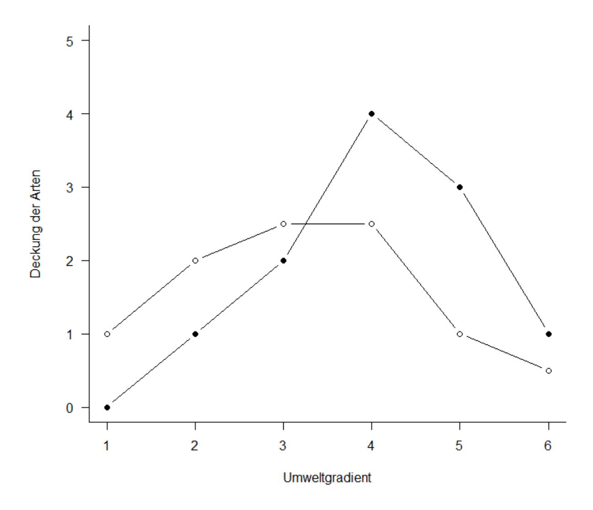
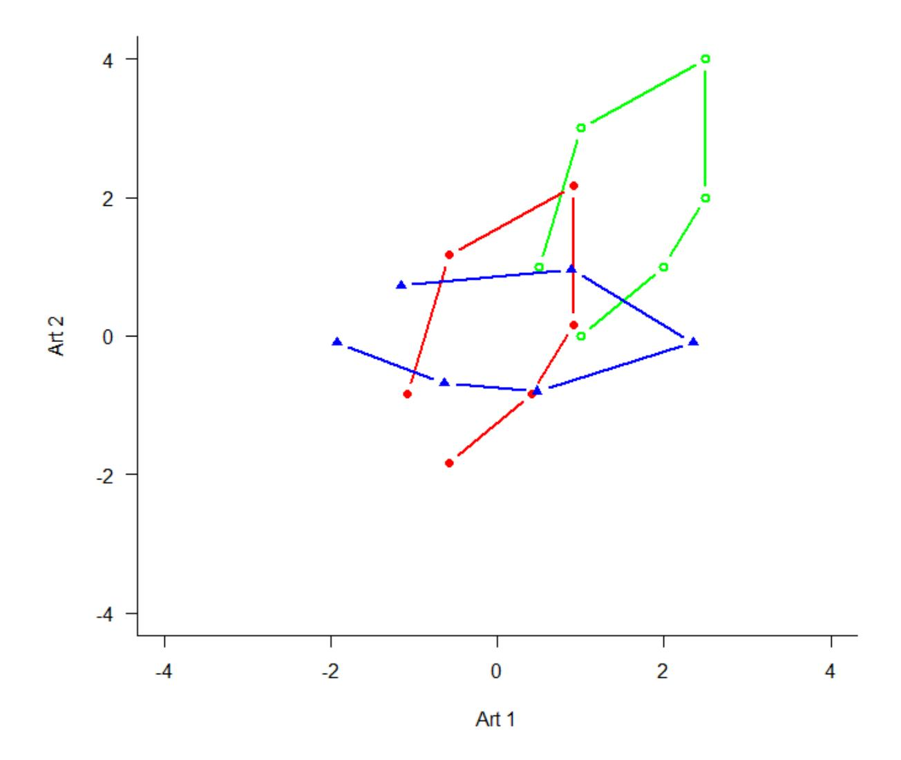
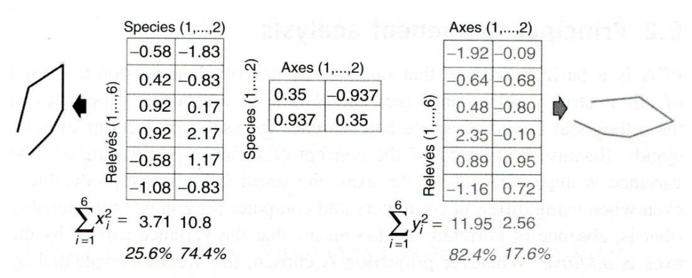
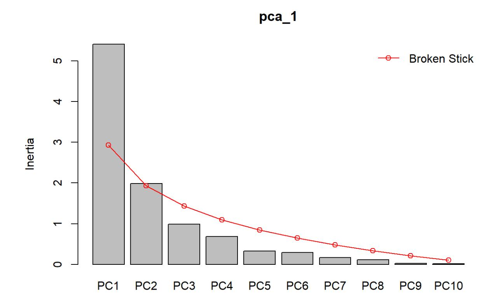
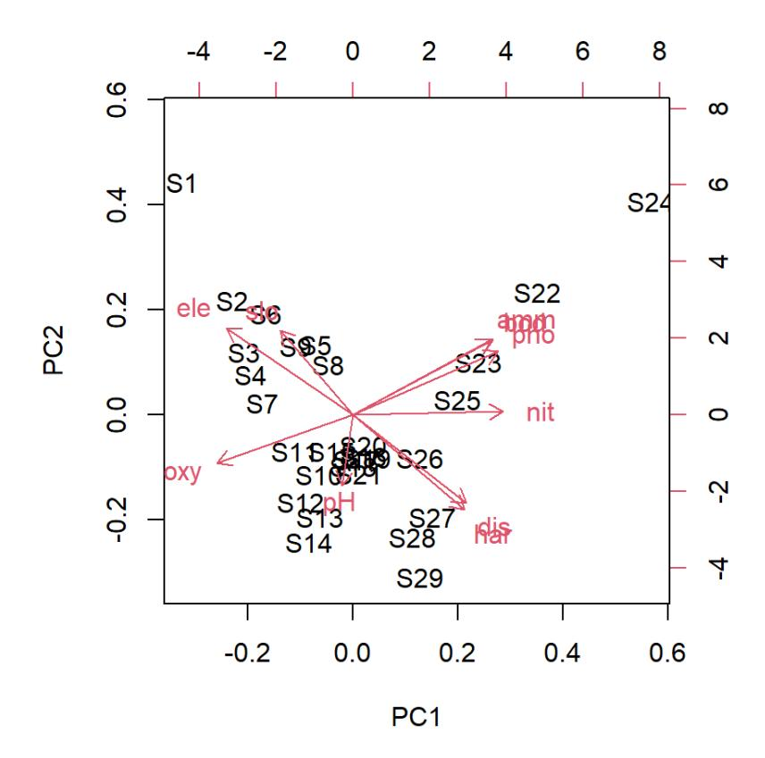
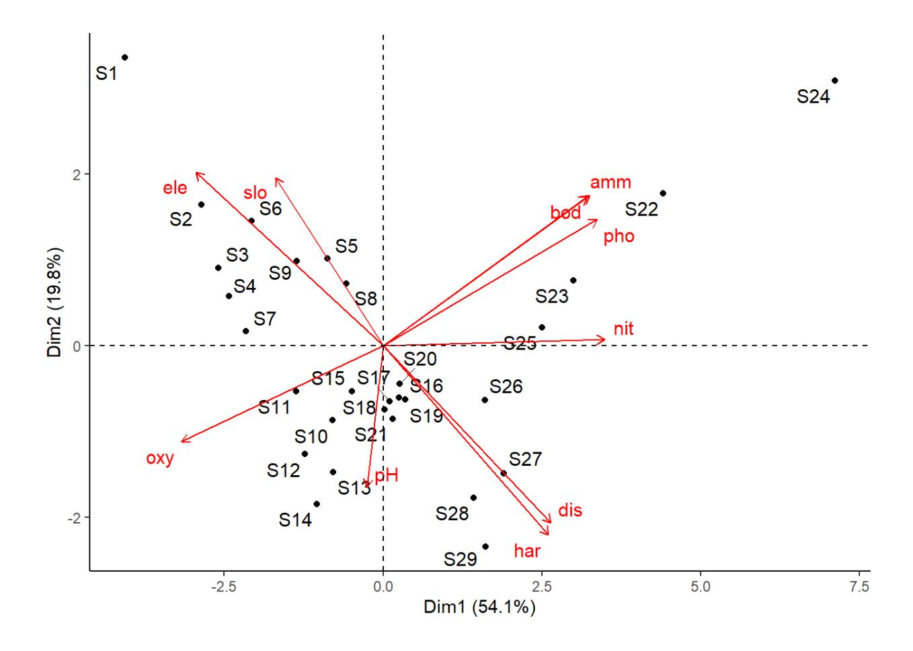
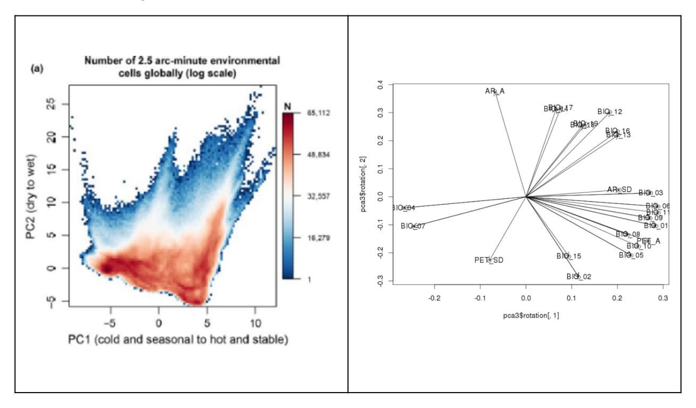
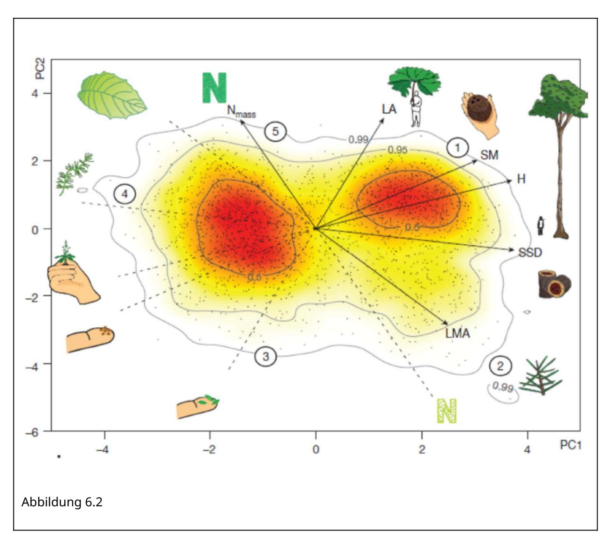

Statistik 7 führt in multivariat-deskriptive Methoden ein, die dazu dienen Datensätze mit mehreren abhängigen und mehrenen unabhängigen Variablen zu analysieren. Dabei betonen Ordinationen kontinuierliche Gradienten und fokussieren auf zusammengehörende Variablen, während Cluster-Analysen Diskontinuitäten betonen und auf zusammengehörende Beobachtungen fokussieren. Ordinationen dienen dazu, die Strukturen in multivariaten Datensätzen via Dimensionsreduktion zu visualisieren. Das Prinzip und die praktische Implementierung wird detailliert am Beispiel der Hauptkomponentenanalyse (PCA) erklärt. Neben der Beschreibung der Datenstruktur in komplexen Datensätzen kann eine PCA auch dazu dienen, aus diesen unabhängie Variablen zu generieren, die anschliessend in einer multiplen Regression als Prädiktoren genutzt werden können.

#### Lernziele

##### Ihr…

- versteht die grundlegenden Unterschiede **multivariat-deskriptive Verfahren** von den bislang besprochenen **inferenzstatistischen Verfahren** und für welche Art von Daten/ Fragen sie sich gut anwenden lassen;
- versteht, **was Ordinationen sollen**, was sie leisten können und was nicht; und
- könnt das **Prinzip einer PCA** beschreiben, sie implementieren, und ihren Ergebnisoutput interpretieren

### Einführung in "multivariate" Methoden

#### Was ist mit "multivariat" gemeint?

Was ist mit **"multivariat"** gemeint? Zunächst einmal sagt das nur, dass pro Beobachtung (*observation*) **mehr als zwei** Variablen erhoben werden, deren Beziehungen zueinander analysiert werden. Im Wortsinne waren also auch schon die zweifaktorielle ANOVA und die multiple Regression "multivariate" Methoden.

Die folgende Tabelle fasst die schon besprochenen und noch kommenden statistischen Verfahren bezüglich der Anzahl von Prädiktor- und Antwortvariablen zusammen:

| Prädiktor(en)        | Antwortvariable(n) | Verfahren                                            |
|----------------------|--------------------|------------------------------------------------------|
| 2 ohne               | Zuordnung          | Korrelation, Assoziationstest                        |
| 1                    | 1                  | einfache lineare Regression,<br>einfaktorielle ANOVA |
| ≥ 2                  | 1                  | multiple Regression, mehrfaktorielle ANOVA, ANCOVA   |
| viele ohne Zuordnung |                    | Ondination on Charten analyses                       |
| viele                | viele              | Ordinationen, <i>Cluster analyses</i>                |

In der Literatur wird der Begriff **"multivariat"** jedoch oft nur für die letzte Gruppe von Verfahren, also **Ordinationen und Cluster-Analysen**, gebraucht. Diese bilden den Gegenstand von Statistik 7– 8.

#### Inferenzstatistik vs. deskriptive Statistik

**Bislang** haben wir statistische Verfahren überwiegend zum Testen von Hypothesen verwendet (inklusive des impliziten Hypothesentestens, wenn man eine offene Forschungsfrage beantwortet): **Inferenzstatistik (schliessende Statistik)**.

\***Ordinationen und Cluster-Analysen** sind überwiegend **deskriptive Statistik** (ohne spezielle Zusatzschritte erlauben sie kein Testen von Hypothesen!).

#### Beispiele multivariater Datensätze

Multivariate Datensätze sind in unserer "datenreichen" Welt allgegenwärtig z. B.:

- **Bodenproben**, an denen viele unterschiedliche physikalische und chemische Variablen, ggf. auch noch in verschiedenen Horizonten gemessen wurden.
- **Klimadaten** von Messstationen: zahlreiche Variablen wie Mittel/Minima/ Maxima von Temperatur/Niederschlag/Sonnenschein/Bewölkung/Windstärke usw. und das für jeden Monat.
- Zusammensetzungen von lokalen **Pflanzengesellschaften oder Tiergemeinschaften**: hier sind die Deckungen bzw. Individuenzahlen der einzelnen Arten die Variablen
- Ergebnisse von **Befragungen von Konsumenten**: viele Variablen zu Präferenzen, Einstellungen usw.

#### Ziele multivariat-deskriptiver Analysen

Im Prinzip können wir auch bei solchen Beobachtungsdaten mit vielen abhängigen Variablen wie bisher jede einzeln testen:

- Das kann **vorteilhaft** sein, **wenn man konkrete Hypothesen testen will** (was ja mit multivariat-deskriptiven Methoden normalerweise nicht geht).
- Ein Problem sind die vielen Tests mit dem gleichen Datensatz, die zu einer **"Inflation" der Typ I-Fehlerrate** führen (wenn ich 20 Tests durchführe, würde ja bei α = 0.05 einer rein zufällig eine Signifikanz anzeigen, selbst wenn eigentlich für keinen eine Beziehung besteht). Für dieses Problem gibt es aber Korrekturmöglichkeiten (z. B. "Bonferroni"-Korrektur).
- Problematischer ist, dass es sehr **schwierig** ist, **aus den vielen Einzelergebnissen am Ende ein aussagekräftiges Gesamtbild zu synthetisieren**.

Hier setzen die multivariat-deskriptiven Methoden mit ihren beiden Hauptzielen an:

- **Muster und Beziehungen** im *n*-dimensionalen Hyperraum erkennen und beschreiben.
- **Dimensionsreduktion**: die wesentliche Information aus den n Dimensionen wird auf zwei bis wenige Dimensionen reduziert, die vorstellbar und visualisierbar sind.

Der **-dimensionale Hyperraum** ist das Konzept, das uns durchgängig bei den multivariatdeskriptiven Methoden begleitet. Dahinter verbirgt sich die Idee, dass jede der *n* Variablen eine orthogonale Achse ist (d. h. rechtwinklig auf den anderen Achsen stehend), auf der die Ausprägungen der Variablen (metrisch oder kategorial) aufgetragen sind. Während wir uns einen 3 dimensionalen Raum noch vorstellen können, ist es mit der Vorstellungskraft bei vier oder gar 100 Dimensionen schnell zu Ende. Aber das ist ja genau der Grund für die multivariat-deskriptiven Methoden.

#### Zwei komplementäre Ansätze

Innerhalb der multivariat-deskriptiven Statistik stellen **Ordinationen** und **Cluster-Analysen (Klassifikationen)** zwei **komplementäre Ansätze** dar. Sie betonen unterschiedliche Aspekte des Datensatzes und können oftmals sogar sinnvoll parallel verwendet werden. Die wesentlichen Unterschiede zeigt die folgende Tabelle:

Was damit gemeint ist, werden wir sehen, wenn wir in den folgenden Lektionen teilweise Ordinationen und Cluster-Analysen auf denselben Datensatz anwenden.

## Hauptkomponentenanalyse (PCA) – das Prinzip

Ordinationen versuchen, im *n*-dimensionalen Raum der (Antwort-) Variablen **diejenigen Ebenen zu finden, welche die meiste Varianz erklären**. Dies geschieht bei der Hauptkomponentenanalyse (*principle component analysis*, PCA) durch die folgenden Schritte (ähnlich bei anderen Ordinationsverfahren):

- **Zentrieren** der Punktwolke, so dass der Schwerpunkt im Ursprung des Koordinatensystems liegt.
- **Rotieren** der Punktwolke, bis die erste Achse die maximal mögliche Varianz abbildet.
- Nach Fixierung der ersten Achse Fortsetzen des Rotierens, bis die zweite Achse wiederum das maximal Mögliche der verbleibenden Varianz abbildet, usw. bis zur *n*-ten Achse.
- **Visualisierung** der Ergebnisse bei Beschränkung auf die relevanten ersten Achsen.

Um diese Idee zu visualisieren, nehmen wir ein System von nur zwei Variablen, da wir diese noch auf einer Ebene (d.  h. im gedruckten Skript) visualisieren können. Stellen wir uns sechs Beobachtungspunkte entlang eines Umweltgradienten (z.  B. Meereshöhe) vor. An jedem dieser Beobachtungspunkte wird die Häufigkeit von zwei Arten (Art 1: gefüllte Kreise, Art 2: offene Kreise) ermittelt, etwa folgendermassen:



Wenn wir das jetzt **im "Artenraum"** zeigen, also mit der Häufigkeit von Art 1 auf der *x*-Achse und der Häufigkeit von Art 2 auf der *y*-Achse, dann bekämen wir das **grüne** Muster. **Zentriert** (d. h. so dass die Mittelwerte aller *x*- und *y*-Werte jeweils 0 sind), ergibt sich die **rote** Figur. Dies wird schliesslich so **rotiert**, dass die maximale Varianz (hier im simplen Fall einfach die Distanz zwischen den extremen Punkten) paralle zur *x*-Achse liegt (**blau**).



#### PCA: Voraussetzungen und Anwendung

Das im vorigen Abschnitt skizzierte Vorgehen, ist genau das, was eine **Hauptkomponentenanalyse (***Principal component analysis***, PCA)** macht:

- Basiert auf einer **linearen Beziehung** zwischen den Attributen.
- Achsen sind **orthogonal** (und die Varianzen daher additiv).
- Die ursprünglichen **Distanzen** zwischen den Objekten (Beobachtungen) bleiben daher **unverändert**.

##### PCAs eignen sich für:

Einfache Visualisierung, wenn die Linearität gegeben ist.

Bei multiplen Regressionen mit vielen, korrelierten Prädiktoren kann man die PCA-Achsen als **synthetische Prädiktoren** verwenden, da sie vollständig unkorreliert sind.

PCAs eignen sich *nicht* (und das gilt fast immer für Daten zur Artenzusammensetzung ökologischer Gemeinschaften) für:

- Nicht-lineare Beziehungen.
- Viele Nullen in der Matrix.

Die PCA findet die beste Rotation mittels der sogenannten **"Eigenanalyse"**, wie die folgende Abbildung veranschaulicht:

Species 
$$(1,...,b)$$

$$X'$$

$$G_{(1,...,b)}$$

$$G_{(2,...,b)}$$

$$G_{(2,...,b)}$$

$$G_{(2,...,b)}$$

$$G_{(2,...,b)}$$

$$G_{(2,...,b)}$$

$$G_{(2,...,b)}$$

$$G_{(2,...,b)}$$

$$G_{(2,...,b)}$$

$$G_{(2,...,b)}$$

$$G_{(2,...,b)}$$

$$G_{(2,...,b)}$$

$$G_{(2,...,b)}$$

$$G_{(2,...,b)}$$

$$G_{(2,...,b)}$$

$$G_{(2,...,b)}$$

$$G_{(2,...,b)}$$

$$G_{(2,...,b)}$$

$$G_{(2,...,b)}$$

$$G_{(2,...,b)}$$

$$G_{(2,...,b)}$$

$$G_{(2,...,b)}$$

$$G_{(2,...,b)}$$

$$G_{(2,...,b)}$$

$$G_{(2,...,b)}$$

$$G_{(2,...,b)}$$

$$G_{(2,...,b)}$$

$$G_{(2,...,b)}$$

$$G_{(2,...,b)}$$

$$G_{(2,...,b)}$$

$$G_{(2,...,b)}$$

$$G_{(2,...,b)}$$

$$G_{(2,...,b)}$$

$$G_{(2,...,b)}$$

$$G_{(2,...,b)}$$

$$G_{(2,...,b)}$$

$$G_{(2,...,b)}$$

$$G_{(2,...,b)}$$

$$G_{(2,...,b)}$$

$$G_{(2,...,b)}$$

$$G_{(2,...,b)}$$

$$G_{(2,...,b)}$$

$$G_{(2,...,b)}$$

$$G_{(2,...,b)}$$

$$G_{(2,...,b)}$$

$$G_{(2,...,b)}$$

$$G_{(2,...,b)}$$

$$G_{(2,...,b)}$$

$$G_{(2,...,b)}$$

$$G_{(2,...,b)}$$

$$G_{(2,...,b)}$$

$$G_{(2,...,b)}$$

$$G_{(2,...,b)}$$

$$G_{(2,...,b)}$$

$$G_{(2,...,b)}$$

$$G_{(2,...,b)}$$

$$G_{(2,...,b)}$$

$$G_{(2,...,b)}$$

$$G_{(2,...,b)}$$

$$G_{(2,...,b)}$$

$$G_{(2,...,b)}$$

$$G_{(2,...,b)}$$

$$G_{(2,...,b)}$$

$$G_{(2,...,b)}$$

$$G_{(2,...,b)}$$

$$G_{(2,...,b)}$$

$$G_{(2,...,b)}$$

$$G_{(2,...,b)}$$

$$G_{(2,...,b)}$$

$$G_{(2,...,b)}$$

$$G_{(2,...,b)}$$

$$G_{(2,...,b)}$$

$$G_{(2,...,b)}$$

$$G_{(2,...,b)}$$

$$G_{(2,...,b)}$$

$$G_{(2,...,b)}$$

$$G_{(2,...,b)}$$

$$G_{(2,...,b)}$$

$$G_{(2,...,b)}$$

$$G_{(2,...,b)}$$

$$G_{(2,...,b)}$$

$$G_{(2,...,b)}$$

$$G_{(2,...,b)}$$

$$G_{(2,...,b)}$$

$$G_{(2,...,b)}$$

$$G_{(2,...,b)}$$

$$G_{(2,...,b)}$$

$$G_{(2,...,b)}$$

$$G_{(2,...,b)}$$

$$G_{(2,...,b)}$$

$$G_{(2,...,b)}$$

$$G_{(2,...,b)}$$

$$G_{(2,...,b)}$$

$$G_{(2,...,b)}$$

$$G_{(2,...,b)}$$

$$G_{(2,...,b)}$$

$$G_{(2,...,b)}$$

$$G_{(2,...,b)}$$

$$G_{(2,...,b)}$$

$$G_{(2,...,b)}$$

$$G_{(2,...,b)}$$

$$G_{(2,...,b)}$$

$$G_{(2,...,b)}$$

$$G_{(2,...,b)}$$

$$G_{(2,...,b)}$$

$$G_{(2,...,b)}$$

$$G_{(2,...,b)}$$

$$G_{(2,...,b)}$$

$$G_{(2,...,b)}$$

$$G_{(2,...,b)}$$

$$G_{(2,...,b)}$$

$$G_{(2,...,b)}$$

$$G_{(2,...,b)}$$

$$G_{(2,...,b)}$$

$$G_{(2,...,b)}$$

$$G_{(2,...,b)}$$

$$G_{(2,...,b)}$$

$$G_{(2,...,b)}$$

$$G_{(2,...,b)}$$

$$G_{(2,...,b)}$$

$$G_{(2,...,b)}$$

$$G_{(2,...,b)}$$

$$G_{(2,...,b)}$$

$$G_{(2,...,b)}$$

$$G_{(2,...,b)}$$

$$G_{(2,...,b)}$$




(aus Wildi 2013)

##### Dabei gilt:

PCA als das einfachste Ordinationsverfahren sind bereits in Base R implementiert (Befehl prcomp). Es gibt daneben Packages, die PCA zusammen mit diversen anderen Ordinationstechniken enthalten, insbesondere vegan für ökologische Analysen.

#### Beispiel in R: Umweltvariablen im Fluss Doubs

In unserem Beispiel wurden an 29 Stellen des Flusses Doubs jeweils die 10 gleichen Umweltvariablen gemessen. Nun ist die Frage, wie sich diese 10-dimensionale Information vereinfache lässt.

Wir führen die PCA mit dem prcomp-Befehl aus. Da die verschiedenen Umweltvariablen auf unterschiedlichen Skalen gemessen wurden (z.B. mg L-1 oder m^3^ s-1) sollte man sie sinnvollerweise vor der Durchführung der PCA standardisieren. Das geschieht mit dem Parameter scale = TRUE, der jede der Variablen so transformiert, dass sie einen Mittelwert von 0 und eine Standardabweichung von 1 hat.

*# Berechnen der PCA*

```{.r}
pca_1 <- prcomp(env, scale = TRUE)
```

Jetzt kann man die Ergebnisse mit drei verschiedenen Outputs erkunden:

```{.r}
summary(pca_1)
```

Importance of components:

PC1 PC2 PC3 PC4 PC5 PC6 PC7

Standard deviation 2.3261 1.4081 0.99377 0.82554 0.57389 0.54229 0.40525

Proportion of Variance 0.5411 0.1983 0.09876 0.06815 0.03293 0.02941 0.01642

Cumulative Proportion 0.5411 0.7393 0.83809 0.90624 0.93917 0.96858 0.98501

PC8 PC9 PC10

Standard deviation 0.33106 0.15186 0.13146

Proportion of Variance 0.01096 0.00231 0.00173

Cumulative Proportion 0.99597 0.99827 1.00000

Der Befehl summary zeigt uns die relative Bedeutung der 10 generierten PC-Achsen, in der ersten Zeile jeweils der Eigenwert, in der zweiten seine Übersetzung in einen Anteil erklärter Varianz und in der dritten schliesslich die kumulierte Varianz der 1. bis *i*. Achse. Die erklärte Varianz ist ein uns schon bekanntes Konzept. Die Gesamtvarianz ist alles, was im Datensatz mit seinen *n* Achsen drinsteckt (100%). Die PCA-Achsen sind nach absteigender erklärter Varianz nummeriert. Man sieht hier, dass die erste Achse allein schon mehr als die Hälfte der Varianz erklärt. Die erste und zweite Achse zusammen erklären bereits 74%.

pca_1\$rotation

PC1 PC2 PC3 PC4 PC5 PC6

ele -0.32983498 0.37326508 0.206379458 0.19101532 -0.2108916 -0.13925126

slo -0.18939659 0.36225406 -0.317430615 -0.78012687 -0.2534671 -0.10409281 dis 0.29534136 -0.38102320 -0.289744571 -0.25273405 -0.2684698 0.30100160 pH -0.02798027 -0.30500230 0.833784024 -0.40105127 -0.1951586 0.07666589 har 0.29140671 -0.40748250 -0.128533282 0.05461084 -0.2491737 -0.71799621 pho 0.37752293 0.27210613 0.155636940 -0.10896147 0.1007383 -0.20179074 nit 0.39070251 0.01310715 -0.007977941 -0.20607662 0.5141959 0.23374094 amm 0.36361130 0.32397140 0.159353915 -0.06949906 0.2419581 -0.15450710 oxy -0.35471920 -0.20647070 -0.007373084 -0.25539560 0.5526433 -0.45522763 bod 0.35944351 0.32155396 0.106029560 0.05309465 -0.2837688 -0.17696504 PC7 PC8 PC9 PC10

ele 0.18472542 0.588745894 0.23188511 0.4176369609 slo -0.20463767 0.034575041 -0.01624550 -0.0715819377 dis 0.59712652 0.176111385 0.19635151 0.1759578515 pH -0.07146037 -0.007914091 0.02364683 -0.0214444926 har -0.28531107 0.261864429 0.04422096 0.0001391902 pho 0.34531100 0.146608797 -0.74268910 0.0644251748 nit -0.42339586 0.270495568 0.13496263 0.4636479419 amm 0.21872209 0.152261020 0.50422013 -0.5700251793 oxy 0.36532131 -0.222406219 0.12492546 0.2347031060 bod 0.03358753 -0.620662606 0.25544171 0.4357752560

Wie die PCA den *n*-dimensionalen Raum verdreht hat, sieht man, indem man auf \$rotation im PCA-Objekt zugreift. Diese Werte sind die Korrelationen der der Variablen mit den neuen synthetischen PC-Achsen, die sogenannten *Loadings*. Zur Interpretation einer Ordination werden diese oft als Pfeile in das Ordinationsdiagramm geplottet (s. u.).

pca_1\$x

PC1 PC2 PC3 PC4 PC5 PC6

\$1 -4.06058121 3.3572582 -1.5353663864 -3.11664281 -0.440940815 0.023962858 \$2 -2.85884496 1.6453967 0.6199429169 0.81205916 0.462056595 1.198866058 \$3 -2.59500367 0.9087955 1.9223023314 0.08390276 -0.149900842 0.742123168 \$4 -2.42274201 0.5759475 0.2416999136 0.73737973 0.197031209 -0.175001441 \$5 -0.87891903 1.0132044 0.9242023016 0.92176239 -0.899225211 -0.317177629 \$6 -2.07214852 1.4521772 -0.0223558512 1.05958043 -0.018694903 0.245670558

S7 -2.16112216 0.1677976 0.4568713333 0.24335994 -0.322106920 -0.877019196 S8 -0.57361742 0.7209215 0.2639757108 1.22605607 -0.878760741 -0.203164295 S9 -1.35708234 0.9878134 -1.7146160465 0.66588881 -0.007739829 -0.393125521 S10 -0.79292243 -0.8705883 0.0009546047 -0.26509619 0.291231194 -0.650848271 S11 -1.36709366 -0.5303252 -0.8181608908 0.48791374 0.458423383 -0.563740808 S12 -1.22749339 -1.2640408 -0.0337087077 -0.04373209 0.156070410 -0.969587498 S13 -0.78848467 -1.4750236 1.0008336819 -0.52937272 0.125890673 -0.835849370 S14 -1.04150973 -1.8473507 2.4695198950 -1.16235808 -0.117675534 -0.019680069 S15 -0.49079952 -0.5350769 -0.3520651388 0.18345496 0.584620728 -0.025245565 S16 0.24701457 -0.6047699 -0.3687986865 0.13321152 0.579189656 -0.068332189 S17 0.09988521 -0.6508563 -0.3833031874 0.04976758 0.683326378 -0.024162612 S18 0.02438927 -0.7420695 0.1223176607 -0.23010483 0.691984141 0.214472693 S19 0.34858245 -0.6284685 -0.4163658010 -0.13136986 1.081653869 0.335357672 S20 0.25655489 -0.4423705 -0.9691575293 0.38503444 0.366563949 0.530706156 S21 0.14920132 -0.8509911 -0.0692153090 -0.02307061 -0.169105752 0.366684836 S22 4.40893902 1.7764650 1.0312263310 -0.27455931 -0.217479493 -0.607578015 S23 2.99431167 0.7625691 0.0170945415 0.48455983 -0.940755575 0.035682696 S24 7.11385299 3.0888496 0.4707839188 -0.34766485 0.841598956 -0.381766823 S25 2.49964796 0.2144704 -0.8136841889 0.34331209 -0.386714310 0.514435592 S26 1.60318946 -0.6308112 -0.1178042084 -0.23842040 -0.252238973 0.894423496 S27 1.90404098 -1.4844247 0.7045838208 -0.94039312 0.124061006 0.646597704 S28 1.42466912 -1.7701617 -2.2784706379 0.15724184 -0.607940975 0.004076669 S29 1.61408580 -2.3443369 -0.3532363923 -0.67170041 -1.234422275 0.359219148 PC7 PC8 PC9 PC10

S1 -0.16756651 -0.01661397 -0.0005434083 -0.027276628 S2 0.66409559 0.08312574 0.0453575992 -0.114126005 S3 0.36457987 -0.06164832 0.1363572490 0.106940451 S4 0.20481751 0.41948659 -0.1190803292 -0.057120717 S5 -0.33938509 0.29033210 0.1331611406 -0.012913680 S6 0.40988744 -0.32654553 -0.0386629851 0.296369679 S7 -0.11117406 0.48938544 0.0184021086 -0.012862367

S8 -0.67526691 0.44432628 -0.0427742137 -0.107371788 S9 -0.22123560 -0.10940926 -0.0297606988 0.019485234 S10 -0.17677815 0.17051596 -0.0891684003 0.197809147 S11 0.47423174 -0.36666506 0.0305048878 -0.036333811 S12 0.22914572 -0.15537004 0.0333334255 -0.133603754 S13 0.02658378 -0.24507682 0.0275604057 0.219092722 S14 0.17355943 -0.15968840 -0.2347153211 -0.143569558 S15 -0.48268849 -0.02834067 -0.1346994236 -0.055576670 S16 -0.32433001 -0.08783303 0.3085297270 0.140390082 S17 -0.07858369 0.12396263 -0.0949232855 -0.147315115 S18 0.06659440 -0.12827386 -0.2055645165 -0.014781123 S19 -0.24395665 0.13680466 0.2479536264 -0.103423285 S20 -0.31209067 -0.24618792 -0.0271824151 -0.091732053 S21 -0.25594533 -0.46246075 -0.0354205351 -0.180973464 S22 0.24323679 -0.72159949 0.1819244804 0.009669496 S23 -0.39736429 -0.53241824 0.0374850854 -0.145733335 S24 0.43932542 0.60742531 -0.0909990349 -0.048500568 S25 -0.15806719 -0.14778266 -0.4470511938 0.249196626 S26 -0.38708608 -0.06975558 0.1101065003 0.024382817 S27 -0.58223511 0.51151147 0.1409060157 0.199078478 S28 0.88253998 0.27851440 0.1417856127 0.037595473 S29 0.73515615 0.31027906 -0.0028221033 -0.066796286

Mit \$x im PCA-Objekt ist schliesslich codiert, wo im Ordinationsraum unsere 29 Beobachtungspunkte zu liegen kommen. Diese sogenannten *Scores* sind einfach die Koordinaten im n-dimensionalen Raum der PCA. Zur Interpretation einer Ordination werden diese oft als Punkte in das Ordinationsdiagramm geplottet (s. u.).

Ein wichtiges Ziel einer Ordination ist ja die Dimensionsreduktion. Hier stellt sich also die Frage, wie viele der ursprünglich 10 Achsen (Dimensionen) sind wirklich informativ. Das kann man mit einem sogenannten Screeplot visualisieren/testen, der die gefundenen Varianzen denen gegenüberstellt, die man mit einem Nullmodel (broken stick) erwarten würde. Screeplots kann man z.B. mit dem Package vegan erstellen:

```{.r}
p_load("vegan")
```

```{.r}
# Visualisierung der Anteile erklärter Varianz, im Vergleich zu einem Broken-Stick-Modell screeplot(pca_1, bstick = TRUE)
```



In diesem Fall hat also die PC1 deutlich mehr Information als zu erwarten, die PC2 noch geringfügig mehr und alle weiteren Achsen haben weniger Information als zu erwarten. Hier können wir uns in der weiteren Interpretation also auf die Ordinationsebene beschränken, die von PC1 und PC2 gebildet wird.

Diese Visualisierung setzen wir jetzt um mit dem biplot-Befehl von Base R:

```{.r}
# Mit biplot von base R
```

```{.r}
biplot(pca_1)
```



Biplot meint, dass man sowohl die Loadings der Variablen (Pfeile) als auch die Positionen der Einzelbeobachtungen parallel darstellt. Das wird schnell etwas unübersichtlich und man kann mit verschiedenen Packages und diversen Einstellungen Ordinationsdiagramme übersichtlicher und schöner machen. In unserem Fall könnte das wie folgt aussehen (mit dem Package factoextra; R Code dazu in der Demo).



Falls auch die dritte Achse noch bedeutsam wäre, könnte man zusätzlich einen Biplot der ersten und dritten Achse erstellen. Wenn es zu viele Variablen oder zu viele Beobachtungen gibt, kann man statt eines Biplots auch die Loadings und Scores in zwei separaten Abbildungen darstellen (Code dazu in der Demo).

Was sagt uns das Ordinationsdiagramm nun? Wir sehen, dass die erste Achse besonders hoch positiv mit Nitrat korreliert, während die zweite Achse stark negativ mit dem pH-Wert korreliert. Das bedeutet, dass Untersuchungsflächen mit hohen Nitrat- und niedrigen pH-Werten rechts oben im Diagramm auftauchen, etwa S22. Die Pfeile von slo (slope) und ele (elevation) sind fast parallel, was sagt, dass sich diese beiden Umweltvariablen im Datensatz weitgehend parallel verändern, d.h. bei hoher Meereshöhe hat man fast immer auch eine grössere Neigung. Schliesslich kann man sehen, welche Beobachtungsflächen sich in ihren Umweltvariablen stark ähneln (z. B. S17, S16 und S19) bzw. sehr unähnlich sind (z.B. S14 von S22).

#### Beispiele von Anwendungen von PCAs

Zunächst sollen aber einige gängige und korrekte Anwendungen auf sehr grossen Datensets gezeigt werden:

**(a) Visualisierung 1**: Hier wurden etwa 20 verschiedene bioklimatische Variablen für alle Rasterzellen der Erdoberfläche (Farbkodierung gibt die Häufigkeit wieder) einer PCA unterworfen. Die Klimadaten sind so hoch korreliert, dass die ersten beiden Achen (Hauptkomponenten) PC1 und PC2 zusammen 76 % der Varianz im Gesamtdatensatz kodieren. Es wäre also unsinnig, die 20 Variablen einzeln zu analysieren. Durch die rechts gezeigten Korrelationen der Originalvariablen mit

PC1 und PC2 kann man die beiden synthetischen Achsen näherungsweise interpretieren (siehe die Achsenbeschriftung links).



Abbildung 6.1: Bruelheide et al. 2019

**(b) Visualisierung 2**: Hier wurden 6 funktionelle Merkmale (traits) von Pflanzenarten weltweit einer PCA unterworfen. Diese erweisen sich so weit korreliert, dass die ersten beiden Achen (Hauptkomponenten) PC1 und PC2 zusammen 74% der Varianz enthalten. Der eine wesentliche Gradient ist der von winizigen, kleinsamigen Arten zu grossen Arten mit schweren Samen (in der Abbildunge mit 1 resp. SM bezeichnet). Dazu weitgehend orthogonal ist der Gradient von Pflanzen mit stickstoffreichen Blättern (links oben) zu Pflanzen mit stickstoffarmen Blättern (rechts unten).



**(c) Principal Components (PCs) in multiplen Regressionen**: Hier rechnet man zunächst eine PCA mit vielen Umweltvariablen ohne Rücksicht auf ihre wechselseitigen Korrelationen. Dann nimmt man die (ersten) PC-Achsen mit der meisten Information als sogenannte "synthetische" Prädiktoren.

- **Vorteil:** Die PC-Achsen sind vollständig unkorreliert.
- **Nachteil:** Die PC-Achsen sind nicht so direkt interpretierbar wie die Original-Umweltparameter, das sie zwar oft stark mit mehreren Umweltparametern korrelieren, aber eben nicht 100 %.
- **Wichtig:** Hochladende Achsen sind nicht unbedingt auch die wichtigsten für die Regression.

## Zusammenfassung

- **Ordinationen** sind im Kern **deskriptive Verfahren für multivariate** (abhängige) **Variablen** und komplementär zu Cluster-Analysen.
- Ihre Ziele sind **Dimensionsreduktion und Visualisierung**.
- Die basale Form einer Ordination ist die **PCA**. Sie setzt **lineare Beziehungen und wenige Nullwerte** in der Matrix voraus.
- Abgesehen von Visualisierungen kann man PCAs auch zum **Generieren unkorrelierter synthetischer Variablen** für nachfolgende multiple Regressionsanalysen verwenden.

### Weiterführende Literatur

- **Borcard, D., Gillet, F. & Legendre, P. 2018.** *Numerical ecology with R***. 2nd ed. Springer, Cham: 435 pp. [mit R]**
- Crawley, M.J. 2013. *The R book*. 2nd ed. John Wiley & Sons, Chichester, UK: 1051 pp. [mit R]
- Everitt, B. & Hothorn, T. 2011. *An introduction to applied multivariate analysis with R*. Springer, New York: 273 pp. [mit R]
- Leyer, I. & Wesche, K. 2007. *Multivariate Statistik in der Ökologie*. Springer, Berlin: 221 pp. [einfache Erklärung von Ordinationsmethoden, ohne R]
- McCune, B., Grace, J.B. & Urban, D.L. 2002. *Analysis of ecological communities*. MjM Software Design, Gleneden Beach, Oregon, US: 300 pp. [gut erklärte und detaillierte Einführung in Ordinationen u.a., ohne R]
- Oksanen, L. 2015. *Multivariate analysis of ecological communities in R: vegan tutorial*. URL: [http://cc.oulu.fi/~jarioksa/opetus/metodi/vegantutor.pdf.](http://cc.oulu.fi/~jarioksa/opetus/metodi/vegantutor.pdf) [gute Einführung in das R-package *vegan* mit vielen Ordinationsmethoden]
- Wildi, O. 2013. *Data analysis in vegetation ecology*. 2nd ed.Wiley-Blackwell, Chichester, UK: 301 pp. [mit R]
- Wildi, O. 2017. *Data analysis in vegetation ecology*. 3rd ed. CABI, Wallingford, UK: 333 pp. [mit R]

### Quellen der Beispiele

- Bruelheide, H., Dengler, J., Purschke, O., Lenoir, J., Jiménez-Alfaro, B., Hennekens, S.M., Botta-Dukát, Z., Chytrý, M., Field, R., (…) & Jandt, U. 2018. Global trait–environment relationships of plant communities. *Nature Ecology and Evolution* 2: 1906–1917.
- Díaz, S., Kattge, J., Cornelissen, J.H.C., Wright, I.J., Lavorel, S., Dray, S., Reu, B., Kleyer, M., Wirth, C. (…) & Gorné, L.D. 2016. The global spectrum of plant form and function. *Nature* 529: 167–171.
