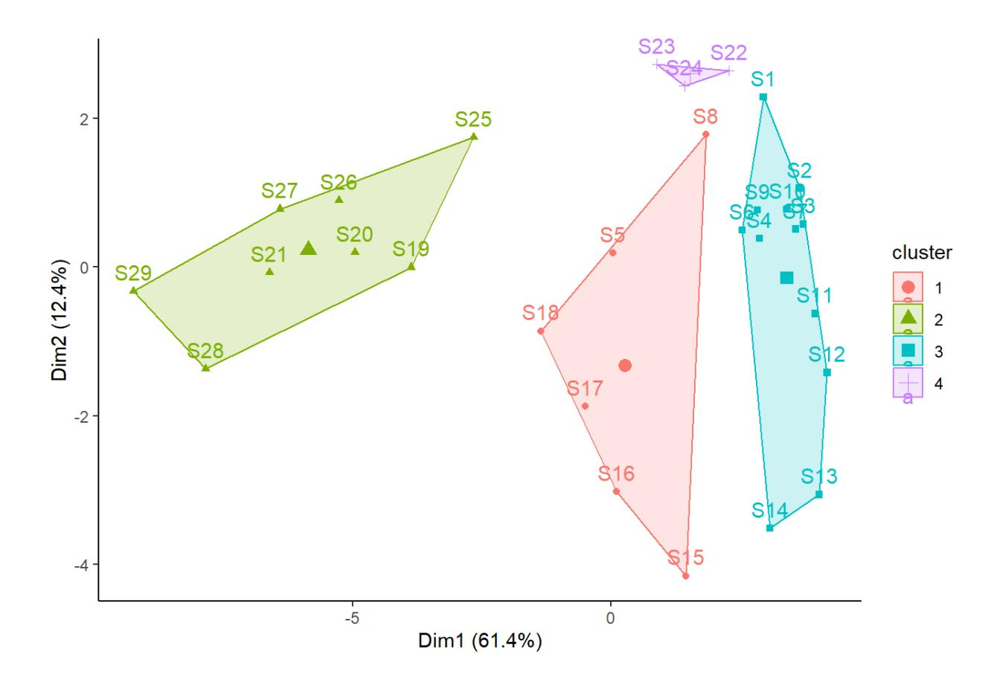
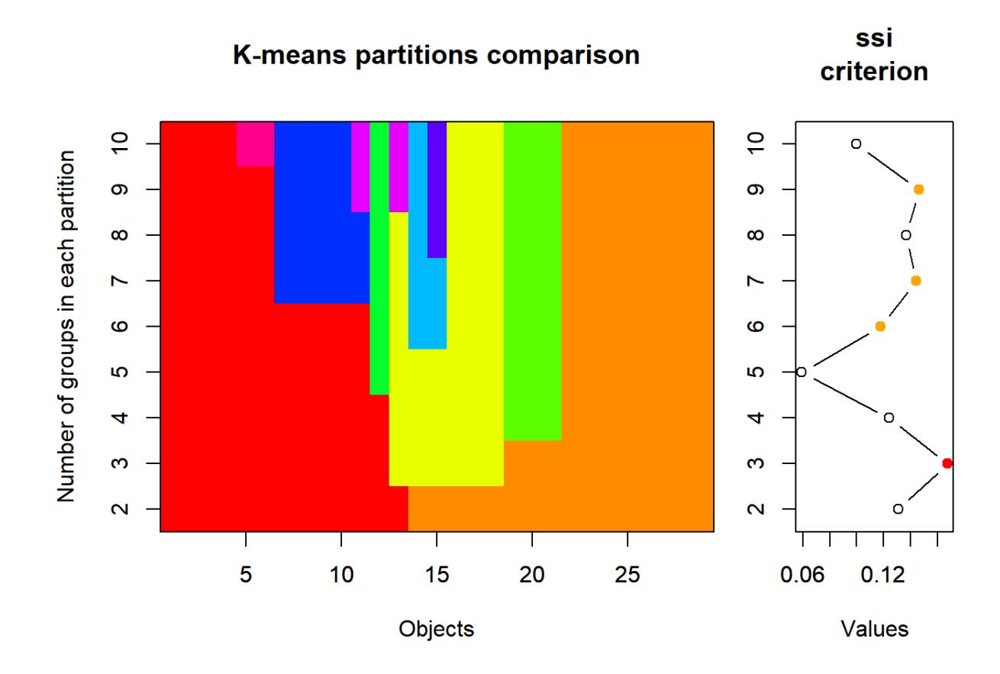
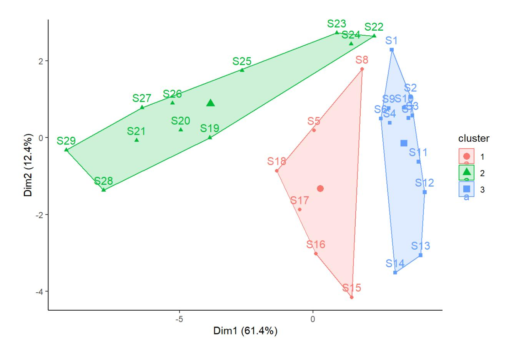
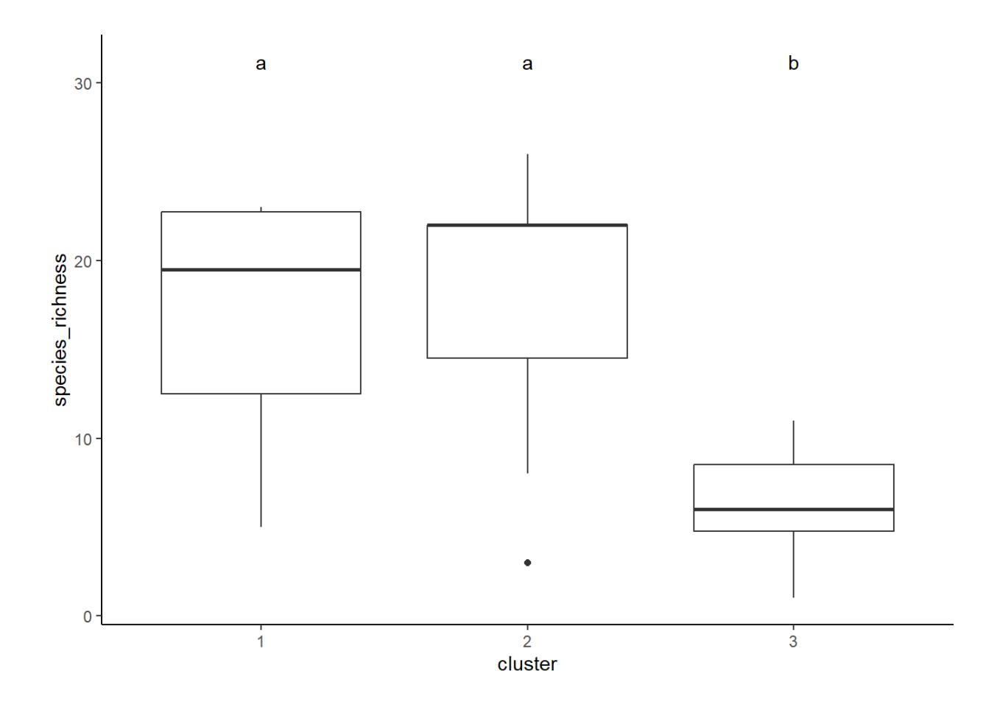

In Statistik 8 lernen die Studierenden Clusteranalysen/Klassifikationen als eine den Ordinationen komplementäre Technik der deskriptiven Statistik multivariater Datensätze kennen. Es gibt Partitionierungen (ohne Hierarchie), divisive und agglomerative Clusteranalysen (die jeweils eine Hierarchie produzieren). Etwas genauer gehen wir auf die *k*means Clusteranalyse (eine Partitionierung) ein.

Im Abschluss von Statistik 8 werden wir dann die an den acht Statistiktagen behandelten Verfahren noch einmal rückblickend betrachten und thematisieren, welches Verfahren wann gewählt werden sollte. Ebenfalls ist Platz, um den adäquaten Ablauf statistischer Analysen vom Einlesen der Daten bis zur Verschriftlichung der Ergebnisse, einschliesslich der verschiedenen zu treffenden Entscheidungen, zu thematisieren.

#### Lernziele

Ihr…

- habt eine prinzipielle Idee, wie **Cluster-Analysen** funktionieren; und
- könnt *k***-means clustering** auf Datensätze anwenden

### Clusteranalysen allgemein

Wie Ordinationen (Statistik 7) gehören Clusteranalysen zu den multivariat-deskriptiven Methoden. Wozu macht man dann Clusteranalysen?

- Clusteranalysen sind **komplementär zu Ordinationen**: Bei Clusteranalysen liegt der Fokus auf den Unterschieden, während bei der Ordination der Fokus auf dem allmählichen Wandel entlang von Gradienten liegt. Insofern sind Ordinationen und Clusteranalysen Methoden, die für die gleichen Datensätze und z. T. ähnliche Fragestellungen angewendet werden können, aber mit Betonung unterschiedlicher Aspekte. Oftmals werden in einer Studie sogar beide Verfahren angewandt.
- Prinzipiell geht es bei Clusteranalysen um das Herausarbeiten von Gruppen von Objekten mit ähnlichen Eigenschaften, z. B.:
  - um diese zu beschreiben,
  - um diese auf Unterschiede zu testen oder
  - um deren Verbreitung in Karten darstellen zu können.

Es gibt drei grundlegende Typen von Clusteranalysen, jeweils mit mehreren Methoden:

**Partitionierung** (ohne Hierarchie)

##### Hierarchische Clusteranalyse

- **divisiv** (der Gesamtdatensatz wird sukzessive in immer feinere Gruppen aufgeteilt)
- **agglomerativ** (beginnend mit den Einzelbeobachtungen werden diese immer weiter zu Gruppen zusammengefasst)

Im Kurs behandeln wir nur die Partitionierung.

## *k*-means clustering: Theorie

Das *k-means clustering* ist die einfachste Clustermethode überhaupt. Ihre Kernaspekte lassen sich wie folgt beschreiben:

- Partitionierung (ohne Hierarchie) in vom Benutzer vorgegebene *k* Cluster.
- Verfahren versucht, die Summe der quadratischen Abweichungen vom den Clusterzentren (Zentroide) zu minimieren.
- In der Tendenz entstehen ± sphärische Cluster ähnlicher Grösse (sphärisch meint kugelförmig/isodiametrisch, aber eben nicht im dreidimensionalen, sondern im vieldimensionalen Variablenraum).
- Da das Ganze mit einem iterativen Optimierungsalgorithmus passiert, der mit zufällig gewählten Startpunkten beginnt, unterscheiden sich unterschiedliche Durchläufe im Ergebnis. Wenn man immer das gleiche Ergebnis haben will, kann man set.seeed() vorher ausführen.

Die Durchführung des *k-means clustering* eines multivariaten Datensatzes geschieht mit dem Befehl kmeans aus Base R:

#### Beispiel in R: Fischvorkommen im Fluss Doubs

Hier schauen wir uns die Fischartvorkommen im Fluss Doubs an den gleichen Beobachtungsstellen an, an denen wir im Ordinationskapitel schon die Umweltdaten betrachtet haben. Im Prinzip ist kmean-clustering nicht so gut für Daten von Artvorkommen geeignet, da solche Daten typischerweise sehr viele Nullwerte (Absenzen) enthalten. Man kann das das Problem durch eine Transformation reduzieren, welche die Randsumme der Quadrate gleich eins macht (während für Umweltvariablen eine scale-Transformation besser ist):

```{.r}
p_load(vegan)
```

```{.r}
spe_norm <- decostand(spe, "normalize")
```

Das eigentliche Clustering geschieht dann wie folgt. Man muss vorab definieren, wie viele Cluster man haben will (hier 4). Da kmeans eine iterative Methode ist, kommt ggf. in jedem Durchlauf ein geringfügig anderes Ergebnis heraus. Wenn man immer exakt das gleiche Ergebnis will, kann man den Befehl set.seed() mit einer beliebigen Zahl vorausschalten:

```{.r}
# k-means-Clustering mit 4 Gruppen durchführen
```

```{.r}
set.seed(123)
```

```{.r}
kmeans_1 <- kmeans(spe_norm, centers = 4, nstart = 100)
```

kmeans_1\$cluster

S1 S2 S3 S4 S5 S6 S7 S8 S9 S10 S11 S12 S13 S14 S15 S16 S17 S18 S19 S20

3 3 3 3 1 3 3 1 3 3 3 3 3 3 1 1 1 1 2 2

S21 S22 S23 S24 S25 S26 S27 S28 S29

2 4 4 4 2 2 2 2 2

Für jede der 29 Beobachtungsflächen zeigt der Output, zu welchem der vier Cluster er gehört, d. h. jedes der Cluster enthält jetzt faunistisch ähnliche Fischgemeinschaften.

Wenn man sehen will, wie diese vier Fischgemeinschaften (basierend auf der Clusterung der Artdaten) sich im Ordinationsraum verhalten, kann man die Clusterzugehörigkeit nutzen, um die Punkte im Ordinationsdiagramm (vgl. Statistik 7) entsprechend einzufärben (Code im Demoskript):



Tatsächlich suggeriert das Ordinationsdiagramm eine klare Separierung der vier Cluster hinsichtlich der Artenzusammensetzung.

Aber wie entscheiden wir im allgemeinen Fall, wie viele Cluster Sinn machen? Vielfach ergibt sich schon aus der geplanten Anwendung, ob eher zwei oder eher zwanzig Einheiten sinnvoll sind. Man kann schauen, wie gut sich die Cluster in ihren Attributen unterscheiden (etwa mittels PCA, s.o., oder ANOVA, s.u.). Es gibt auch unterschiedliche numerische Kriterien, um die "beste" Partitionierung zu finden (allerdings liefern verschieden Gütemasse unterschiedliche Ergebnisse).

Ein Gütemass ist **SSI =** *Simple Structure Index*. Der SSI kombiniert drei Aspekte von Cluster-Güte: (a) maximale Differenz aller Variablen zwischen den Clustern, (b) Grössen der einzelnen Clusters und (c) Abweichung der Variablenwerte in den Clusterzentren vom Gesamtmittel. Der SSI reicht von 0 bis 1 und eine Partitionierung ist umso besser, je höher der Wert ist.

```{.r}
# k-means partionierung, 2 bis 10 Gruppen
```

```{.r}
set.seed(123)
```

```{.r}
km_cascade <- cascadeKM(spe_norm, inf.gr = 2, sup.gr = 10, iter = 100, criterion = "ssi")
```

km_cascade\$results

[…]

```{.r}
# Visualisierung citerion Simple Structure Index
```

```{.r}
plot(km_cascade, sortg = TRUE)
```



Die farbige Visualisierung links zeigt, dass es eben keine hierarchische Clusteranalyse ist. Bei *k* > 2 bleibt die ursprüngliche Abgrenzung der zwei Hauptcluster nicht erhalten. Gemäss SSI wäre in diesem Fall die 3-Cluster-Lösung die beste (es sei aber empfohlen, solchen numerischen "Empfehlungen" nicht blindlings zu glauben). Im Ordinationsraum der Umweltvariablen, sieht die 3- Cluster-Lösung der Fischdaten wie folgt aus:



Sobald wir uns auf eine Cluster-Auflösung festgelegt haben, gilt es auch noch, die Cluster zu charakterisieren und zu vergleichen. Das kann z.B. mit einer ANOVA geschehen (hier für die 3- Cluster-Lösung und die Fischartenzahl pro Beobachtungsstelle als abhängiger Variable). Den Code dafür und weitere Beispiele gibt es im R Demo Code.



## Zusammenfassung

- *k-means clustering* ist eine einfache nicht-hierarchische Clustermethode, bei der der Benutzer vorgibt, wie viele Einheiten er haben möchte.
- **Agglomerative Clusterverfahren** fassen Einheiten sukzessive über ihre Ähnlichkeitsbeziehungen zusammen. Am Ende kann man dann subjektiv oder nach unterschiedlichen numerischen Kriterien entscheiden, welche Clusterauflösung dem Bedarf am besten entspricht.
- Sobald man sich auf eine Cluster-Lösung festgelegt hat, sollte man die erhaltenen Cluster bezüglich ihrer Attribute noch charakterisieren und vergleiche, wozu insbesondere Ordinationen und ANOVAs geeignet sind.

#### Weiterführende Literatur

- **Borcard, D., Gillet, F. & Legendre, P. 2018.** *Numerical ecology with R***. 2nd ed. Springer, Cham: 435 pp. [mit R]**
- Crawley, M.J. 2013. *The R book*. 2nd ed. John Wiley & Sons, Chichester,UK: 1051 pp. [mit R]
- Everitt, B. & Hothorn, T. 2011. *An introduction to applied multivariate analysis with R*. Springer, New York: 273 pp. [mit R]

Wildi, O. 2017. *Data analysis in vegetation ecology*. 3rd ed. CABI, Wallingford, UK: 333 pp. [mit R]
